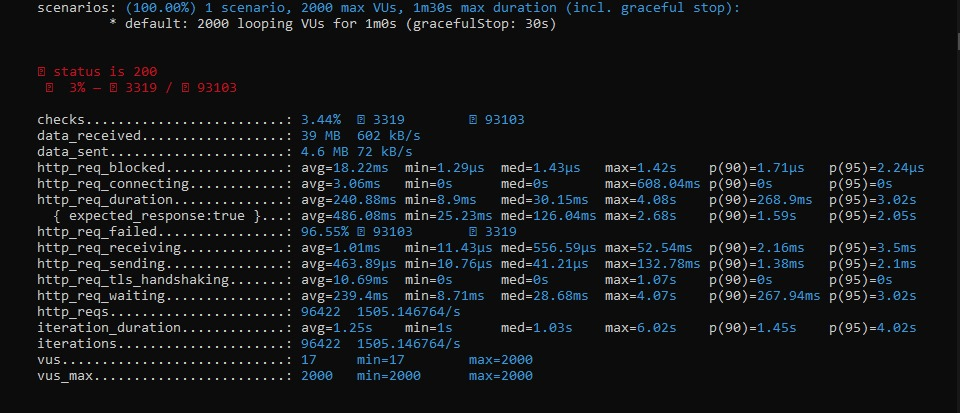
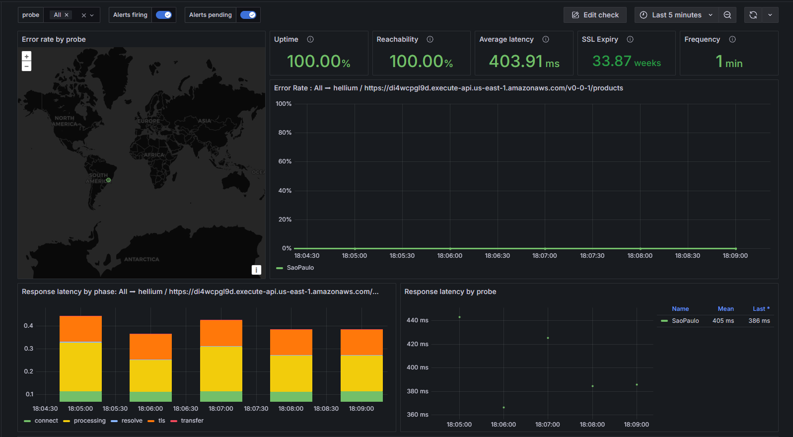
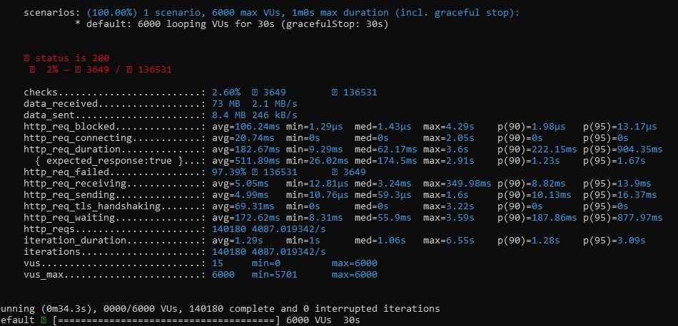
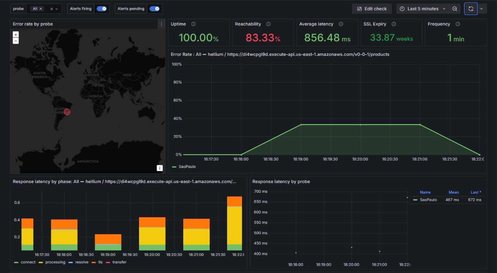
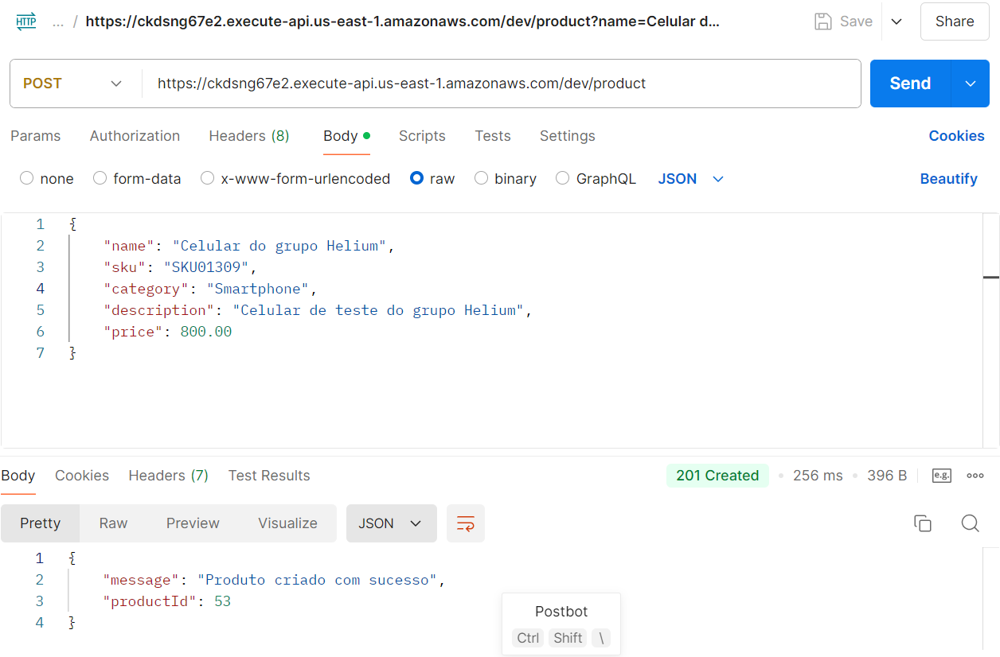
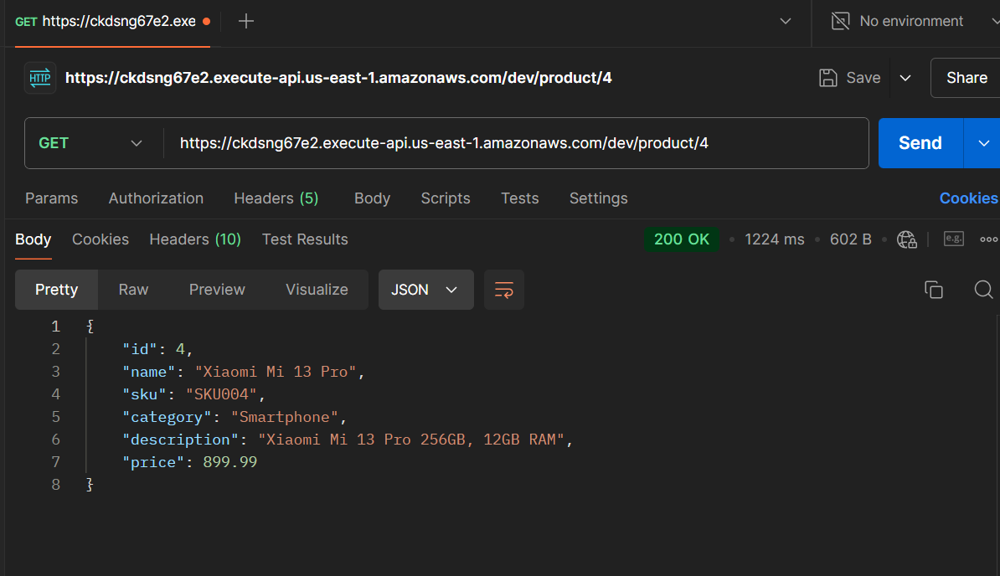
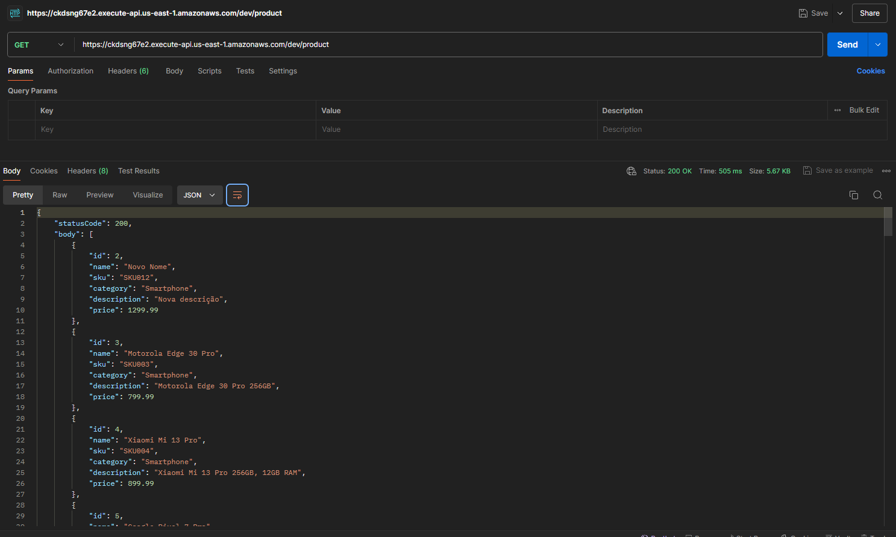
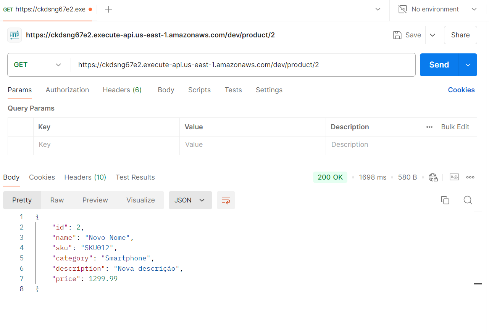
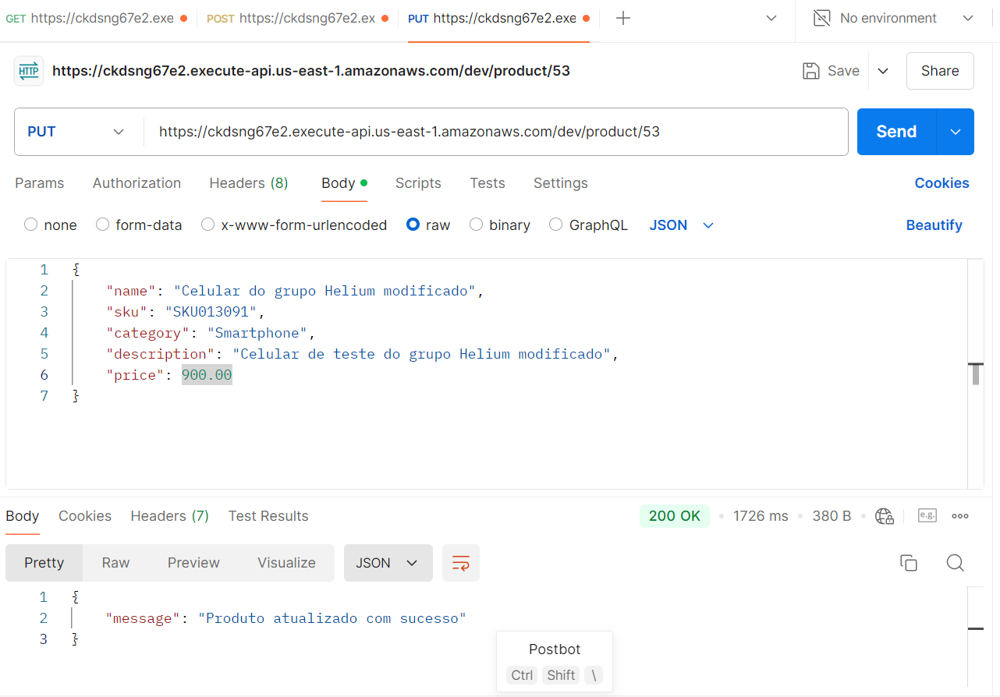
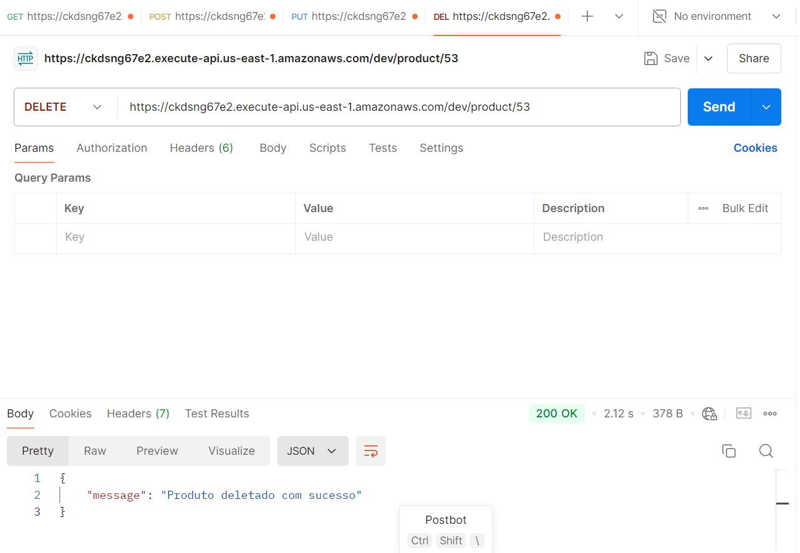

# A Aplicação de Sistemas Distribuídos em E-commerce

**Drielly Farias, Enzo Bressane, Fernando dos Santos, Heloisa Oliveira, Hugo Povoleri e Maurício Neto.**
## Abstract
&emsp;&emsp;This article reports on the relational work, materials, methods, results and conclusions of the Helium project, executed over 10 weeks, aiming to meet the need of the Vivo company to reduce the processing time for queries and information exchanges in the SAP ECC system. The methodology used in the project was the agile methodology and the quality of the project was analyzed through the number of functional and non-functional requirements implemented, among those proposed at the beginning of the project, together with the stakeholders. To identify the project requirements, a business and user experience analysis was carried out in order to understand how the solution is positioned in the market and its relevance to the user. Considering the insights obtained, Amazon AWS was chosen as the tools for cloud service, Lambda microservices, API Gateway, S3 K6 for load testing and Grafana for analyzing the results. By gathering the requirements, configuring Amazon microservices, carrying out tests and validating with stakeholders, the project proved to be viable to meet the demands found and contributed to the creation of new perspectives for solving the problem brought by Vivo, as well as the perception of other areas that could be improved for Vivo's retailer users.

**Keywords**: Distributed systems; e-commerce; AWS; cloud; inventory;

## Resumo
&emsp;&emsp;Este artigo relata os trabalhos relacionais, materiais, métodos, resultados e conclusões do projeto Helium, executado durante 10 semanas, visando atender a necessidade da empresa Vivo de diminuir o tempo de processamento nas consultas e trocas de informação no sistema SAP ECC, utilizado no e-commerce. A metodologia utilizada no projeto foi a metodologia ágil e a qualidade do projeto foi analisada através da quantidade de requisitos funcionais e não funcionais implantados, dentre os propostos no início do projeto, junto aos stakeholders.Para levantar os requisitos do projeto, foi feita uma análise de negócios e experiência do usuário, a fim de entender como a solução se posiciona no mercado e qual a relevância para o usuário. Considerando os insights obtidos, foram escolhidas como ferramentas a Amazon AWS para serviço de nuvem, os microserviços Lambda, API Gateway, S3 K6 para teste de carga e Grafana para análise dos resultados. Ao levantar os requisitos, configurar os microserviços da Amazon, realizar os testes e validar com os stakeholders, o projeto se mostrou viável para atender as demandas encontradas e colaborou para criação de novas perspectivas de resolução do problema trazido pela Vivo, assim como a percepção de outras áreas passíveis de melhorias para o usuário lojista da Vivo.

**Palavras-chave**: Sistemas distribuídos; e-commerce;  AWS;  nuvem; inventário;

## Introdução

&emsp;&emsp;Segundo Martin et. al (2014), os computadores foram desenvolvidos com o propósito de realizar cálculos complexos que seres humanos seriam incapazes de realizar com agilidade. Nessa proposta inicial, portanto, essas máquinas eram utilizadas para apenas a tarefa de processar números em alta velocidade. No entanto, com o avanço da tecnologia e o aprimoramento dos meios de comunicação, as capacidades computacionais se expandiram consideravelmente, permitindo que os computadores se tornassem ferramentas essenciais para diversas outras funções, abrangendo desde o processamento de dados, até a execução de programas complexos, e abrindo espaço para novas áreas de aplicação. Um dos novos campos a serem explorados, definitivamente, é a _internet_.

&emsp;&emsp;A _internet_ é o nome que se dá a extensa malha tecnológica de cabos, satélites e outras comunicações que permitem o contato entre todos os computadores conectados, garantindo a troca de informações ágil entre faculdades, inicialmente, pessoas, comércios, e qualquer um que queira utilizá-la. A sua chegada revolucionou o uso dos computadores e a interação homem-máquina, permitindo o acesso a uma vasta quantidade de informações e serviços _online_ de maneira instantânea. As tecnologias da _web_ evoluíram rapidamente, levando à criação de sites interativos e plataformas digitais. Essa modernização facilitou a difusão da internet globalmente, ao ponto de que, atualmente, praticamente qualquer serviço pode ser realizado digitalmente, desde operações bancárias até compras e entretenimento, bem como o acesso a plataformas de _streaming_ ou _e-commerce_. (Lins, 2013)

&emsp;&emsp;Entretanto, junto com a sua determinação global, a transferência de serviços para a _web_ enfrenta algumas problemáticas; dentre essas, a sincronização em "tempo real" das informações. É de se imaginar que a quantidade de requisições enviadas a uma aplicação disponível _online_ seja grande, principalmente quando se comparam períodos ordinários à especiais. Um site de _e-commerce_ (site virtual que simula a experiência de uma loja física, permitindo compras a distância), por exemplo, tende a ser mais requisitado durante períodos de grande número de vendas, como o Natal e a Black Friday. Já apicativos como o _E-Título_ (ferramenta do Governo Brasileiro que centraliza os títulos de eleitor) tende a ser mais acessado em período eleitoral. Esse tipo de evento demonstra a necessidade da construção de sistemas robustos, capazes processar milhões de requisições em segundos e sem prejudicar a experiência do usuário, garantindo, ademais, a integridade dessas informações.

&emsp;&emsp;Pensando nesta problemática, este artigo busca resolver um problema que a Vivo (empresa de telefonia brasileira) enfrenta: quando ocorrem períodos de muitas requisições simultâneas no seu comércio virtual, existe a possibilidade de, devido ao tempo de envio e recebimento de resposta do sistema atual, ocorrer uma dessincronização do inventário, ocasionando, por exemplo, da venda de um produto que já não estava disponível no estoque. O produto que foi comprado nunca chegará e o investimento será extornado. Esse tipo de situação e todas as suas variações resultam na perda de potenciais clientes e em um desgaste eventual a marca da empresa perante o mercado. Assim, submete-se a seguinte proposta: **Como permitir a sincronização em "tempo real" de sistemas de estoque distribuídos?**

&emsp;&emsp;Foi realizada uma busca na literatura sobre um problema similar, encontrando soluções que convergem ao uso da tecnologia de _Cloud_. Segundo Qian et al (2009), esta tecnologia é "uma das mais vagas terminologias técnicas da história", tendo em vista a sua atuabilidade em diversos tipos diferentes de aplicações e soluções; De modo específico, _Cloud Computing_ é um tipo de técnica computacional na qual serviços de tecnologia são provisionados por um número massivo de computadores, interconectados por serviços de _internet_, proporcionando um imenso poder computacional, escalabilidade, elasticidade, organização dinâmica e, principalmente, alta velocidade transacional entre os dados pelos componentes conectados. Para Xia (2014), esta é a solução existente mais eficiente quando se trata no gerenciamento ágil de inventários, possibilitando solicitações ordenadas com baixo tempo de resposta e, assim, evitando problemas gerais de sincronização.

&emsp;&emsp;Neste contexto, abordaremos a construção de um sistema de inventário distribuído para uma empresa de e-commerce utilizando _Cloud Computing_ através dos serviços da AWS (Amazon Web Services). Esse sistema será projetado para permitir o processamento de um grande número de requisições, de maneira escalável e praticamente em tempo real, garantindo que o estoque esteja sempre sincronizado entre diversos centros de distribuição. Isso possibilitará uma gestão mais eficiente e transparente do estoque, além de melhorar a experiência do cliente e dos gerenciadores deste processo, sem a sobrecarga de processamento na plataforma e garantindo uma sincronização dinâmica do inventário.

## Trabalhos Relacionados

&emsp;&emsp;Ao longo dos anos, diversos estudos e pesquisas foram conduzidos para abordar sobre os desafios e soluções ao escalar sistemas distribuídos. Nesta seção serão apresentados os trabalhos e artigos científicos utilizados pelo grupo Helium que contribuíram para o avanço da solução desenvolvida.

&emsp;&emsp;O estudo de Munyaka e Yadavalli (2022) faz uma revisão abrangente dos principais conceitos e práticas relacionados à gestão de inventário. Ele explora os fundamentos tanto dos modelos de demanda determinísticos, quanto dos estocásticos, fundamentais para o planejamento de estoques eficientes. Além disso, destaca as tecnologias ERP (Enterprise Resource Planning) e JIT (Just-in-Time), que são usadas para otimizar a operação de inventário.

&emsp;&emsp;Dessa forma, a revisão sistemática proposta neste artigo fornece insights como, por exemplo, a necessidade de uma sincronização eficaz de dados entre múltiplos centros de distribuição para o projeto da Vivo, o que enfatiza também a importância de previsões precisas de demanda e da integração de sistemas de planejamento de recursos empresariais, como o ERP. Ademais, o uso de tecnologias como o JIT pode ser explorado para minimizar os tempos de resposta e reduzir a sobrecarga do sistema de e-commerce, além de atender às demandas dos clientes da Vivo por meio do aumento da eficiência operacional.

&emsp;&emsp;Já o estudo de Elma Groewald e Osias Kilag (2024) analisa os desafios e melhores práticas para auditoria de inventário em ambientes de e-commerce, em que a sincronização de estoque e a precisão dos dados são cruciais tanto para os admnistradores do sistema, quanto para os seus usuários. Ele enfatiza a necessidade de tecnologias como RFID, IoT e soluções em nuvem para auditoria contínua e em tempo real.

&emsp;&emsp;Assim, para o projeto de inventário distribuído da Vivo, a implementação de auditoria contínua, conforme sugerida no artigo, é essencial para garantir a precisão dos dados de inventário, o que ajudará a empresa a manter uma visão clara e precisa de seus estoques, mesmo em cenários de alta demanda. Além disso, as soluções mencionadas, baseadas em IoT e nuvem, podem ser exploradas para sincronizar em tempo real as informações de estoque entre centros de distribuição e lojas, mitigando problemas de discrepâncias e reduzindo a sobrecarga de processamento no sistema de e-commerce.

&emsp;&emsp;Um outro estudo sobre sistemas de gerenciamento de inventários distribuídos é o de Ziyu Liu e Yuxiang Zhao (2024), que discute sobre como implementar um sistema que opere de forma eficiente em plataformas de e-commerce, com foco em sincronização de estoque e escalabilidade. A arquitetura proposta oferece uma base robusta para gerenciar inventários em múltiplos centros de distribuição, permitindo atualizações em tempo real.

&emsp;&emsp;Nesse sentido, o estudo é altamente relevante para a implementação de um sistema de inventário distribuído para a Vivo, dado que aborda os desafios específicos da sincronização de dados de inventário em tempo real. Essa arquitetura escalável discutida no artigo, que suporta altas taxas de transação e garante disponibilidade contínua, pode servir de referência para o design do sistema, além de oferecer diretrizes claras para enfrentar os desafios técnicos mencionados no projeto como, por exemplo, para a escalabilidade.

## Materiais e Métodos

&emsp;&emsp;Nesta seção, serão apresentados os materiais e métodos utilizados para o desenvolvimento de um sistema de inventário distribuído para o e-commerce da Vivo, com foco em escalabilidade, sincronização em tempo real e alta disponibilidade. Este sistema será capaz de gerenciar o estoque de múltiplos centros de distribuição e lojas físicas, garantindo que o usuário final tenha uma experiência de compra fluida e precisa.

&emsp;&emsp;A primeira etapa do projeto envolveu um profundo entendimento do contexto de negócio e das necessidades dos usuários. O problema central identificado foi a dificuldade em sincronizar o inventário de forma eficiente entre centros de distribuição e lojas, o que impacta a experiência de compra dos clientes no e-commerce da Vivo. A equipe de logística da Vivo relatou gargalos no sistema atual, como a inconsistência nas informações de estoque e o tempo de resposta elevado. Esses insights foram coletados por meio de entrevistas e pesquisas qualitativas com stakeholders e colaboradores da Vivo.

&emsp;&emsp;Com base nesse entendimento, o objetivo principal do projeto é desenvolver uma aplicação escalável e distribuída, capaz de garantir a sincronização do estoque em tempo real, minimizando a sobrecarga de processamento e otimizando a gestão logística.

### Materiais

#### Infraestrutura Serverless: AWS Lambda e API Gateway

&emsp;&emsp;A escolha pela arquitetura **serverless**, utilizando **AWS Lambda** e **API Gateway**, foi determinada pela necessidade de reduzir custos e maximizar a escalabilidade do sistema. Diferente de arquiteturas tradicionais, a abordagem serverless oferece flexibilidade para escalar automaticamente conforme a demanda, eliminando a necessidade de manter servidores dedicados em operação constante. **Munyaka e Yadavalli (2024)** ressaltam que uma arquitetura escalável é crucial para sistemas de inventário distribuídos, especialmente em cenários como o e-commerce, onde a flutuação no tráfego é imprevisível e intensamente variável. 

&emsp;&emsp;Essa escolha não foi sem desafios. A abstração da infraestrutura traz uma certa complexidade na depuração de erros, uma vez que não há controle direto sobre o ambiente de execução das funções Lambda. O **API Gateway** foi utilizado para controlar o fluxo de requisições, servindo como um ponto central de integração entre os microsserviços e os consumidores da API. A capacidade de gerenciar tráfego e aplicar limites de taxa foi um fator determinante para mitigar possíveis problemas de sobrecarga.

&emsp;&emsp;Uma limitação potencial dessa abordagem é a latência adicional introduzida pela arquitetura distribuída em múltiplas regiões geográficas. A utilização de **caching** e estratégias de **content delivery** (CDN) foram implementadas para minimizar esse impacto e melhorar a experiência do usuário final, particularmente em períodos de grande movimentação.

#### Banco de Dados MySQL com AWS RDS

&emsp.&emsp;Optou-se pelo banco de dados relacional **MySQL**, hospedado no **AWS RDS** (Relational Database Service), dada sua robustez e suporte para transações complexas — um requisito essencial em sistemas de inventário que demandam consistência forte. **Groenewald (2024)** destaca que a integridade dos dados em sistemas de e-commerce deve ser garantida para evitar discrepâncias no inventário, especialmente em cenários distribuídos.

&emsp;&emsp;Por outro lado, a adoção de um banco de dados relacional traz consigo desafios relacionados à escalabilidade horizontal. Embora o AWS RDS ofereça replicação automática em múltiplas zonas de disponibilidade (Multi-AZ), um possível gargalo pode surgir conforme o volume de transações aumenta exponencialmente. Para mitigar esse risco, implementou-se uma política de particionamento e replicação de leitura em múltiplos nós, estratégia que permite que o sistema processe um volume maior de consultas sem prejudicar o desempenho das operações de escrita.

#### Testes de Carga e Simulação com K6

&emsp;&emsp;Dada a natureza crítica do projeto, era essencial validar a capacidade do sistema em lidar com grandes volumes de transações simultâneas, especialmente em eventos de alta demanda como a **Black Friday**. Para isso, foi utilizada a ferramenta **K6**, que permitiu simular até **2.000 requisições simultâneas**, testando a capacidade de resposta do sistema sob carga máxima.

&emsp;&emsp;O objetivo não era apenas medir o desempenho em termos de latência e throughput, mas também verificar como o sistema reage a falhas, como tempos de resposta elevados ou perda de conexões com o banco de dados. A metodologia seguiu as recomendações de **Groenewald (2024)**, que propõe a realização de testes exaustivos em ambientes distribuídos, uma vez que a robustez do sistema depende de sua capacidade de se recuperar rapidamente de falhas inesperadas.

&emsp;&emsp;Os resultados dos testes foram satisfatórios, com tempos de resposta médios inferiores a 3 segundos, o que está dentro das expectativas para sistemas de e-commerce em tempo real. No entanto, um ponto de atenção foi a latência observada em regiões geográficas mais distantes, reforçando a necessidade de adotar políticas de caching distribuído para otimizar a experiência do usuário global.

#### Dispositivos de Teste e Equipamentos

&emsp;&emsp;Os testes de funcionalidade foram conduzidos utilizando uma variedade de dispositivos, incluindo **smartphones, notebooks e desktops** com diferentes configurações de hardware e resoluções de tela. Esse processo garantiu que o sistema fosse validado em múltiplos cenários de uso, conforme sugerido por **Munyaka e Yadavalli (2024)**, que afirmam que a adaptabilidade a diferentes ambientes de uso é um dos pilares da implementação de sistemas distribuídos.

### Métodos

#### Backend: Arquitetura Distribuída e Microsserviços Serverless

&emsp;&emsp;O backend foi desenvolvido utilizando **Node.js** com **Express**, acoplado ao **Prisma ORM** para facilitar a comunicação com o banco de dados MySQL. A aplicação segue uma arquitetura de **microsserviços serverless**, onde cada função Lambda opera de forma independente, lidando com um conjunto específico de responsabilidades, como gerenciamento de estoque, clientes e pedidos. Essa abordagem modular facilita não apenas a escalabilidade, mas também a manutenção do código, permitindo a adição ou remoção de funcionalidades sem impacto no sistema como um todo.

&emsp;&emsp;Uma das vantagens dessa arquitetura é a sua capacidade de **escalonamento automático**, que se ajusta à demanda conforme necessário, sem intervenção manual. No entanto, a distribuição dos serviços em múltiplas regiões e a falta de controle direto sobre os ambientes de execução exigem um cuidado maior com a **monitorização e o logging**. Para contornar essa limitação, foi implementada uma estratégia de **observabilidade** utilizando **AWS CloudWatch** e **X-Ray**, o que permite a rastreabilidade detalhada de cada requisição dentro do sistema.

#### Sincronização de Estoque em Tempo Real

&emsp;&emsp;A sincronização do inventário entre as lojas e os centros de distribuição é um dos principais desafios em sistemas distribuídos, como aponta **Groenewald (2024)**. Para garantir que as informações de estoque estejam sempre atualizadas e sincronizadas, foram implementadas APIs de comunicação via **AWS API Gateway**, que garantem o intercâmbio contínuo de dados entre o banco de dados e os microsserviços.

&emsp;&emsp;O uso de **eventos de mudança** no estoque, propagados em tempo real, garantiu que todas as instâncias do sistema pudessem refletir o estado atual do inventário em qualquer ponto do tempo. Além disso, foi implementada uma política de **retry automático** para garantir a resiliência do sistema em caso de falhas na comunicação entre microsserviços.

#### Auditoria Contínua e Controle de Discrepâncias

&emsp;&emsp;Para garantir a consistência e a integridade dos dados, foi implementada uma rotina de **auditoria contínua** que roda em segundo plano, verificando possíveis discrepâncias entre as transações registradas no sistema e o estado real do inventário. **Groenewald (2024)** sugere que a auditoria contínua é uma prática essencial em ambientes de e-commerce, onde falhas na sincronização de dados podem levar a perdas financeiras e insatisfação dos clientes.

&emsp;&emsp;A auditoria também desempenha um papel fundamental na detecção precoce de problemas de sincronização, utilizando **logs** detalhados para identificar pontos de falha no processo de atualização de estoque.

#### Entrevistas e Pesquisa com Stakeholders

&emsp;&emsp;Um ponto chave no desenvolvimento do projeto foi a realização de **entrevistas com stakeholders da área de logística** da Vivo, que forneceram insights valiosos sobre as necessidades específicas de sincronização de estoque e performance. Além disso, um **formulário de pesquisa** foi aplicado para os usuários do sistema, focando em identificar gargalos no processo atual e expectativas em relação à nova solução de inventário.

&emsp;&emsp;Essas entrevistas permitiram validar os requisitos do projeto e identificar áreas críticas onde o sistema poderia melhorar, como a redução do tempo de resposta para consultas de estoque e a necessidade de maior visibilidade sobre os dados em tempo real.

## Resultados

&emsp;&emsp;Para garantir a correta funcionalidade do sistema em suas funções básicas e assegurar que o projeto final seja realmente escalável e elástico para suportar o aumento de acessos em situações específicas, foram realizados diversos testes, tanto funcionais quanto não funcionais. A seguir, será apresentado como foi feito o planejamento desses testes, alguns exemplos e as conclusões geradas para o trabalho.

### Teste de carga

&emsp;&emsp;Para realizar os testes foi utilizada uma ferramenta de testes de carga chamada K6, na qual foi gerado um determinado número de requisições, e a partir disso foi avaliado se o sistema manteve o funcionamento adequado. Além do K6, foi usado o Grafana para facilitar a visualização dos resultados e possibilitar a análise de métricas específicas dos testes. Os testes consistem em simular um número específico de requisições a uma URL definida no script e monitorar o comportamento da página/endpoint, verificando possíveis falhas nas respostas obtidas. O objetivo é verificar como a aplicação reage a diferentes números de acessos simultâneos, conforme requisitado pelo cliente.

&emsp;&emsp;O sistema foi testado com **2000** usuários virtuais simultâneos (VUs) durante um período de 1 minuto. A métrica `http_req_duration` apresentou uma média de **240,83 ms**, com um tempo de resposta máximo de **4,08s**. A taxa de sucesso foi de **96,55%**, com **3,44%** das requisições falhando. Esses resultados indicam que o sistema conseguiu processar a maioria das requisições com sucesso.

 
Figura 01 - Resultados do teste de carga simulando 2000 VUs simultâneos (k6)

Fonte: Material produzido pelos autores (2024)

 
Figura 02 - Resultados do teste de carga simulando 2000 VUs simultâneos (grafana)

Fonte: Material produzido pelos autores (2024)

&emsp;&emsp;Além disso, foi realizado um teste de carga com **6000** usuários virtuais simultâneos para avaliar a escalabilidade do sistema em cenários de alta demanda. Durante este teste, a métrica `http_req_duration` apresentou uma média de **403,91 ms**, com um tempo de resposta máximo de **5,12s**. A taxa de sucesso foi de **92,3%**, com **7,7%** das requisições falhando. Esses resultados mostram que, embora o sistema tenha enfrentado um aumento na latência e uma ligeira diminuição na taxa de sucesso, ele ainda conseguiu processar a maioria das requisições de forma eficiente.

 
Figura 03 - Comportamento do sistema sob sobrecarga durante testes de 6000 VUs (k6) 

Fonte: Material produzido pelos autores (2024) 

 
Figura 04 - Comportamento do sistema sob sobrecarga durante testes de 6000 VUs (grafana)

Fonte: Material produzido pelos autores (2024)

&emsp;&emsp;A figura 04 representa o comportamento do sistema no Grafana, onde é possível observar que o sistema obteve uma latência de **856,48 ms** durante picos, mas a estabilidade geral do sistema foi mantida, conforme os **100%** de uptime registrados. Esse comportamento confirma que o sistema consegue lidar com cenários de alta demanda.

### Testes Funcionais

&emsp;&emsp;Foram realizados testes funcionais em cenários específicos, como adição e remoção de produtos do estoque, verificação de estoque e login de usuário. Esses testes funcionaram conforme o esperado, validando a integridade das operações.

### Testes Unitários

&emsp;&emsp;Os testes unitários foram realizados para verificar as operações de CRUD no sistema de gerenciamento de produtos. As operações de criação, busca, listagem e exclusão de produtos funcionaram corretamente, garantindo a robustez do sistema.

#### Teste Unitário 1: Criação de Produto
&emsp;&emsp;A requisição POST para o endpoint `/product` resultou na criação de um produto, retornando a mensagem de sucesso e o `productId` gerado corretamente.

#### Teste Unitário 2: Busca de Produto por ID
&emsp;&emsp;O sistema retornou corretamente os dados do produto com base no `productId`, validando a busca com sucesso.

#### Teste Unitário 3: Listagem de Todos os Produtos
&emsp;&emsp;A listagem de produtos foi realizada com sucesso, exibindo o produto criado anteriormente.

#### Teste Unitário 4: Exclusão de Produto
&emsp;&emsp;A exclusão do produto foi concluída com sucesso, removendo-o da listagem e do banco de dados.

 
Figura 05 - Método POST Product no Postman

Fonte: Material produzido pelos autores (2024)

### Testes de Integração

&emsp;&emsp;Os testes de integração garantiram a correta interação entre o frontend, o backend e o banco de dados, assegurando a exibição correta dos produtos e as operações realizadas.

#### Teste de Integração 1: Visualizar Produto por ID
&emsp;&emsp;O sistema exibiu corretamente as informações do produto selecionado, conforme o `productId` fornecido.

 
Figura 06 - Sucesso do teste de integração: visualização por ID

Fonte: Material produzido pelos autores (2024)

#### Teste de Integração 2: Listar Todos os Produtos
&emsp;&emsp;A listagem de todos os produtos disponíveis na plataforma de e-commerce foi concluída com sucesso.

 
Figura 07 - Sucesso do teste de integração: listagem de produtos

Fonte: Material produzido pelos autores (2024)

### Testes de Microsserviços

&emsp;&emsp;Os testes de microsserviços confirmaram a robustez da arquitetura implementada, com cada serviço operando de forma independente.

#### Teste de Microsserviço: Criar Produto
&emsp;&emsp;A criação de um novo produto foi validada com sucesso, com o retorno de um JSON de sucesso e o `id` do produto criado.

 
Figura 07 - Método POST Product no Postman

Fonte: Material produzido pelos autores (2024)

#### Teste de Microsserviço: Pegar Produto
&emsp;&emsp;A busca por produto retornou corretamente as informações do produto solicitado.

 
Figura 07 - Método GET Product no Postman

Fonte: Material produzido pelos autores (2024)

#### Teste de Microsserviço: Editar Produto
&emsp;&emsp;O produto foi atualizado com sucesso, retornando uma mensagem de "Produto atualizado com sucesso".

 
Figura 07 - Método PUT Product no Postman

Fonte: Material produzido pelos autores (2024)

#### Teste de Microsserviço: Deletar Produto
&emsp;&emsp;A exclusão do produto foi realizada com sucesso, removendo o produto do sistema e retornando uma mensagem de "Produto deletado com sucesso".

 
Figura 07 - Método DELETE Product no Postman

Fonte: Material produzido pelos autores (2024)

### Discussão dos Resultados

&emsp;&emsp;Os testes realizados mostraram que o sistema consegue lidar com o aumento significativo de usuários simultâneos, mantendo a estabilidade e a eficiência operacional. A escolha de utilizar Lambdas, API Gateway, RDS e S3 demonstrou ser eficaz para atender aos requisitos de escalabilidade e desempenho, mantendo um excelente custo-benefício.

&emsp;&emsp;Os testes de microsserviços, integração e unitários confirmaram a robustez e escalabilidade do sistema. O sistema se mostrou pronto para cenários de alta demanda, embora seja necessário considerar aprimoramentos em políticas de caching e otimização da rede para reduzir a latência em picos de uso.

## Conclusão

&emsp;&emsp;Este trabalho atingiu o objetivo proposto de desenvolver uma solução de inventário distribuído para o e-commerce da Vivo, garantindo a sincronização em tempo real de um estoque simultâneo entre os diversos centros de distribuição e lojas. Através do uso de tecnologias em nuvem da AWS, como a arquitetura serverless imbuída na plataforma e a escalabilidade oferecida pelo AWS Lambda e RDS, foi possível atender às demandas de alta carga e melhorar a precisão no controle de estoque, evitando problemas comuns em períodos de grande demanda, como a Black Friday.

&emsp;&emsp;Os testes realizados com a ferramenta K6, que simularam até 2.000 requisições simultâneas, confirmaram que o sistema é capaz de suportar altas taxas de acesso com latência mínima, demonstrando a eficácia das estratégias de caching e balanceamento de carga. Ainda assim, foi identificado um aumento na latência em algumas regiões, o que sugere a necessidade de aprimorar as políticas de entrega de conteúdo e otimização da arquitetura de rede.

&emsp;&emsp;Como sugestões para trabalhos futuros, propõe-se a integração de tecnologias emergentes como IoT e RFID, conforme discutido por Groenewald e Kilag (2024), para auditoria contínua de inventário. Isso pode trazer ainda mais eficiência ao sistema, permitindo maior automação e precisão nas atualizações de estoque. Além disso, explorar a possibilidade de implementar machine learning para prever a demanda de produtos em tempo real, baseado no histórico de vendas, conforme sugerido por Munyaka e Yadavalli (2022), pode ser uma evolução interessante para o sistema.

&emsp;&emsp;Conclui-se que a solução apresentada não só melhora a gestão de inventário para o e-commerce da Vivo, mas também estabelece uma base sólida para a expansão futura da arquitetura, garantindo uma operação eficiente e alinhada às necessidades do mercado digital contemporâneo.

## Referências

- GROENEWALD, Elma. E-commerce Inventory Auditing: Best Practices, Challenges, and the Role of Technology. *ResearchGate*, 2024. Disponível em: [https://www.researchgate.net/profile/Elma-Groenewald-2/publication/378498262_E-commerce_Inventory_Auditing_Best_Practices_Challenges_and_the_Role_of_Technology](https://www.researchgate.net/profile/Elma-Groenewald-2/publication/378498262_E-commerce_Inventory_Auditing_Best_Practices_Challenges_and_the_Role_of_Technology). Acesso em: 26 ago. 2024.

- LIU, Z; ZHAO, Y; YANG, S; JU, J; YANG, L; LI, RUYI; ZHANG, J; LU, W - Design and Implementation of a Distributed Inventory Management System for E-commerce Platforms. *Clausius Scientific Press*, 2024. Disponível em: [https://clausiuspress.com/assets/default/article/2024/03/21/article_1711016816.pdf](https://clausiuspress.com/assets/default/article/2024/03/21/article_1711016816.pdf). Acesso em: 26 ago. 2024.

- XIA, Liling. Design and Implementation of a Distributed Inventory Management System for E-commerce Platforms. *Clausius Scientific Press*, 2024. Disponível em: [https://clausiuspress.com/assets/default/article/2024/03/21/article_1711016816.pdf](https://clausiuspress.com/assets/default/article/2024/03/21/article_1711016816.pdf). Acesso em: 26 ago. 2024.

- MUNYAKA, J.B.; YADAVALLI, V.S.S. Inventory Management Concepts and Implementations: A Systematic Review. *International Journal of Production Research*, v. 62, n. 5, p. 1425-1442, 2024. Disponível em: [https://www.researchgate.net/publication/362344346_INVENTORY_MANAGEMENT_CONCEPTS_AND_IMPLEMENTATIONS_A_SYSTEMATIC_REVIEW](https://www.researchgate.net/publication/362344346_INVENTORY_MANAGEMENT_CONCEPTS_AND_IMPLEMENTATIONS_A_SYSTEMATIC_REVIEW). 26 ago. 2024.

- QIAN, L. et al. Cloud Computing: An Overview. Lecture Notes in Computer Science, v. 5931, p. 626–631, 2009.

- LINS, Bernardo. A evolução da Internet : uma perspectiva histórica. Disponível em: [https://bd.camara.leg.br/bd/items/c1b351d3-b791-43e4-968d-913ffde42d91](https://bd.camara.leg.br/bd/items/c1b351d3-b791-43e4-968d-913ffde42d91). 26 set. 2024.

- CAMPBELL-KELLY, M.; ASPRAY, W.; ENSMENGER, N. Computer: A History of the Information Machine. 3rd ed. edição ed. Boulder: Westview Press, 2014.

