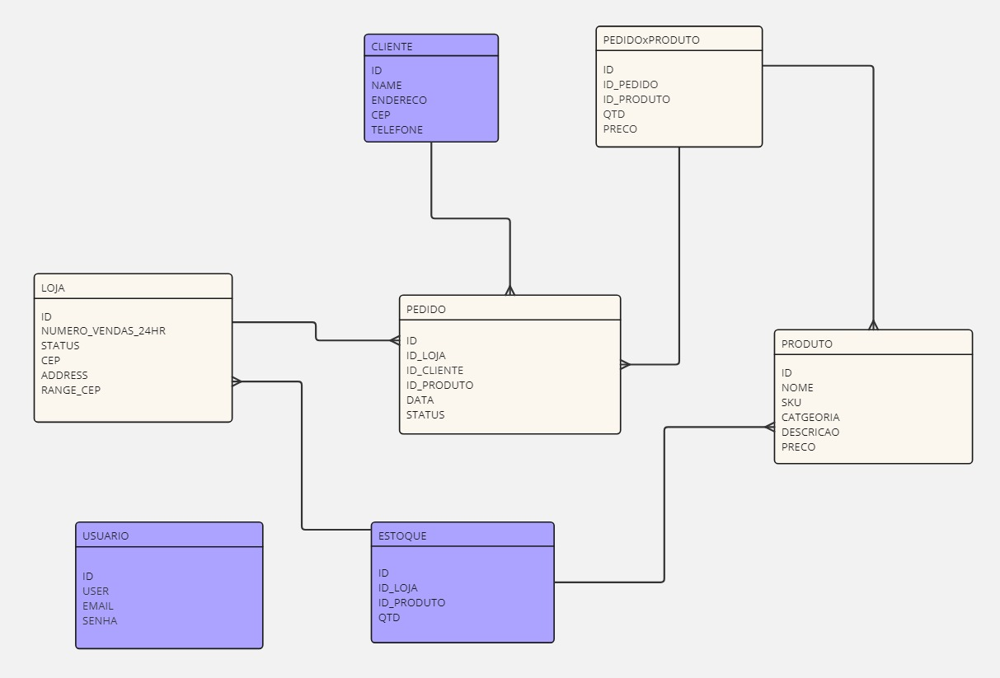
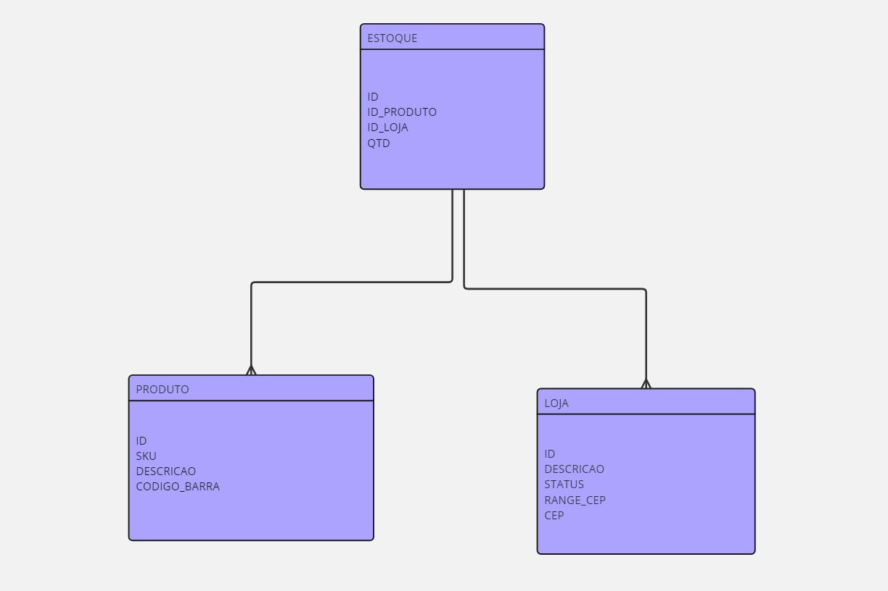

# 1. Backend

&emsp;&emsp;O backend desenvolvido para este projeto foi construído com o objetivo de fornecer uma API robusta e escalável para a gestão do inventário da Vivo. A aplicação foi implementada utilizando Node.js com Express, proporcionando uma base sólida e amplamente utilizada para o desenvolvimento de APIs RESTful.

 &emsp;&emsp;Para garantir a persistência dos dados, utilizamos o ORM Prisma, que facilita a interação com o banco de dados MySQL, permitindo que as consultas sejam realizadas de forma eficiente e com segurança. O backend foi projetado para ser facilmente escalável, possibilitando a adição de novas funcionalidades de forma modular.

 &emsp;&emsp;As principais funcionalidades do backend incluem:

* Gerenciamento de Clientes (Customers): CRUD completo para a gestão de clientes, permitindo a criação, leitura, atualização e exclusão de registros.
* Gerenciamento de Pedidos (Orders): CRUD completo para a gestão de pedidos, incluindo a possibilidade de associar produtos aos pedidos.
* Gerenciamento de Produtos (Products): CRUD completo para a gestão de produtos, com funcionalidades para manipulação de estoque e preços.
* Gerenciamento de Estoques (Stock): Controle de estoque de produtos, permitindo adicionar, remover ou consultar a quantidade disponível.
* Relação Pedido-Produto (OrderProduct): Gestão das relações entre pedidos e produtos, controlando quantidades e associações.
* Gerenciamento de Lojas (Stores): CRUD completo para a gestão de lojas, com funcionalidades para manipulação de estoque e preços.
* Gerenciamento de Usuários (Users): CRUD completo para a gestão de usuários, com funcionalidades para manipulação de estoque e preços.

&emsp;&emsp;O backend foi implementado seguindo boas práticas de desenvolvimento, como a utilização de controllers para organizar a lógica de negócio, services para a comunicação com o banco de dados via Prisma e rotas bem definidas para a interação com o frontend ou outros consumidores da API.

&emsp;&emsp;A aplicação foi testada utilizando Postman, e uma documentação detalhada das rotas foi gerada, permitindo que desenvolvedores e consumidores da API possam facilmente entender e interagir com os serviços disponíveis.

# 2. Banco de Dados

&emsp;&emsp;O banco de dados utilizado neste projeto é um MySQL hospedado no AWS RDS, escolhido por sua confiabilidade, escalabilidade e suporte a transações complexas, essenciais para a gestão de inventário e pedidos. O design do banco de dados foi modelado para suportar as operações críticas do sistema, garantindo integridade e performance.

&emsp;&emsp;Existem duas versões do banco de dados: uma versão simplificada, desenvolvida para testar o e-commerce da Vivo, e outra mais complexa, que atende a todos os requisitos do negócio, focando exclusivamente no inventário da Vivo. O objetivo da versão complexa é entregar as funcionalidades solicitadas pela Vivo, proporcionando uma maior sincronização do estoque e, ao mesmo tempo, reduzindo os custos operacionais.

&emsp;&emsp;O modelo de dados inclui as seguintes tabelas principais **relacionadas ao e-commerce**:

* Cliente: Armazena informações dos clientes, incluindo identificador único, nome, email e telefone.
* Pedido: Armazena os pedidos realizados pelos clientes, incluindo status e data de criação.
* Produto: Armazena os produtos disponíveis no inventário, com informações como nome, preço e descrição.
* Estoque: Controle de estoque dos produtos, incluindo a quantidade disponível e a localização física no armazém.
* Pedido-Produto: Tabela de relacionamento entre pedidos e produtos, especificando as quantidades de cada produto em cada pedido.
* Loja: Armazena as lojas disponíveis no inventário, com informações como nome, endereço e coordenadas geográficas.
* Usuário: Armazena as informações dos usuários do sistema, incluindo identificador único, nome, email e senha.

&emsp;&emsp;Veja a seguir a o banco de dados do e-commerce:

  Figura 1 - Banco de dados e-commerce (2024)

  

Fonte: Material produzido pelos autores (2024)

&emsp;&emsp;O modelo de dados inclui as seguintes tabelas principais **relacionadas ao MVP**:

* Estoque: Controle de estoque dos produtos, incluindo a quantidade disponível e a localização física no armazém.
* Produto: Armazena os produtos disponíveis no inventário, com informações como nome, preço e descrição.
* Loja: Armazena as lojas disponíveis no inventário, com informações como nome, endereço e coordenadas geográficas.

  Figura 2 - MVP (2024)

  

Fonte: Material produzido pelos autores (2024)

 &emsp;&emsp;Cada tabela foi projetada para garantir a normalização dos dados, evitando redundâncias e facilitando as operações CRUD. Além disso, foram implementados índices nas colunas mais acessadas para otimizar as consultas e garantir uma rápida resposta do banco de dados.

&emsp;&emsp;O banco de dados foi configurado com backups automáticos e replicação em múltiplas zonas de disponibilidade (Multi-AZ) na AWS, garantindo alta disponibilidade e recuperação de desastres. A conexão entre o backend e o banco de dados é realizada de forma segura, utilizando SSL para proteger os dados em trânsito.

&emsp;&emsp;Para gerenciar as migrações e evoluções do esquema de banco de dados, foi utilizado o Prisma Migrate, permitindo que alterações no modelo de dados fossem aplicadas de maneira controlada e versionada.

&emsp;&emsp;Para melhor visualização, uma demonstração desse backend conectado ao banco de dado pode ser visto [neste vídeo](https://drive.google.com/file/d/1Kz1Tf2nWcUpF6Q0PyvLKDY8nziqC4mxS/view?usp=sharing), assim como as rotas do Postman [nesse link](https://app.getpostman.com/join-team?invite_code=0b0f4cc56ef2cd588ac9b1bc5d4f1c7e&target_code=f3750b6ead329d02b46f961af8707f27).