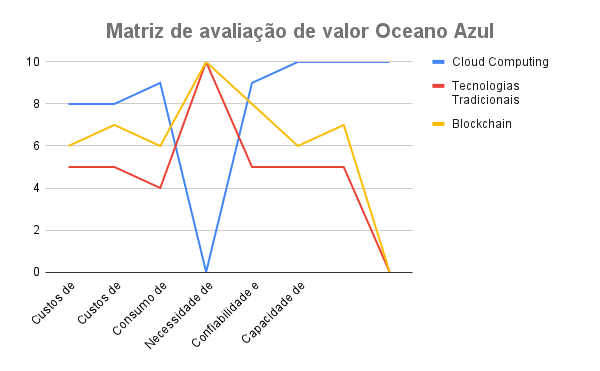
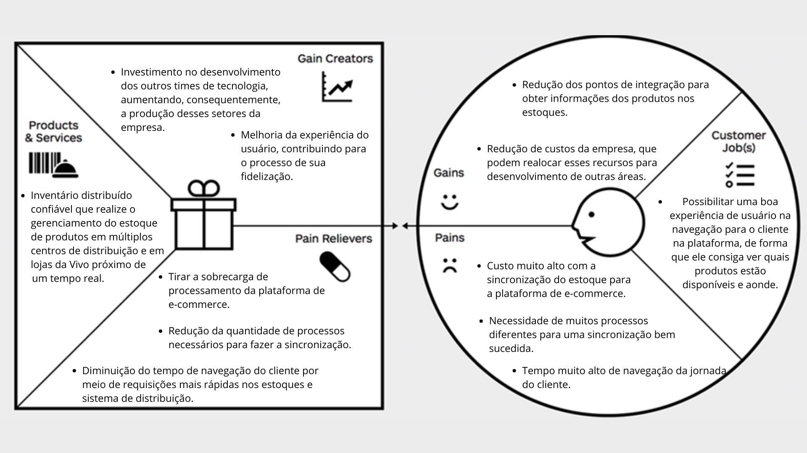
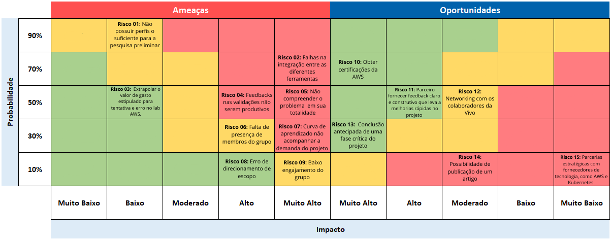

# Entendimento de negócio

## 1. Matriz de Oceano Azul

&emsp;&emsp;A Matriz do Oceano Azul aplicada ao setor de telecomunicações, introduzida para a Vivo (Telefônica) no contexto do Sistema de Inventário, tem como obejetivo desenvolver uma solução inovadora no nível do desempenho que aborde a gestão de estoques de centros de distribuição e lojas de dispositivos de comunicação e acessórios, com alto tráfego e em tempo real. Integrando fatores como alinhamento eficiente de estoque e robustez operacional, o sistema muda a forma como as operações são realizadas para alcançar melhor desempenho logístico e economias que impactam diretamente a experiência do cliente, como a velocidade da entrega e a competitividade no mercado. Dessa forma, a Vivo não pretende apenas superar suas empresas concorrentes, mas visa estabelecer referências no setor em relação à gestão de inventário.

&emsp;&emsp;A imagem a seguir apresenta a Matriz Oceano Azul, ilustrando o desempenho da Cloud para a criaçao de um Sistema de Inventário em comparação com outras ferramentas do mercado.

  Figura 01 - Matriz de avaliação de valor Oceano Azul (2024)

  

Fonte: Material produzido pelos autores (2024)

 Após a imagem, a avaliação detalhada oferece insights sobre como cada ferramenta para a criaçao Sistema de Inventário é classificado em diferentes atributos, esclarecendo as vantagens de Cloud computing para Vivo frente aos concorrentes.

### 1.1. Concorrentes em Tecnologias de Gestão de Inventário

&emsp;&emsp;Para realizar uma análise detalhada e comparativa das principais tecnologias de gestão de inventário, foram consultadas fontes que oferecem uma visão abrangente sobre as capacidades e diferenças entre cloud computing, tecnologias tradicionais e blockchain. As documentações oficiais da AWS2, Microsoft Azure3, e IBM Blockchain4 foram utilizadas para fornecer uma base sólida nas comparações entre cloud computing e blockchain, além das informações fornecidas no TAPI e workshop sobre a tecnologia atualmente utilizada. Essa pesquisa foi essencial para entender os aspectos de cada tecnologia, permitindo uma avaliação precisa das suas capacidades em relação à integração, custos de manutenção, processamento de dados em tempo real e segurança, todos aspectos críticos para a gestão eficiente de inventário em ambientes distribuídos.

- **Cloud Computing:**
  A computação em nuvem oferece uma solução moderna para a gestão de inventário, permitindo que empresas sincronizem dados em tempo real em diversos locais, eliminem a necessidade de infraestrutura física pesada e escalem suas operações de maneira eficiente. Sistemas baseados em cloud também oferecem maior segurança, flexibilidade e disponibilidade, atendendo às demandas de negócios que operam em escala nacional ou global.

- **Tecnologias Tradicionais:**
  Empresas que utilizam tecnologias tradicionais geralmente dependem de servidores locais e processos manuais, como a criação de planilhas CSV e a transferência de arquivos via métodos convencionais. Esses métodos são propensos a erros, não oferecem atualizações em tempo real e podem resultar em altos custos operacionais devido à necessidade de manutenção constante e intervenção humana. Como atualmente é utilizado na vivo de acordo com o TAPI.

- **Blockchain para Sistema de Inventário:**
  Blockchain oferece uma abordagem revolucionária para um Sistema de inventário com sua capacidade de proporcionar transparência, segurança e imutabilidade nas transações. Esta tecnologia permite rastrear produtos e transações em toda a cadeia de suprimentos de forma segura e transparente, reduzindo o risco de fraudes e erros, mas requer uma infraestrutura de rede robusta e um entendimento técnico avançado para sua implementação.

### **1.2. Reduzir**

**Custos de Infraestrutura**

- **Cloud Computing (8/10):**
  A adoção de cloud computing permite à Vivo reduzir significativamente os custos com infraestrutura física. Com a cloud, a necessidade de manter servidores locais e realizar atualizações constantes é eliminada, permitindo uma escalabilidade flexível e o pagamento apenas pelos recursos utilizados. Isso também reduz o tempo de inatividade e melhora a resposta às flutuações na demanda.

- **Tecnologias Tradicionais (5/10):**
  As tecnologias tradicionais geralmente envolvem altos custos operacionais devido à necessidade de manutenção contínua de servidores locais, atualizações manuais e backups físicos. Esses métodos podem ser menos eficientes e mais caros em longo prazo, especialmente em um ambiente de negócios dinâmico.

- **Blockchain (6/10):**
  O uso do blockchain na gestão de inventário pode oferecer redução de custos pela automatização e segurança nas transações, mas a implementação e manutenção da tecnologia blockchain podem exigir investimentos iniciais significativos e dependência de uma infraestrutura técnica especializada.

**Custo de Gerenciamento de Dados**

- **Cloud Computing (8/10):**
  A cloud permite reduzir os custos associados ao gerenciamento de grandes volumes de dados, oferecendo armazenamento escalável e ferramentas de análise de dados que podem ser ajustadas conforme a demanda. Isso elimina a necessidade de investimentos em hardware local e reduz o custo de manutenção de data centers.

- **Tecnologias Tradicionais (5/10):**
  Tecnologias tradicionais exigem um gerenciamento manual e contínuo dos dados, incluindo backups físicos e manutenção de servidores, o que pode aumentar significativamente os custos operacionais. A redução desses custos pode ser alcançada através da migração para soluções mais automatizadas e eficientes.

- **Blockchain (7/10):**
  Blockchain pode reduzir os custos de gerenciamento de dados ao descentralizar o armazenamento de dados e eliminar intermediários, melhorando a segurança e reduzindo a necessidade de grandes infraestruturas centralizadas. No entanto, requer uma infraestrutura robusta e uma integração cuidadosa com sistemas existentes para realizar seu potencial de redução de custos efetivamente.

**Consumo de Recursos Energéticos**

- **Cloud Computing (9/10):**
  A adoção de cloud computing permite uma redução significativa no consumo de recursos energéticos. Com a nuvem, a necessidade de operar e manter servidores físicos é drasticamente reduzida, uma vez que os data centers em nuvem são otimizados para eficiência energética. Além disso, muitas infraestruturas em nuvem utilizam fontes de energia renovável, contribuindo ainda mais para a sustentabilidade.

- **Tecnologias Tradicionais (4/10):**
  Tecnologias tradicionais exigem uma grande quantidade de energia para operar servidores locais, sistemas de resfriamento e outros recursos necessários para a manutenção da infraestrutura física. Isso resulta em um consumo elevado de energia e um impacto ambiental maior.

- **Blockchain (6/10):**
  Embora o blockchain ofereça benefícios em termos de segurança e transparência, ele pode consumir uma quantidade significativa de energia, especialmente em sistemas que utilizam provas de trabalho (Proof of Work). O consumo energético pode ser um fator limitante para a adoção dessa tecnologia em larga escala.

### **1.3. Eliminar**

**Necessidade de Backups Manuais**

- **Cloud Computing (0/10):**
  A computação em nuvem elimina a necessidade de backups manuais, pois oferece soluções automatizadas de backup em tempo real, garantindo que os dados estejam sempre seguros e acessíveis, independentemente de falhas ou desastres locais. 

- **Tecnologias Tradicionais (10/10):**
  Sistemas tradicionais ainda dependem de backups manuais, o que pode ser demorado, sujeito a erros e caro em termos de tempo e recursos. A necessidade de realizar backups manuais regularmente é uma limitação significativa dessas tecnologias.

- **Blockchain (10/10):**
  No blockchain, os dados são distribuídos e replicados por toda a rede, o que também elimina a necessidade de backups manuais. No entanto, a tecnologia pode ainda requerer processos complexos para recuperação de dados em alguns casos específicos.

### **1.4. Aumentar**

**Confiabilidade e Disponibilidade**

- **Cloud Computing (9/10):**
  A cloud computing aumenta significativamente a confiabilidade e a disponibilidade do sistema de inventário, graças à sua capacidade de operar em ambientes distribuídos com redundância integrada. Isso garante que os dados de inventário estejam sempre acessíveis, mesmo em casos de falha em partes da infraestrutura, o que é crucial para suportar grandes volumes de transações sem interrupções.

- **Tecnologias Tradicionais (5/10):**
  Sistemas tradicionais geralmente oferecem menor confiabilidade e disponibilidade, devido à dependência de infraestrutura local que pode falhar ou ficar sobrecarregada em momentos de alta demanda. Aumentar a confiabilidade exige investimentos contínuos em manutenção e upgrades de hardware.

- **Blockchain (8/10):**
  Blockchain pode aumentar a confiabilidade e a disponibilidade do sistema de inventário ao oferecer um registro distribuído, transparente e imutável. Isso assegura que os dados sejam consistentes e confiáveis em toda a cadeia de suprimentos, diminuindo o risco de discrepâncias e melhorando a integridade dos dados.

**Capacidade de Escalabilidade**

- **Cloud Computing (10/10):**
  A cloud computing oferece uma escalabilidade quase ilimitada, permitindo que a Vivo ajuste rapidamente a capacidade do sistema conforme a demanda. Isso é especialmente importante durante picos de venda ou em períodos de alta demanda, garantindo que o sistema continue operando sem interrupções.

- **Tecnologias Tradicionais (5/10):**
  Tecnologias tradicionais possuem limitações significativas em termos de escalabilidade, devido à necessidade de adquirir e instalar hardware adicional para suportar o aumento da carga. Isso pode resultar em tempos de resposta mais lentos e maiores custos operacionais.

- **Blockchain (6/10):**
  Enquanto o blockchain oferece benefícios de segurança e transparência, sua escalabilidade é um desafio conhecido, especialmente em sistemas que requerem transações rápidas e em grande volume. A natureza descentralizada e o consenso necessário entre os participantes podem atrasar a resposta e aumentar os custos operacionais, tornando a escalabilidade mais complexa e cara em comparação com soluções baseadas exclusivamente em cloud computing.

**Capacidade de Adaptação a Novas Tecnologias**

- **Cloud Computing (10/10):**
  A nuvem oferece uma alta capacidade de adaptação a novas tecnologias, permitindo que a Vivo integre rapidamente novas ferramentas, frameworks, e metodologias sem a necessidade de grandes alterações na infraestrutura existente. Isso é crucial para manter a competitividade em um mercado dinâmico e em constante evolução.

- **Tecnologias Tradicionais (5/10):**
  Tecnologias tradicionais têm uma capacidade limitada de adaptação a novas tecnologias, devido à sua infraestrutura rígida e à necessidade de
  upgrades físicos frequentes. Isso pode retardar a inovação e aumentar os custos de atualização.

- **Blockchain (7/10):**
  O blockchain, embora inovador, pode ter uma curva de adaptação mais lenta devido à complexidade técnica e ao desafio de integrar novos avanços sem comprometer a segurança e a integridade dos dados. No entanto, uma vez implementado, pode oferecer uma plataforma sólida para futuras inovações.

### **1.5. Criar**

**Sincronização Imediata de Estoque**

- **Cloud Computing (10/10):**
  Apenas a cloud computing permite a criação de uma sincronização imediata de estoque em tempo real entre múltiplos centros de distribuição e lojas. Isso garante que as informações de estoque sejam sempre precisas e disponíveis, melhorando a experiência do cliente e a eficiência operacional.

- **Tecnologias Tradicionais (0/10):**
  As tecnologias tradicionais não são capazes de oferecer uma sincronização de estoque em tempo real, o que pode levar a discrepâncias e atrasos na atualização de informações, impactando negativamente a operação.

- **Blockchain (0/10):**
  Embora o blockchain ofereça uma fonte de dados segura e transparente, ele não é projetado para a sincronização imediata de grandes volumes de dados em tempo real como a cloud computing, limitando sua aplicabilidade em situações onde a latência mínima é crucial.

### 1.6. Casos de Uso e Exemplos Práticos

#### 1.6.1. Sincronização Imediata de Estoque em Tempo Real

- **Caso de Uso:** 
Uma grande rede de lojas de eletrônicos, com filiais em diversas regiões, precisa garantir que o inventário seja atualizado em tempo real em todas as suas plataformas de venda, tanto online quanto físicas. Durante eventos de alta demanda, como lançamentos de novos produtos, a empresa deve evitar problemas de overselling (venda de produtos que já estão esgotados) e garantir que todos os clientes tenham acesso às informações mais precisas sobre a disponibilidade de estoque.

- **Exemplo Prático com Cloud Computing:**
Utilizando uma solução baseada em cloud computing, a rede de lojas implementa uma sincronização imediata de estoque que opera em tempo real. Cada vez que um produto é vendido ou transferido em qualquer loja ou centro de distribuição, o sistema de inventário é atualizado instantaneamente em todas as plataformas de venda. Essa sincronização garante que não ocorram vendas de produtos fora de estoque e que os clientes tenham informações precisas e atualizadas em tempo real. Durante o lançamento de um novo smartphone, o sistema é capaz de lidar com picos de demanda, processando milhares de transações simultâneas sem falhas, mantendo a precisão do inventário e melhorando a experiência do cliente.

- **Tecnologias Tradicionais e Blockchain:** 
As tecnologias tradicionais dependem de processos manuais e servidores locais, resultando em atualizações de inventário mais lentas e sujeitas a erros. Soluções baseadas em blockchain, embora ofereçam segurança e rastreabilidade, não são projetadas para suportar sincronizações de grandes volumes de dados em tempo real, tornando-as menos eficazes em ambientes de alta demanda. 

#### 1.6.2. Redução de Custos Operacionais com Backup Automatizado e Recuperação de Desastres

- **Caso de Uso:** 
Uma empresa global com múltiplos centros de distribuição precisa garantir a segurança e a disponibilidade contínua dos dados de inventário, incluindo a capacidade de recuperação rápida em caso de falha de sistema ou desastre natural.

- **Exemplo Prático com Cloud Computing:**
Implementando serviços de backup automatizado em nuvem, a empresa pode programar backups regulares e ter a certeza de que todos os dados de inventário estão seguros e acessíveis. Em caso de falha no sistema ou desastre, a recuperação dos dados é feita de forma rápida e eficiente através dos serviços de recuperação de desastres em nuvem. Isso minimiza o tempo de inatividade e garante que as operações de inventário possam continuar sem interrupções significativas. A capacidade de restaurar o sistema em minutos em vez de horas ou dias reduz os custos operacionais e evita perdas de receita.

- **Tecnologias Tradicionais e Blockchain:** 
Tecnologias tradicionais exigem backups manuais ou físicos, que são propensos a erros e demoram mais tempo para restaurar em caso de falha. Além disso, os custos de manutenção e a necessidade de espaço físico para armazenar backups aumentam os custos operacionais. O blockchain, embora seguro, não é ideal para backups frequentes ou recuperação rápida devido à natureza distribuída e ao processo complexo de reconfiguração da rede em caso de falha.

## 2. Canvas Proposta de Valor

&emsp;&emsp;O _Value Proposition Canvas_ (Canvas Proposta de Valor em Português) é uma ferramenta, em formato de _template_, que tem como objetivo ajudar a entender, dentre outros fatores, as necessidades, dores e desejos dos clientes consumidores. Por meio dele, é possível identificar o que a Vivo, mais especificadamente o time de logística, precisa como cliente, além de possibilitar a análise de quais tarefas ele precisa realizar. Dessa forma, é possível estabelecer quais são as suas dificuldades e lhe apresentar os criadores de ganhos e vantagens da solução.

Figura 02 - Value Proposition Canvas

Fonte: Material produzido pelo Grupo 5 (2024)

&emsp;&emsp;Ao examinar o _VPC_, observa-se que o parceiro tem como tarefa possibilitar uma boa experiência de usuário na navegação para o cliente na plataforma, de forma que ele consiga ver quais produtos estão disponíveis e aonde. Assim, se torna uma necessidade da Vivo a construção de um inventário distribuído confiável que realize o gerenciamento do estoque de produtos em múltiplos centros de distribuição, e em lojas da Vivo, próximo de um tempo real. Nesse sentido, ela retornaria o fluxo que cada produto deve realizar e o respectivo volume para atender os clientes.

&emsp;&emsp;Outro ponto que é possível ser analisado com o VPC são as dores do cliente. Nesse contexto, o time de logística da Vivo possui um custo muito alto com a sincronização do estoque para a plataforma de e-commerce devido a necessidade de muitos processos diferentes para uma sincronização bem sucedida. Além disso, esses processos impactam no tempo de navegação da jornada do cliente, que acaba sendo muito alto. Dessa forma, conclui-se que, para aliviar essas dores, é necessário tirar a sobrecarga de processamento da plataforma de _e-commerce_, por meio da redução de processos necessários para a sincronização do inventário, que diminui, consequentemente, o tempo de navegação do cliente por meio de requisições mais rápidas nos estoques e sistema de distribuição.

&emsp;&emsp;Assim, com o novo sistema desenvolvido por este grupo, ocorrerá a melhoria da experiência do usuário, contribuindo para o processo de sua fidelização, por conta da redução dos pontos de integração para obter informações dos produtos nos estoques. Ademais, haverá uma redução dos custos da empresa, que podem realocar esses recursos para desenvolvimento de outras áreas. Com esses ganhos, a empresa poderá investir, por exemplo, no desenvolvimento dos outros times de tecnologia, aumentando a produção desses setores da empresa, contribuindo para uma plataforma mais eficiente.

## 3. Matriz de risco

&emsp;&emsp;A matriz de risco1 é uma forma dinâmica de conseguir analisar quais são os riscos que cercam uma empresa/projeto e é importante para conseguir gerir e prever potenciais riscos, podendo eles serem vistos como ameaça, que causa impacto negativo, ou como uma oportunidade, que causa impacto positivo. Essa dupla visão é necessária para se preparar mediante qualquer situação. É comum prever uma possível crise, e é necessário se preparar para ela, mas tão importante quanto, é se preparar para impactos positivo, como por exemplo, uma oportunidade para uma empresa de crescimento repentino exponencial devido uma solução gerar o crescimento de seu superávit. No entanto, se não existir um plano de ação que permita uma base sólida de negócio, essa oportunidade de desenvolvimento excepcional pode ser perdida. Por isso, junto da matriz de risco é feito o plano de ação para cada possibilidade.

  
<b>Figura 03 </b>- Matriz de Risco 

  
  
Fonte: elaboração própria

  
<b>Quadro 1 </b>- Ameaças 

| Ameaça | Descrição | Ação | Descrição do plano de ação |
|---|---|---|---|
| **Risco 01** | Não possuir perfis o suficiente para a pesquisa preliminar | Mitigar | Como não há o que fazer nessa situação, resta aceitar e realizar o projeto com base nos conceitos de "Lean UX", que trabalha com suposições sobre os usuários. |
| **Risco 02** | Falhas na integração entre as diferentes ferramentas | Evitar | Realizar testes de integração regulares e manter uma documentação detalhada de todas as ferramentas utilizadas |
| **Risco 03** | Extrapolar o valor de gasto estipulado para tentativa e erro no lab AWS | Evitar | Usar o serviço com cautela e estudar os autoestudos antes de usar a plataforma. |
| **Risco 04** | Feedbacks nas validações não serem produtivos | Evitar | Realizar perguntas incisivas e estruturadas. |
| **Risco 05** | Não compreender o problema em sua totalidade | Evitar | Tirar dúvidas durante os momentos de validação e pedir feedback direcionado |
| **Risco 06** | Ausência de membros do grupo | Evitar | Participar ativamente das dailies, a fim de redistribuir rapidamente as tarefas, caso alguém falte. |
| **Risco 07** | Curva de aprendizado não acompanhar a demanda do projeto | Evitar | Realizar os autoestudos com qualidade e esclarecer dúvidas quando necessário. |
| **Risco 08** | Erro de direcionamento de escopo | Evitar | Revisar regularmente o escopo do projeto com todos os membros e stakeholders. |
| **Risco 09** | Baixo engajamento do grupo | Evitar | Criar momentos de descontração para manter o grupo mais interessado. |

  
<b>Quadro 02 </b>- Oportunidades 

| Oportunidade | Descrição | Ação | Plano de Ação |
|---|---|---|---|
| **Risco 10** | Obter certificações da AWS | Explorar | Realizar os autoestudos da AWS Academy com qualidade. |
| **Risco 11** | Parceiro fornecer feedback claro e construtivo que leva a melhorias rápidas no projeto | Explorar | Preparar apresentações para a validação que corroborem para esse momento. |
| **Risco 12** | Networking com os colaboradores da Vivo | Compartilhar | Conversar e aproveitar ao máximo a disponibilidade dos pontos focais e visitantes. |
| **Risco 13** | Conclusão antecipada de uma fase crítica do projeto | Aceitar | Não há garantias que isso aconteça. Contudo, caso esse momento chegue, ele será aproveitado pelos membros. |
| **Risco 14** | Possibilidade de publicação de um artigo | Explorar | Documentar as etapas de desenvolvimento e conclusão do projeto. |
| **Risco 15** | Parcerias estratégicas com fornecedores de tecnologia, como AWS e Kubernetes | Explorar | Fazer bom uso das parcerias alcançadas. |

&emsp;&emsp;É importante destacar que a matriz de risco é iterativa, o que significa que está sendo constantemente alterada, já que riscos deixam de existir por medidas resolutivas tomadas para resolvê-los. Concluindo, com a matriz de risco e as medidas do plano de ação, é possível estruturar uma solução mais segura e confiável.

## 4. Análise Financeira do Projeto

&emsp;&emsp;Nesta seção, pretende-se verificar os gastos relativos à realização do projeto, indicando o orçamento total destinado ao feitio e manutenção da plataforma. Desta maneira, pode-se compreender os custos fixos e recorrentes que são imbuídos à utilização da aplicação.

### Receita gerada

&emsp;&emsp;Com a solução, não ocorre a geração direta de receita, visto que o projeto atua com a proposta de incrementar a experiência do cliente e agilizar o trato operacional do setor logístico. Por outro lado, entende-se que, indiretamente, a melhora desses processos alavancaria a quantidade de vendas realizadas, seja pela fidelização de consumidores (vide o bom serviço prestado), seja pela melhora na distribuição de produtos nas franquias da empresa, possibilitando vendas locais instantâneas.

&emsp;&emsp;Pensando na venda desta solução e partindo de uma premissa de lucro de 20% com base no custo total estimado, pode-se imaginar que o preço ideal (sem considerar os impostos) e pensando no custo de R\$ 42.258,82 seria de R\$ 50.710,58. Pensando, por outro lado, na adição dos impostos de ICMS, IPI, PIS, e COFINS, o valor ideal de venda é de R\$ 87.810,54, para a obtenção do lucro estimado de 20%. O valor recebido pela equipe, de lucro, é de R$ 8.451.76

### Orçamento total

&emsp;&emsp;A equipe conta com um saldo de 600,00 USD (R$ 3310,44, na cotação do dia 9 de agosto de 2024) em laboratórios da _AWS_ (_Amazon Web Services_) destinado à utilização dentro da plataforma. Este valor possibilita a testagem de modelos e de versões prévias da solução final dentro de uma interface de _Cloud_ (nuvem), sendo essencial para o desenvolvimento do projeto. Vale constar que este projeto foi desenvolvido por um grupo de universitários, e tem o propósito de, além de gerar um entregável para a VIVO (empresa parceira), incentivar o aprendizado dos alunos sobre determinados assuntos.  

&emsp;&emsp;Dados estes pontos, este é todo o orçamento disposto pela equipe durante o processo de realização do projeto.

## Custos

#### Métodos de pagamento AWS

&emsp;&emsp;Existem 4 métodos de pagamento disponiveis na AWS (_Compute Savings Plans, On demand, Spot Instances_ e _EC2 Instance Savings Plans_). No caso do projeto elaborado, por se tratar de um MVP (_Minimum Viable Product_, Produto Mínimo Viável, em português), a melhor opção é o pagamento sob demanda porque ele oferece a flexibilidade necessária para ajustar os recursos de acordo com as necessidades variáveis do projeto em sua fase inicial. O pagamento sob demanda permite que você comece com uma base mínima de recursos e aumente gradualmente à medida que a demanda do MVP cresce.

&emsp;&emsp;O modelo de pagamento sob demanda é especialmente vantajoso quando se trabalha em um MVP, onde as estimativas iniciais de uso podem variar e evoluir rapidamente à medida que o projeto é refinado e desenvolvido. Não há necessidade de se comprometer com um contrato de longo prazo ou investir em recursos que possam não ser completamente utilizados no estágio inicial. Além disso, a abordagem de pagamento sob demanda alinha-se perfeitamente com os princípios ágeis e iterativos comuns na construção de um MVP.

&emsp;&emsp;No entanto, é importante monitorar de perto seus custos e considerar a transição para outras opções de pagamento, como Instâncias Reservadas ou Planos de Economia de Computação no caso de uso do projeto por parte da empresa. Essas opções podem proporcionar economias substanciais a longo prazo, à medida que você adquire mais previsibilidade em relação ao uso de recursos.

### Custo dos Serviços utilizados (Manutenção)

&emsp;&emsp;Os serviços computacionais que, neste estágio inicial, vão ser empregados no projeto estão contabilizados abaixo. A descrição disposta para cada um dos serviços é a mesma que está disponível no site da AWS para verificação.

1. **EC2 (Elastic Compute Cloud)**

&emsp;&emsp;"O Amazon Elastic Compute Cloud (Amazon EC2) oferece uma capacidade de computação escalável sob demanda na Nuvem Amazon Web Services (AWS). O uso do Amazon EC2 reduz os custos de hardware para que você possa desenvolver e implantar aplicações com mais rapidez. É possível usar o Amazon EC2 para executar quantos servidores virtuais forem necessários, configurar a segurança e as redes e gerenciar o armazenamento. Você pode adicionar capacidade (aumentar a escala verticalmente) para lidar com tarefas de computação pesada, como processos mensais ou anuais ou picos no tráfego do site. Quando o uso diminui, você pode reduzir a capacidade (reduzir a escala verticalmente) de novo.

&emsp;&emsp;Uma instância do EC2 é um servidor virtual na Nuvem AWS. Quando executa uma instância do EC2, o tipo de instância que você especifica determina o hardware disponível para sua instância. Cada tipo de instância oferece um equilíbrio diferente entre recursos de computação, memória, armazenamento e rede." (Disponível em https://docs.aws.amazon.com/pt_br/AWSEC2/latest/UserGuide/concepts.html)

   - **Custo**: Os serviços da EC2 são cobrados com base no tempo de execução das instâncias. A Região da AWS na qual esse serviço está hospedado também impacta diretamente no custo, além do tipo de instância e o uso total de recursos. A solução pretende usar o modelo sobre demanda: ou seja, o gasto será proporcional a quantidade de tempo usada. A região indicada, ademais, é a sa-east-1. A cotação foi realizada para uma instância t3.small, com uma vCPU de 2, 2 GiB de Memória Ram e performance de até 5 gigabits.

2. **AWS RDS**
   
&emsp;&emsp;"O Amazon Relational Database Service (Amazon RDS) é um serviço da Web que facilita a configuração, a operação e escalabilidade de um banco de dados relacional na Nuvem AWS. Ele fornece capacidade econômica e redimensionável para um banco de dados relacional padrão do setor e gerencia tarefas comuns de administração de banco de dados." (Disponível em: https://docs.aws.amazon.com/pt_br/AmazonRDS/latest/UserGuide/Welcome.html)

   - **Custo**: Dependendo do modelo de banco de dados utilizado, além da região e serviços adicionais, este preço varia. Ademais, ele é cobrado com base na quantidade de GB utilizados. No projeto atual, será utilizado um banco de dados com o padrão do AURORA, seguindo a definição _default_ oferecida pela AWS. O preço por hora, neste modelo, é de 0,084 USD, pensando na instância t3.small.

3. **Elastic Load Balancing (ELB)**

&emsp;&emsp;"O Elastic Load Balancing distribui automaticamente seu tráfego de entrada entre vários destinos, como instâncias do EC2, contêineres e endereços IP, em uma ou mais zonas de disponibilidade. Ele monitora a integridade dos destinos registrados e roteia o tráfego apenas para os destinos íntegros. O Elastic Load Balancing escalona automaticamente sua capacidade de balanceador de carga em resposta a mudanças ao tráfego de entrada."(Disponível em: https://docs.aws.amazon.com/pt_br/elasticloadbalancing/latest/userguide/what-is-load-balancing.html)

   - **Custo:** A AWS cobra pelo Elastic Load Balancer (ELB) com base, novamente, na demanda de utilização, utilizando dois critérios: quantidade de dados e tempo de atividade. Existem alguns modelos, cada qual com suas definições e preços distintos. Ademais, assim como nos casos anteriores, a região de implementação também consta como um diferencial na hora de compreender os custos totais.

| Serviço                      | Detalhes técnicos                   | Custo (dólares)                           |
| ---------------------------- | ----------------------------------- | ----------------------------------------- |
| EC2 (Elastic Compute Cloud)  | Sistema Operacional: Ubuntu         | Por hora, 0,0336 USD; por mês 24,9984 USD |
| AWS RDS                      | -                                   | 0,084 USD por hora, 61,32 USD por mês     |
| Elastic Load Balancing (ELB) | Revisão e otimização da arquitetura | 0,034 USD e 24,82 USD por mês             |

\*_Cotação do dólar: R$ 5,50 (09/08/2024)_

&emsp;&emsp;Os custos totais associados dessa sessão, seguindo a cotação do dólar americano do dia de escrita desse documento (09/08/2024), são de: R$ 611,19 por mês (isto considerando a média prevista de 278 visitas/minuto para a plataforma em questão).

&emsp;&emsp;Em versões posteriores desse planejamento, com adição ou remoção de serviços, este valor pode ser alterado.

# Custos de desenvolvimento

&emsp;&emsp;Considerando a mão de obra especializada aplicada no desenvolvimento do projeto, é essencial citar os custos para a prestação de serviços durante a produção da aplicação. As estimativas foram feitas com base nos salários e valores médios disponíveis na internet e refletem uma previsão.

1. **Duração do projeto** - O Desenvolvimento da Solução dura um período de 10 semanas.

2. **Salário de cada desenvolvedor** - Baseado na remuneração média de um Desenvolvedor disponibilizada pelo Glassdoor no seguinte _link_: https://www.glassdoor.com.br/Sal%C3%A1rios/desenvolvedor-sal%C3%A1rio-SRCH_KO0,13.htm

3. **Custos relacionados à manutenção do projeto** - Neste caso, são destacados os custos operacionais e de manutenção cobrados pela AWS pelo uso da infraestrutura de Nuvem utilizada para disponibilizar a aplicação.

4. **Horas totais** - Considera-se aqui o tempo estimado pela Faculdade para o desenvolvimento e estudo relacionado ao projeto. Este somatório total é indicado como sendo de 240h para o período de 10 semanas.

5. **Remuneração por hora** - Baseando-se no salário médio estimado e a quantidade de horas trabalhadas, pode-se dizer que a remuneração por hora para Desenvolvedor seria de R$ 41,67.

6. **Custo total de desenvolvimento do projeto** - Somados os custos mensais com os salários, encontrou-se o valor total de: R\$ 36615,99 , que equivale ao custo total do desenvolvimento do projeto, sendo que R\$ 611,19 são custos mensais e recorrentes da AWS e 36000 é o salário dos desenvolvedores junior na Vivo SP (disponibilizado no Glassdoor). Com a aplicação dos impostos sob salários, o valor do salário total pago é de R\$ 41.647,56. Com o valor da AWS, o custo total é de R\$ 42.258,82.

| Item                                   | Descrição                                | Valor       |
| -------------------------------------- | ---------------------------------------- | ----------- |
| Duração do projeto                     | 10 semanas                               | -           |
| Número de integrantes no time          | 6 desenvolvedores                        | -           |
| Salário mensal para cada desenvolvedor | Média salarial da Vivo para Desenvolvedores Junior            | R$ 3.000,00 |
| Salário adicionado ao imposto | Salário acrescido do imposto        | R$ 3.470,63 |
| Horas disponíveis                      |                                          | 240h        |
| Remuneração por hora                   | Salário mensal \* 2 meses / horas totais | R$ 25,00   |
| Custo de desenvolvimento do projeto sem os impostos   | Salários + Valor da AWS           | R$ 36.615,99 |
| Custo de desenvolvimento do projeto com os impostos  | Salários + impostos + Valor da AWS         | R$ 42.258,82 |

## Conclusão

&emsp;&emsp;A análise financeira do projeto revela uma estrutura de custos bem definida, com foco nos principais serviços da AWS utilizados para sua implementação. Os serviços incluem o Amazon EC2, que oferece capacidade de computação escalável e foi configurado com uma instância t3.small, o Amazon RDS, que proporciona um banco de dados relacional gerenciado com o modelo Aurora, e o Elastic Load Balancing, que distribui o tráfego de entrada entre várias instâncias para garantir a estabilidade da aplicação.

&emsp;&emsp;Esses serviços foram selecionados para atender às necessidades técnicas do projeto, proporcionando a base necessária para o desenvolvimento e operação da solução. Os custos totais, incluindo tanto os valores dos serviços da AWS quanto os salários dos desenvolvedores, foram estimados em aproximadamente R$ 36.615,99 para o período de desenvolvimento, com R$ 611,19 em custos mensais recorrentes. 

&emsp;&emsp;O planejamento financeiro abrange todos os aspectos críticos do projeto, assegurando que os recursos sejam utilizados de maneira eficaz para cumprir os objetivos propostos. A previsão detalhada dos custos permite uma visão clara do investimento necessário, garantindo que o projeto se mantenha dentro do orçamento estabelecido.

&emsp;&emsp;As informações adicionais relativas ao cálculo desses valores está apresendado no Link abaixo:

[Planilha do Google Docs com a Análise Financeira](https://docs.google.com/spreadsheets/d/1sbisWipE7Iy5LCplBc6p6WHJWWkhETQrnMqli3u8SJo/edit?usp=sharing)

&emsp;&emsp;Os custos e porcentagens estão especificados e podem ser alterados para futuros novos cálculos. Ademais, todos os cálculos realizados estão disponívei no link representado, como justificativa dos cálculos e métricas.

# Referências

Amazon EC2 on demand - Preço sob demanda - AWS. Disponível em: https://aws.amazon.com/pt/ec2/pricing/on-demand/. Acesso em: 13 ago. 2024.

AWS. AWS Pricing Calculator. Disponível em: https://calculator.aws/#/. Acesso em: 13 ago. 2024.

ESFERA ENERGIA. Matriz de risco: o que é, quando usar e como montar uma tabela. esferablog. Disponível em: https://blog.esferaenergia.com.br/gestao-empresarial/matriz-de-risco. Acesso em: 07 ago 2024.

GUSHIKEN, A. "Value Proposition Canvas: o que é e como funciona essa metodologia?" Disponível em: https://g4educacao.com/portal/value-proposition-canvas . Acesso em: 12 ago. 2024.

GLASSDOOR. Salário mensal de Desenvolvedor Júnior da empresa Vivo (Telefônica Brasil). Disponível em: https://www.glassdoor.com.br/Pagamento-mensal/Vivo-Telef%C3%B4nica-Brasil-Desenvolvedor-J%C3%BAnior-Pagamento-mensal-E8338_D_KO23,43.htm. Acesso em: 13 ago. 2024.

IBM. IBM Blockchain - Enterprise Blockchain Solutions & Services. Disponível em: https://www.ibm.com/blockchain. Acesso em: 13 ago. 2024.

Microsoft Learn: Desenvolva habilidades que abrem portas em sua carreira. Disponível em: https://learn.microsoft.com/pt-br/. Acesso em: 18 ago. 2024.

O que é o Amazon EC2? - Amazon Elastic Compute Cloud. Disponível em: https://docs.aws.amazon.com/pt_br/AWSEC2/latest/UserGuide/concepts.html. Acesso em: 13 ago. 2024.

O que é o Amazon Relational Database Service (Amazon RDS)? - Amazon Relational Database Service. Disponível em: https://docs.aws.amazon.com/pt_br/AmazonRDS/latest/UserGuide/Welcome.html. Acesso em: 13 ago. 2024.

‌O que é Elastic Load Balancing? - Elastic Load Balancing. Disponível em: https://docs.aws.amazon.com/pt_br/elasticloadbalancing/latest/userguide/what-is-load-balancing.html. Acesso em: 13 ago. 2024.

Serviços de computação em nuvem - Amazon Web Services (AWS). Disponível em: https://aws.amazon.com/pt/. Acesso em: 18 ago. 2024.

