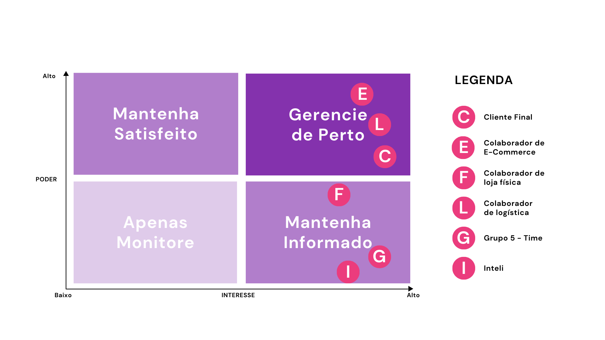
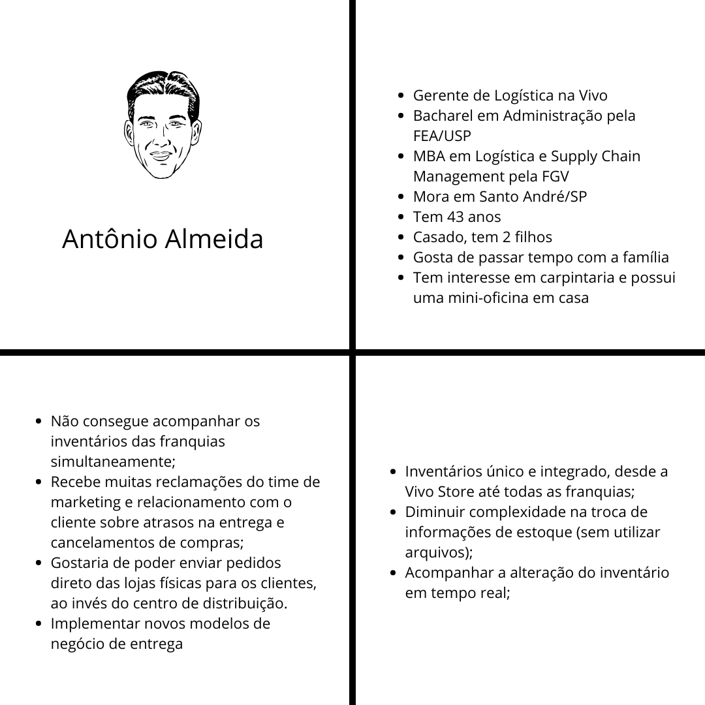
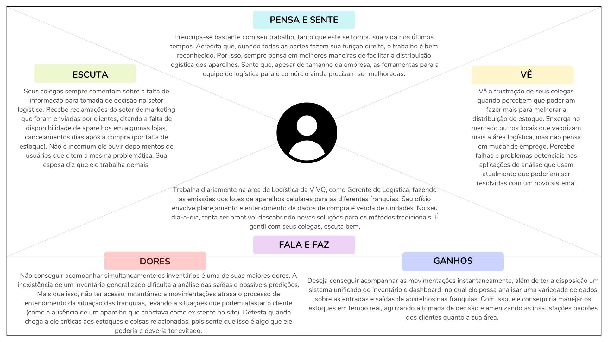
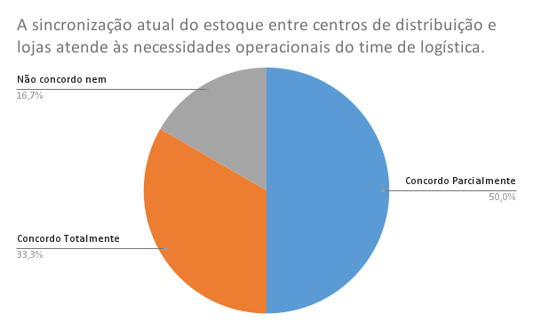
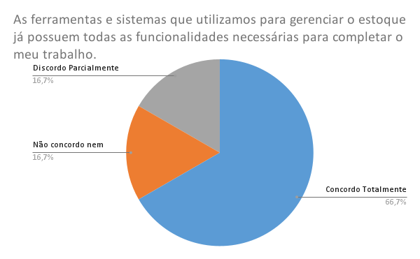
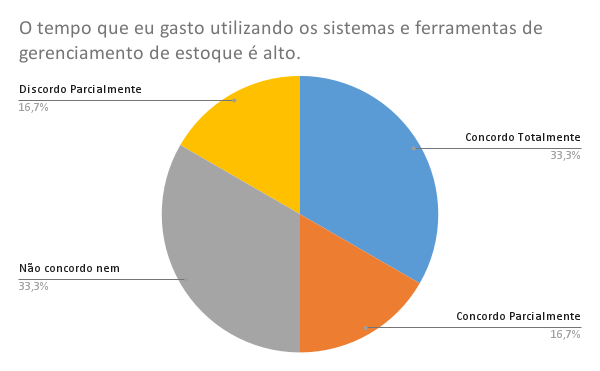
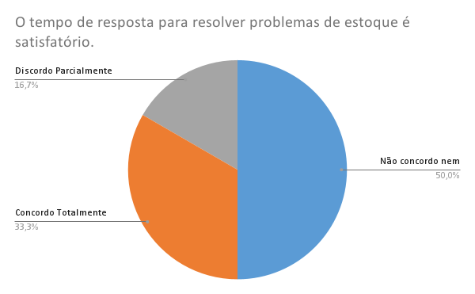
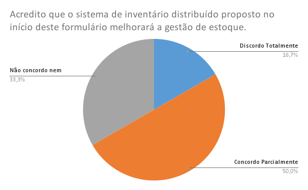
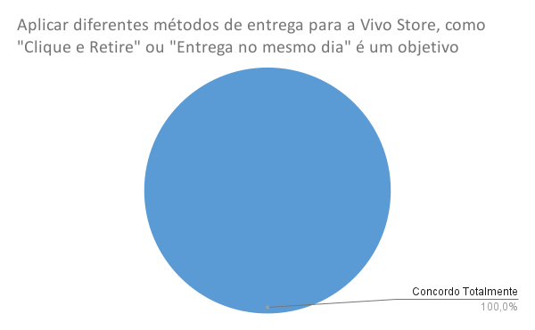
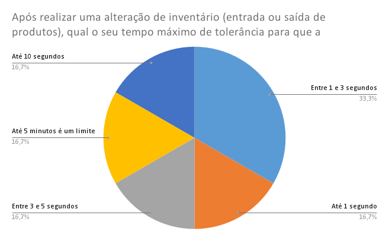

# Entendimento do usuário

&emsp; &emsp; Neste documento serão abordados os resultados da pesquisa no que tange à experiência do usuário da Vivo, dando destaque para aqueles que estão diretamente ligados com o projeto a ser desenvolvido. Este entendimento passou por um processo de 6 etapas: imersão preliminar, proto-persona, matriz de interesse/poder, mapa de empatia, pesquisa qualiquantitativa e elaboração de persona. 
&emsp; &emsp; Optou-se por serguir um processo com mais etapas para entender da melhor maneira possível o comportamento do usuário. Além disso, embora as metodologias aqui utilizar também buscassem eliminar quaisquer vieses, a separação de temas feita dentre os grupos da sala fez com que este grupo seguisse com o entedimento do perfil dos colaborades de logística, o que pode acabar direcionando para um lado.

&emsp; &emsp; Assim, o principal objetivo desta pesquisa é compreender o perfil dos colaboradores de logística da Vivo, mapeando suas necessidades, dores e expectativas. Por meio de de uma abordagem qualiquantitativa, busca-se obter uma visão sobre os principais fatores que impactam diretamente a eficiência das operações logísticas e a satisfação dos clientes da Vivo. Essa análise servirá como base para a construção de uma solução que atenda aos reais desafios identificados nos stakelholders.

&emsp; &emsp; Essa pesquisa se faz necessisária pois uma solução não deve apenas resolver problemas técnicos, mas deve ser, sobretudo, centrada no usuário. Isso garante que projeto venha a garantir que as decisões de design e desenvolvimento estejam alinhadas com a realidade operacional e com as expectativas de quem lida diretamente com as demandas logísticas da Vivo no dia a dia.

## 1. Imersão preliminar

&emsp; &emsp; Inicialmente, foi necessário realizar a leitura do Termo de Abertura do Projeto - Inteli (TAPI) para entender do que o problema trazido pelo parceiro se tratava. Após discussões internas neste grupo de desenvolvedores, foi percebido que o ponto focal do problema era uma questão logística e, por isso, decidiu-se pela execução de uma pesquisa das principais reclamações destinadas à empresa Vivo nos sites [Reclame Aqui](https://www.reclameaqui.com.br/empresa/vivo-celular-fixo-internet-tv/) e [Proteste](https://www.proteste.org.br/reclame/lista-de-reclamacoes-publicas?company=300000927). Essa consulta objetivava entender quais os principais impactos que uma logística não otimizada trariam para os clientes que compravam na [Vivo _Store_](https://store.vivo.com.br/). Com isso, foram observados como principais pontos:

- A entrega de um produto comprado na Vivo _Store_ depois do prazo inicialmente informado;

- Cancelamento de uma compra realizada na Vivo _Store_ por falta de estoque, mesmo depois do pagamento confirmdo;

- Entrega de produto adiquirido na Vivo _Store_ não entregue.

&emsp; &emsp; Nessa linha de raciocínio, o grupo priorizou o primeiro dos pontos para compôr um cenário hipotético e validá-lo junto ao parceiro durante o momento de _kick-off_. Assim, criou-se o seguinte cenário, representando a fala de um cliente da Vivo _Store_:

> “Comprei um telefone na Vivo Store com a expectativa de recebê-lo no prazo estimado, mas o envio demorou mais do que o previsto. Espero que possam melhorar a previsão de entrega para futuras compras.”

&emsp; &emsp; A apresentação deste cenário foi acompanhada de uma proposta de solução para evitar tentar mitigar esse problema, e, com isso, transformá-lo em outra experiência, como descrito abaixo:

> “Recebi o telefone que comprei na Vivo Store exatamente no prazo estimado e estou muito satisfeito com a pontualidade da entrega. Agradeço pelo excelente serviço!”

&emsp; &emsp; A intenção dessa apresentação foi ratificar o entendimento do grupo acerca do problema, uma etapa importante antes de partir para o desenvolvimento de uma solução propiamente dita. Além disso, foi feita uma série de perguntas para delimitar qual o melhor caminho a ser trilhado na busca por um projeto assertivo que ataque exatamente as dores dos usuário.

### 1.2 Proto-persona

&emsp; &emsp; Modelos são criados para representar fenônemos complexos com um determinado grau de abstração. Da mesma maneira que economistas criam modelos para descrever o comportamento do mercado, e físicos criam modelos para descrever o comportamento subatômico de partículas, é necessário criar um modelo descritivo de um usuário ao se projetar algo para ele. Este modelo é chamado de **persona** (COOPER _et al._, 2014).

&emsp; &emsp; Contudo, fazer essa representação envolve uma pesquisa aprofundada, baseando-se, dentre outras coisas, nos resultados de pesquisas aos perfis que pretende-se mapear. Isso não implica, no entanto, que não se deva desenhar um retrato do usuário baseado em suposições. A este tipo de modelagem, conforme apontado por Gothelf e Seiden (2013), dá-se o nome de **proto-persona**. 

&emsp; &emsp; Este grupo seguirá a metodologia apresenta por esses autores, esquematizando uma proto-persona com base em suposições e na observação dos dados preliminares disponíveis. Em seguida, será aplicada um questionário para validá-la e construir uma persona mais fidedigna. Essa confecção pode ser observada nas seções a seguir.

### 1.3 Matriz de poder/interesse

&emsp; &emsp; Analisar os _stakeholders_ é importante para determinar de quem os interesses devem ser levados em consideração ao longo de um projeto. Existem diversas formas de realizar essa análise. Este grupo utilizará uma técnica descrita no _PMBOK Guide_: a matriz de poder/interesse. Essa matriz consiste em agrupar os _stakeholders_ de acordo com os seus níveis de autoridade (poder) e de preocupação (interesse) com os resultados de um projeto (PROJECT MANAGEMENT INSTITUTE, 2013).

&emsp; &emsp; Para iniciar o preenchimento desta matriz, foi necessário, primeiro, identificar os principais _stakeholders_. Nesse sentindo, definiu-se que os de maiores relevância para o projeto são:

- **Cliente Final**: Caracterizados pelos clientes que compraram e/ou tiveram intenção de comprar algum produto da Vivo;

- **Colaborador do _E-Commerce_**: Equipe da Vivo responsável pela manutenção da Vivo _Store_, o _e-commerce B2C_ da Vivo;

- **Colaborador de Loja Física**: Equipe responsável pelo contato e atendimento direto nas lojas e quiosques físicos da Vivo;

- **Colaborador de Logística**: Equipe da Vivo responsável pela entrega dos produtos adquiridos na Vivo _Store_ e pela integridade do estoque dos centros de distribuição e das lojas físicas da Vivo;

- **Grupo 5**: Este grupo de desenvolvedores, o qual participará da construção da solução;

- **Inteli**: A faculdade deste grupo, cuja função é mediar e acompanhar o desenvolvimento do projeto.

&emsp; &emsp; Em vista disso, a distribuição na matriz é exibida na figura 1.

<b>Figura 01.</b> Matriz poder/interesse

<b>Fonte:</b> Elaborada pelos autores

- **Cliente Final**: Médio/Alto poder e alto interesse. Como o cliente final é o mais impactado pelo desenvolvimento desta solução, é incotestável que ele possua um alto interesse no desenvolvimento dela. Ao mesmo tempo, por mais que não participe diretamente do seu processo de construção, a solução acaba sendo moldada de forma a atender esse perfil e, portanto, eles possuem um poder médio/alto.

- **Colaborador do _E-Commerce_**: Alto poder e alto interesse. Por se tratar de funcionários da própria Vivo, é incontestável seu alto nível de poder no desenvolvimento da solução. Aliás, é justamente com esse público que acontecerão as validações ao final de cada sprint. Outrossim, o nível de interesse também é elevado, haja vista que o problema trazido é um gargalo identificado por esta equipe.

- **Colaborador de Loja Física**: Médio/Baixo poder e alto interesse. Aqui, o vendedor que atua nas lojas físicas possui um alto interesse na solução, haja vista que isso poderia converter mais clientes durante períodos de compra pr

- **Colaborador de Logística**: Alto poder e alto interesse. Nesse cenário, é levado em consideração os reponsáveis pelo despacho de produtos dos centros de distribuição, seja para as lojas, seja para os clientes. Tanto o poder quanto o interesse são altos, haja vista que, além de quererem que esta solução seja feita para possibilidar uma série de entregas mais rápidas e com menores taxas de cancelamento, este grupo também guia como a solução deve ser estruturada.

- **Grupo 5**: Baixo poder e alto interesse. A construção desta solução é de grande interesse para o grupo, haja vista a oportunidade de aprendizado e a vontade de ver o cliente utilizando algo produzido por estes desenvolvedores. Contudo, o poder é elencado como baixo, uma vez que, ainda que o grupo possa optar pela forma como vai modelar o problema, representá-lo de maneira visual, etc., as decisões finais acabam recaindo sobre o parceiro (Vivo).

- **Inteli**: Baixo poder e alto interesse. Ainda que a faculdade tenha um enorme interesse no desenvolvimento do projeto, o seu poder é baixo, haja vista que a instituição haje mais no sentido de intermediar e oferecer a parceria entre alunos - empresas.

&emsp; &emsp; Um dos _insights_ que essa matriz oferece é que, geralmente, as personas mapeadas estão no quadrante "Gerencie de perto". Sabendo disso, o perfil do usuário a ser mapeado aqui concentra-se no cliente final, no colaborador do e-commerce e no colaborador de logística. Para esta análise, seguiremos com o perfil do colaborador de logística.

&emsp; &emsp; Sabendo disso, é possível criar a proto-persona com base nas suposições levantadas por este grupo, bem como em validações feitas no LinkedIn. A imagem abaixo retrata as conjecturas elaboradas por este grupo.

<b>Figura 02.</b> Proto-persona

<b>Fonte:</b> Elaborada pelos autores

### 1.4 Mapa de empatia

&emsp; &emsp; Para continuar o processo de entendimento do perfil do Antônio Almeida, outra ferramenta útil é o mapa de empatia, que consiste em uma ferramenta visual usada para entender profundamente o usuário, facilitando a construção de personas ao explorar suas necessidades, dores e motivações. Ele divide o conhecimento sobre o usuário em categorias como o que ele vê, ouve, pensa, sente, fala e faz, permitindo que equipes de design criem soluções centradas em suas perspectivas. O mapa de empatia do Antônio é visualizado abaixo.

<b>Figura 03.</b>Mapa de empatia

<b>Fonte:</b> Elaborada pelos autores

## 2. Pesquisa qualiquantitativa

&emsp; &emsp; Para sair do campo das suposições, foi necessário pensar na elaboração de uma pesquisa qualiquantitativa destinada à equipe de logística da Vivo. Para tal, foi elaborada uma lista de hipóteses com o intuito de guiar a investigação sobre o perfil dos colaboradores de logística. Com base nessas hipóteses, foi desenvolvida uma série de perguntas que visavam confirmar ou refutar cada uma delas. Um ponto importante é que as perguntas foram construídas de forma que não induzissem uma resposta para quem estava respondendo. O quadro a seguir apresenta as hipóteses formuladas e suas respectivas perguntas, permitindo que as hipóteses sejam aceitas ou refutadas.

<b>Quadro 01.</b>Mapa de empatia

| Hipótese | Pergunta |
|---|---|
| A satisfação do time de logística não está boa para a ferramenta utilizada atualmente. | A sincronização atual do estoque entre centros de distribuição e lojas atende às necessidades operacionais do time de logística. (Avalie em uma escala de 1 a 5, sendo 1 discordo totalmente e 5 concordo totalmente) |
| O time de logística sente que a quantidade de ferramentas atualmente não é adequada para gerenciar todos os centros de distribuição. | As ferramentas e sistemas que utilizamos para gerenciar o estoque já possuem todas as funcionalidades necessárias para completar o meu trabalho. (Avalie em uma escala de 1 a 5, sendo 1 discordo totalmente e 5 concordo totalmente) |
| Os colaboradores de logística estão insatisfeitos com o tempo de atualização da solução atual e, por isso, gostariam do menor tempo de resposta possível para a nova solução. | O tempo que eu gasto utilizando os sistemas e ferramentas de gerenciamento de estoque é alto. (Avalie em uma escala de 1 a 5, sendo 1 discordo totalmente e 5 concordo totalmente) |
| Os colaboradores de logística estão insatisfeitos com o tempo de atualização da solução atual e, por isso, gostariam do menor tempo de resposta possível para a nova solução. | Após realizar uma alteração de inventário (entrada ou saída de produtos), qual o seu tempo máximo de tolerância para que a informação fosse alterada na solução? |
| O sistema de inventário distribuído proposto melhorará a gestão de estoque. | Acredito que o sistema de inventário distribuído proposto no início deste formulário melhorará a gestão de estoque. (Avalie em uma escala de 1 a 5, sendo 1 discordo totalmente e 5 concordo totalmente) |
| Aplicar diferentes métodos de entrega para a Vivo Store, como "Clique e Retire" ou "Entrega no mesmo dia" é um objetivo de curto prazo. | Aplicar diferentes métodos de entrega para a Vivo Store, como "Clique e Retire" ou "Entrega no mesmo dia" é um objetivo desejável. (Avalie em uma escala de 1 a 5, sendo 1 discordo totalmente e 5 concordo totalmente) |

<b>Fonte:</b> Elaborada pelos autores

&emsp; &emsp; Ademais, foram elaboradas duas perguntas disserativas, nas quais os respondentes foram convidados a expôr seu ponto de vista de forma livre, sem a presença de altenativas. Estas pergunta objetivavam entender quais funcionalidades poderiam ser acrescidas na solução, bem como delimitar melhor a persona deste grupo. Estas perguntas foram:

> "O que mais te incomoda no sistema de inventário atual? Você já tomou alguma medida, ainda que pequena, para facilitar esse processo?"

e

> "Pode descrever um caso recente em que o time de logística enfrentou um desafio crítico relacionado ao estoque? Como a situação foi resolvida?"

&emsp; &emsp; Estas perguntas foram compiladas em um formulário dentro da plataforma _Microsoft Forms_ e encaminhado para que os colabores de logística da Vivo pudessem respondê-lo, a fim de entender como eles se sentem em relação ao sistema atual e possibilidades de mudanças. Veja a seguir as perguntas enviadas e as respostas.

&emsp; &emsp; Por fim, considerando que a proto-persona não pode ser validada, assim como nenhuma nova informação conseguiu ser acrescentada, é possível conferir a persona deste grupo no template abaixo.

<b>Figura 4</b> - Antônio Almeida - Persona

<b>Fonte:</b> Elaborada pelos autores

## Pesquisa com profissionais de logística da Vivo

  
<b>Figura 4.</b> Pergunta 1 

  
  
Fonte: elaboração própria

&emsp; &emsp; A maioria dos usuários concorda que a sincronização atual atende às necessidades operacionais, com duas pessoas concordando totalmente e três parcialmente, sugerindo uma percepção positiva, refutando parcialmente a hipótese de que os usuários não estão satisfeitos.

  
<b>Figura 05</b> - Pergunta 2 

  
  
Fonte: elaboração própria

&emsp; &emsp; Três usuários concordam totalmente que as funcionalidades são suficientes, e outros dois parcialmente, refutando a hipótese de que os usuários não estão satisfeitos com as ferramentas utilizadas atualmente.

  
<b>Figura 5</b> - Pergunta 3 

  
  
Fonte: elaboração própria

&emsp; &emsp; Metade dos usuários concorda, total ou parcialmente, que o tempo gasto com os sistemas e ferramentas de gerenciamento de estoque é elevado, o que está de acordo com a hipótese de que os usuários estão insatisfeitos com o tempos de atualização do sistema atual.

  
<b>Figura 6</b> - Pergunta 4 

  
  
Fonte: elaboração própria

&emsp; &emsp; Metade dos repondentes está neutra em relação à satisfação com o tempo de resposta para resolver problemas de estoque, refutando a hipótese de que os usuários querem o menor tempo possível.

  
<b>Figura 7</b> - Pergunta 5 

  
  
Fonte: elaboração própria

&emsp; &emsp; Metade dos usuários concorda parcialmente que o sistema de inventário proposto melhorará a gestão de estoque, concordando parcialmente com a hipótese de que o sistema de inventário distribuído melhorará a gestão de estoque.

  
<b>Figura 8</b> - Pergunta 6 

  
  
Fonte: elaboração própria

&emsp; &emsp; Todos os usuários concordam totalmente que a aplicação de diferentes métodos de entrega, como "Clique e Retire" ou "Entrega no mesmo dia", faz sentido para a Vivo, o que está de acordo com a hipótese proposta.

  
<b>Figura 9</b> - Pergunta 7 

  
  
Fonte: elaboração própria

&emsp; &emsp; Metade dos usuários prefere que as atualizações ocorram em até 3 segundos, mostrando necessidade de velocidade.

#### O que mais te incomoda no sistema de inventário atual?

> "Tenho que colocar informações em sistemas diferentes para tipos diferentes de entregas. Demora para trocar de um sistema para outro."

>"Na minha área não vejo problemas relacionados a inventário ou gestão de estoque, apenas vejo problemas nas integrações com a loja online."

> "Processo ainda manual, sem uso de coletores."

> "NA"

> "Temos abundância de dados, mas em sua maioria em bases, servidores e transações SAP distintas. Também é extremamente penoso para termos dados de D0. Realizei com o time a criação de dashboards que concatenam dados importantes para visibilidade de estoques e tomada de decisões. Agora, temos que avançar para que essa solução traga dados online e não somente informações históricas."

> "Não possuímos impacto no sistema atual."

&emsp; &emsp;As principais dificuldades relatadas pelos usuários incluem a necessidade de trabalhar com múltiplos sistemas para diferentes tipos de entregas,o que será resolvido pelo sistema proposto. Além disso processos manuais e a dispersão de dados em diferentes servidores e sistemas SAP dificultam o acesso a informações em tempo real, o que ressalta a relevância do projeto.

#### Pode descrever um caso recente em que o time de logística enfrentou um desafio crítico relacionado ao estoque? Como a situação foi resolvida?

> "Lançamento do Galaxy S24 faltaram unidades. Pedimos apoio para a Samsung repor em tempo menor que o normal. Atrasamos alguns dias as entregas, mas garantimos quem comprou no pré-lançamento e os primeiros do lançamento."

> "Venda de materiais como pré-venda (lançamentos). Problema: Como controlar e garantir estoque para todos os pedidos recebidos. Solução: Estoque virtual com controle dentro da loja online disparando os pedidos somente após a chegada dos materiais nos CDs. Foi definido um volume que os CDs iriam receber, realizando o abatimento do saldo na loja conforme entravam os pedidos. Após o encerramento desta quantidade, o produto foi retirado da vitrine, e o processamento dos pedidos realizados foi enviado para o ERP após o período de pré-venda, reduzindo e até mesmo eliminando o risco de ruptura."

> "A falta de estoque de algum produto é resolvida atuando diretamente no aumento da conversão de forma avançada, evitando transferências. Produtos que estavam sistemicamente disponíveis, mas não fisicamente."

> "Enfrentamos recentemente um problema crítico de escassez de supply de um produto/fornecedor extremamente importante. Para mitigar a falta de estoques, utilizamos algumas soluções: 
  1.Transferências entre CDs;
  2.Transferências entre lojas via crowdshipping;
  3.Rateio de escassez entre canais de venda;
  4.Redução dos volumes de abastecimento das lojas e aumento da frequência de entregas, proposto por nossa ferramenta de abastecimento."

> "Não tivemos."

&emsp; &emsp; Considerando as situações apontadas, o sistema de inventário distribuído ajudaria a mediar todas as transações mais rapidamente ao permitir uma troca de informações em menor tempo.

&emsp; &emsp; A partir do formulário, foi possível comprovar algumas hipóteses, refutar outras e conhecer outros contextos em que o sistema poderá ser usado. Além disso, foi possível construir uma persona mais fidedigna, conforme ilustra a imagem abaixo.

<b>Figura 10.</b> Antônio Almeida - Persona

<b>Fonte:</b> Elaborada pelos autores

## Referências bibliográficas.

COOPER, A. _et al._. **About Face:** The Essentials of Interaction Design. Indianopolis: Wiley, 2014.

GOTHELF, J., SEIDEN, J. **Lean UX:** Applying Lean Principles to Improve User Experience. Sebastopol: O’Reilly, 2013.

PROJECT MANAGEMENT INSTITUTE. **A Guide to the Project
Management Body of Knowledge**. Newtown Square: Project Management Institute, 2013
