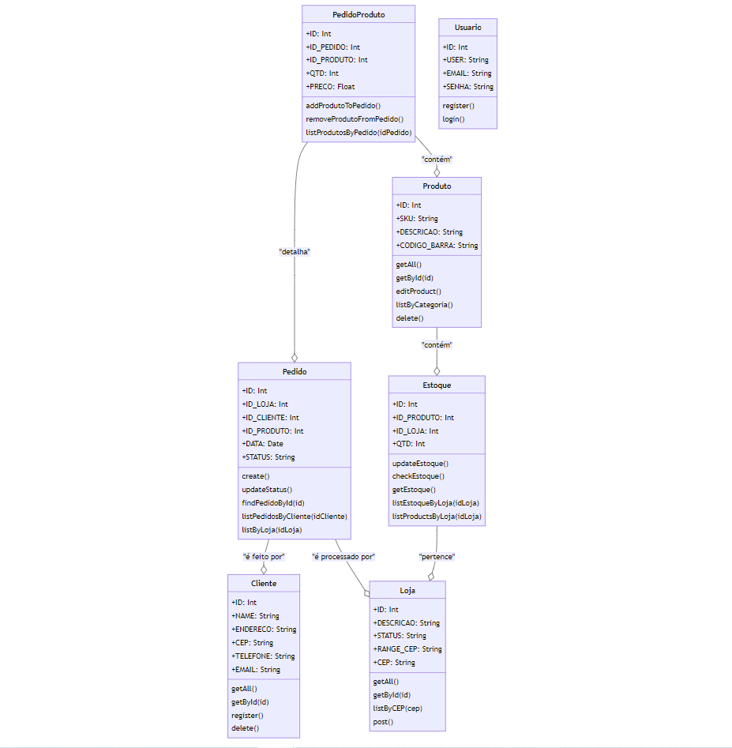
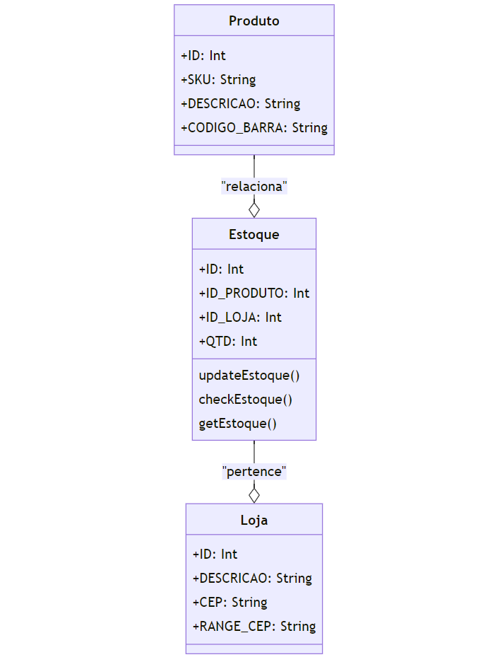
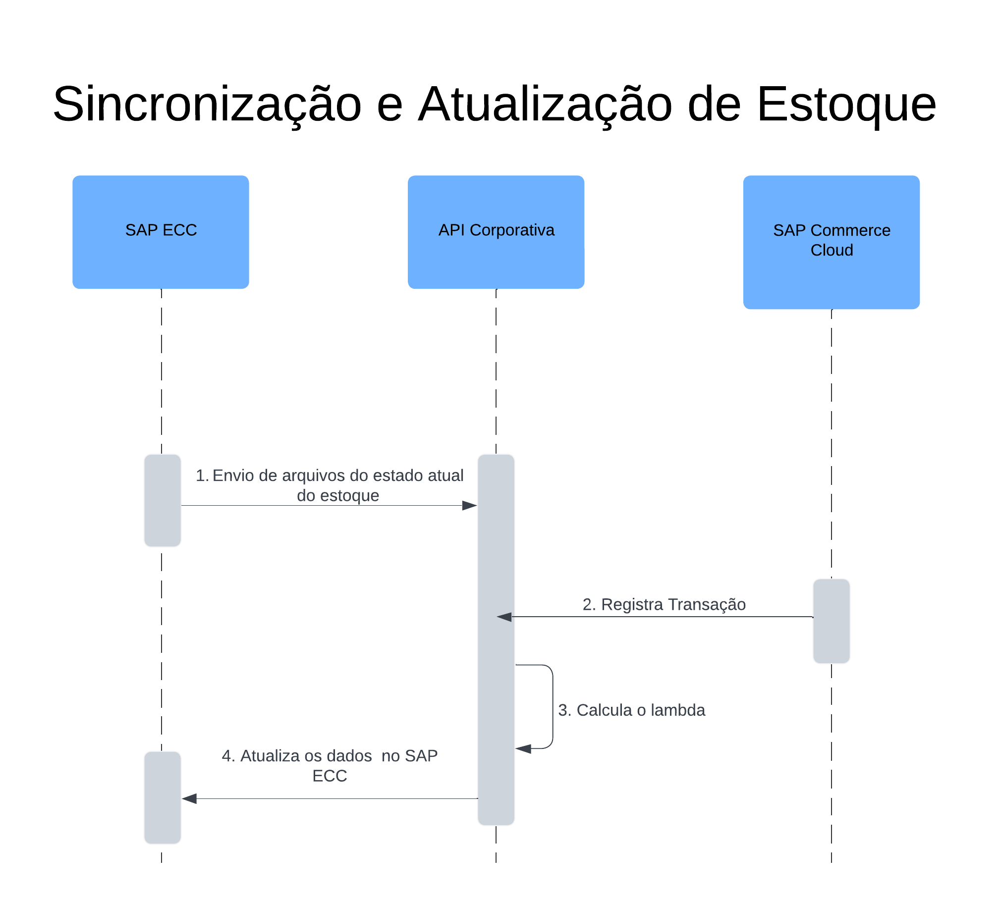
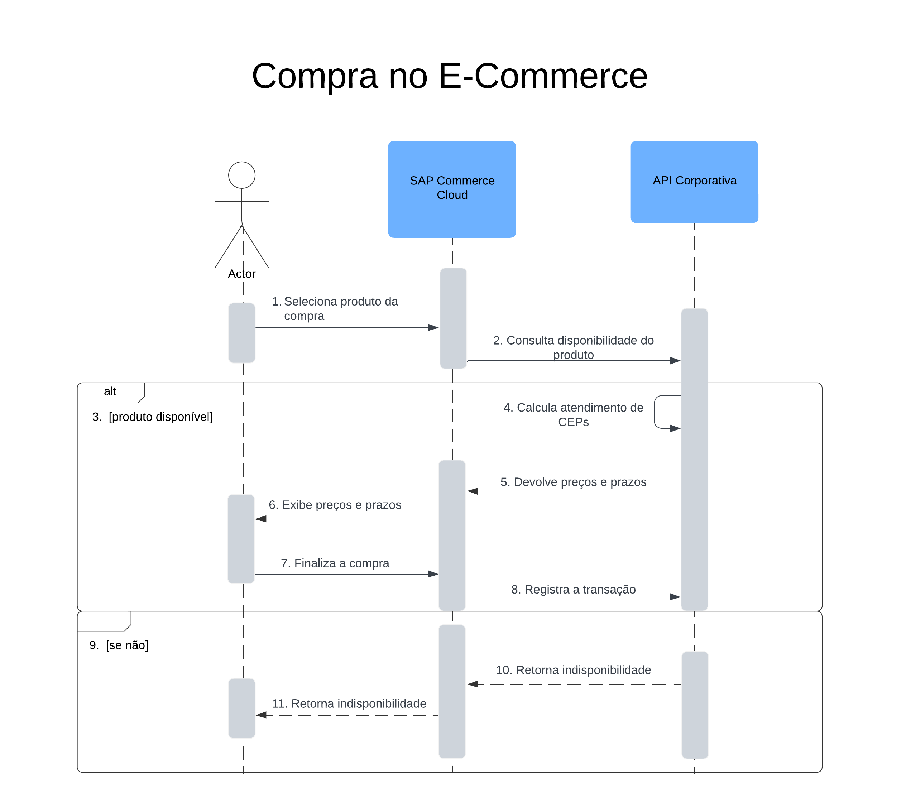
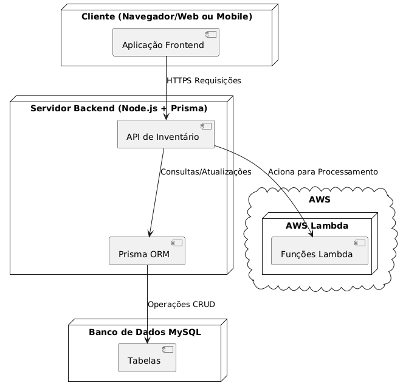

# Modelagem

## 1. Caso de Uso

### 1.1. Caso de uso CDU1: Adicionar Produto no Estoque

**Escopo:** Aplicação "Godofredo"  
**Nível:** Objetivo do usuário  
**Ator Principal:** Lojista 
**Interessados e Interesses:**
- Lojista: Deseja adicionar rapidamente uma entrada no estoque, para conseguir colocar mais produtos a venda e fornecer uma maior variedade de opções ao cliente tanto no e-commerce quanto presencialmente.
- Gerente logístico: As movimentações do estoque são de extrema importância para este, pois permite verificar os produtos faltantes e sobresalentes em cada uma das filiais da corporação.

**Pré-Condições:** Usuário previamente "logado" na plataforma.  
**Garantia de Sucesso (ou Pós-Condições)**: Foi adicionado no Banco de Dados uma unidade adicional do produto que foi indicado. Foi recebido um _popup_ que indica o sucesso nessa operação.  
**Cenário de Sucesso Principal (ou Fluxo Básico)**: 
1. Usuário abre o aplicativo;
2. Usuário faz um login na plataforma;
3. Usuário seleciona a opção de adicionar item (indicada por uma seta para baixo)
4. Usuário escanea o código de barras do produto usando o celular
5. Usuário confirma o código de barras do produto
6. Frontend da aplicação envia a requisição ao backend
7. Backend verifica se existe o produto no Banco de Dados
8. Backend adiciona um produto no mesmo id no Banco de dados
8. Backend envia o sucesso na transação para o front-end
9. Usuário visualiza a resposta do sistema (_popup_)

**Extensões (ou Fluxos Alternativos)**: 
- 2a. Sistema não reconhece o login inserido pelo usuário:  
&nbsp;&nbsp; - 1. Sistema deolve uma mensagem de erro;  
&nbsp;&nbsp; - 2. Retorna ao início da etapa dois.
- 4a. Caso o usuário esteja no _desktop_ ou a câmera esteja disponível:  
&nbsp;&nbsp; - 1. Sistema abre a possibilidade de inserir _sku manualmente;  
&nbsp;&nbsp; - 2. Fluxo segue normalmente, só que com o número de registro digitado maualmente.
- 7a. Caso o produto não exista no Banco de Dados:
&nbsp;&nbsp; - 1. Cria um novo produto com o novo id e estoque 0;  
&nbsp;&nbsp; - 2. Fluxo segue normalmente.

**Requisitos Especiais:** Interface móvel da aplicação deve ser sensível ao toque. A aplicação deve alterar sua formatação quando a proporção do dispositivo for alterada. O Banco de Dados, Backend e Frontend devem estar disponíveis na maior parte do tempo. A inserção de códigos sku deve ser restrita a números. 

**Lista de Variantes Tecnológicas e de Dados:**
- *a. Todas as operações ocorrem através de _desktops_ ou dispositivos móveis. 
- 4a. A leitura de código de barras ocorre através da câmera de um dispositivo móvel.
- 4b. A inserção de dados de SKU é realizada através de teclado físico ou digital.

**Freqüência de Ocorrência:** Contínuo. 

**Problemas em Aberto:**
- Como impedir a dupla inserção de um mesmo produto (erro humano).

### 1.2. Caso de uso CDU2: Remover Produto no Estoque

**Escopo:** Aplicação "Godofredo"  
**Nível:** Objetivo do usuário  
**Ator Principal:** Lojista 
**Interessados e Interesses:**
- Lojista: Deseja remover rapidamente um eproduto no estoque, permitindo a rápida compreensão logística do estoque atual e assegurando confiabilidade ao e-commerce e loja física.
- Gerente logístico: As movimentações do estoque são de extrema importância para este, pois permite verificar os produtos faltantes e sobresalentes em cada uma das filiais da corporação.

**Pré-Condições:** Usuário previamente "logado" na plataforma.  
**Garantia de Sucesso (ou Pós-Condições)**: Foi removida no Banco de Dados uma unidade adicional do produto que foi indicado. Foi recebido um _popup_ que indica o sucesso nessa operação.  
**Cenário de Sucesso Principal (ou Fluxo Básico)**: 
1. Usuário abre o aplicativo;
2. Usuário faz um login na plataforma;
3. Usuário seleciona a opção de remover item (indicada por uma seta para cima)
4. Usuário escanea o código de barras do produto usando o celular
5. Usuário confirma o código de barras do produto
6. Frontend da aplicação envia a requisição ao backend
7. Backend verifica se existe o produto no Banco de Dados
8. Backend remove um produto no mesmo id no Banco de dados
9. Backend envia o sucesso na transação para o front-end
10. Usuário visualiza a resposta do sistema (_popup_)

**Extensões (ou Fluxos Alternativos)**: 
- 2a. Sistema não reconhece o login inserido pelo usuário:  
&nbsp;&nbsp; - 1. Sistema deolve uma mensagem de erro;  
&nbsp;&nbsp; - 2. Retorna ao início da etapa dois.
- 4a. Caso o usuário esteja no _desktop_ ou a câmera esteja disponível:  
&nbsp;&nbsp; - 1. Sistema abre a possibilidade de inserir _sku manualmente;  
&nbsp;&nbsp; - 2. Fluxo segue normalmente, só que com o número de registro digitado maualmente.
- 8a. Caso o produto não exista no Banco de Dados ou esteja com o número de estoque menor ou igual a zero:  
&nbsp;&nbsp; - 1. Não decresce do número existente no Banco de Dados;  
&nbsp;&nbsp; - 2. Fluxo segue normalmente.

**Requisitos Especiais:** Interface móvel da aplicação deve ser sensível ao toque. A aplicação deve alterar sua formatação quando a proporção do dispositivo for alterada. O Banco de Dados, Backend e Frontend devem estar disponíveis na maior parte do tempo. A inserção de códigos sku deve ser restrita a números. 

**Lista de Variantes Tecnológicas e de Dados:**
- *a. Todas as operações ocorrem através de _desktops_ ou dispositivos móveis. 
- 4a. A leitura de código de barras ocorre através da câmera de um dispositivo móvel.
- 4b. A inserção de dados de SKU é realizada através de teclado físico ou digital.

**Freqüência de Ocorrência:** Contínuo. 

**Problemas em Aberto:**
- Como impedir a remoção de um produto duas vezes (erro humano).
- Como amenizar a possibilidade de remoção de um produto que não deveria ser removido (erro humano).

### 1.3. Caso de uso CDU3: Realizar login na aplicação "Godofredo"

**Escopo:** Aplicação "Godofredo"  
**Nível:** Subfunção  
**Ator Principal:** Lojista 
**Interessados e Interesses:**
- Lojista: Para conseguir inserir e remover produtos, isso é essencial de ser realizado previamente.
- Gerente logístico: Entender quem foi o responsável pelas modificações e de quais locais ocorreram as saídas e entradas é essencial para a viabilidade da estruturação do processamento logístico e planejamento estratégico.

**Pré-Condições:** Usuário ter a disponibilidade de um dispositivo tecnológico (_desktop_ ou dispositivos móveis)  
**Garantia de Sucesso (ou Pós-Condições)**: O usuário (lojista) conseguiu acessar as outras funcionalidades da aplicação. 
**Cenário de Sucesso Principal (ou Fluxo Básico)**: 
1. Usuário abre o aplicativo;
2. Usuário insere o email no campo solicitado;
3. Usuário insere sua senha no campo solicitado;
4. Usuário confirma os dados adicionados nos passos anteriores apertando um botão de envio;
5. Frontend encaminha para o backend as informações requisitadas;
6. Backend verifica o email e senha no banco de dados;
7. Backend envia a corretude na transação para o front-end;
9. Usuário consegue acessar a aplicação.

**Extensões (ou Fluxos Alternativos)**: 
- 2a. Email inserido não tem padrão válido  
&nbsp;&nbsp; - 1. Sistema devolve uma mensagem de erro;  
&nbsp;&nbsp; - 2. Envio é impedido;  
&nbsp;&nbsp; - 3. Sistema solicita o adequamento ao padrã;  
&nbsp;&nbsp; - 4. Usuário retorna ao início da etapa 2.
- 6a. Senha e Email não tem correspondentes no Banco de Dados  
&nbsp;&nbsp; - 1. Backend envia um código de erro ao Frontend;  
&nbsp;&nbsp; - 2. Informações inseridas nos formulários são apagadas;  
&nbsp;&nbsp; - 3. Usuário retorna ao início da etapa 2.

**Requisitos Especiais:** Interface móvel da aplicação deve ser sensível ao toque. A aplicação deve alterar sua formatação quando a proporção do dispositivo for alterada. O Banco de Dados, Backend e Frontend devem estar disponíveis na maior parte do tempo. 

**Lista de Variantes Tecnológicas e de Dados:**
- *a. Todas as operações ocorrem através de _desktops_ ou dispositivos móveis. 
- *b. A inserção de dados de login e senha são realizadas através de teclados físicos ou digitais.

**Freqüência de Ocorrência:** Único por dia. 

**Problemas em Aberto:**
- Como impedir a tentativa de acesso por força bruta (combinação de possibilidades).

### 1.4. Caso de uso CDU4: Verificar Produto no Estoque

**Escopo:** Aplicação "Godofredo"  
**Nível:** Objetivo do usuário  
**Ator Principal:** Lojista 
**Interessados e Interesses:**
- Lojista: Deseja verificar rapidamente um produto no estoque, permitindo a rápida compreensão logística do estoque atual e assegurando confiabilidade ao e-commerce e loja física.

**Pré-Condições:** Usuário previamente "logado" na plataforma.  
**Garantia de Sucesso (ou Pós-Condições)**: As informações sobre o produto são exibidas  
**Cenário de Sucesso Principal (ou Fluxo Básico)**: 
1. Usuário abre o aplicativo;
2. Usuário faz um login na plataforma;
3. Usuário seleciona a opção de verificar item (imagem de _scan_)
4. Usuário escanea o código de barras do produto usando o celular
5. Usuário confirma o código de barras do produto
6. Frontend da aplicação envia a requisição ao backend
7. Backend verifica se existe o produto no Banco de Dados
8. Backend retorna as informações que constam no Banco de Dados 
9. Backend envia o sucesso na transação para o front-end
10. Usuário visualiza as informações que almeja como retorno do sistema no seu Frontend.
**Extensões (ou Fluxos Alternativos)**: 
- 2a. Sistema não reconhece o login inserido pelo usuário:  
&nbsp;&nbsp; - 1. Sistema devolve uma mensagem de erro;  
&nbsp;&nbsp; - 2. Retorna ao início da etapa dois.
- 4a. Caso o usuário esteja no _desktop_ ou a câmera esteja disponível:  
&nbsp;&nbsp; - 1. Sistema abre a possibilidade de inserir _sku manualmente;  
&nbsp;&nbsp; - 2. Fluxo segue normalmente, só que com o número de registro digitado maualmente.
- 8a. Caso o produto não exista no Banco de Dados:  
&nbsp;&nbsp; - 1. Retorna ao Frontend que o produto não está cadastrado;  
&nbsp;&nbsp; - 2. Fluxo é finalizado.

**Requisitos Especiais:** Interface móvel da aplicação deve ser sensível ao toque. A aplicação deve alterar sua formatação quando a proporção do dispositivo for alterada. O Banco de Dados, Backend e Frontend devem estar disponíveis na maior parte do tempo. A inserção de códigos sku deve ser restrita a números. 

**Lista de Variantes Tecnológicas e de Dados:**
- *a. Todas as operações ocorrem através de _desktops_ ou dispositivos móveis. 
- 4a. A leitura de código de barras ocorre através da câmera de um dispositivo móvel.
- 4b. A inserção de dados de SKU é realizada através de teclado físico ou digital.

**Freqüência de Ocorrência:** Contínuo. 

**Problemas em Aberto:**
- Como possibilitar o cadastro rápido de produtos ausentes no Banco de Dados?

### 1.5. Caso de uso CDU5: Selecionar Tipo de Entrega

**Escopo:** E-commerce  
**Nível:** Subfunção  
**Ator Principal:** Cliente que deseja comprar no site da VIVO 
**Interessados e Interesses:**
- Cliente: Deseja ter uma variedade de opções quanto a entrega do seu produto. Almeja receber seu dispositivo o mais cedo possível.
- Gerente logístico: As movimentações dos produtos são dependentes do tráfego que será realizado em decorrência do modelo de entrega selecionado.
- Lojista: O modelo de entrega "Retirar na loja mais próxima" impacta diretamente o seu trabalho, pois adiciona uma tarefa diária a ser concluída.

**Pré-Condições:** Nenhuma.  
**Garantia de Sucesso (ou Pós-Condições)**: O cliente pôde selecionar a opção que é mais conveniente para ele, dentre as disponíveis.  
**Cenário de Sucesso Principal (ou Fluxo Básico)**: 
1. Usuário abre o aplicativo ou aplicação web do e-commerce;
2. Usuário busca o produto que lhe é relevante;
3. Usuário seleciona o produto que deseja;
4. Usuário verifica as opções de entrega;
5. Usuário insere o CEP de entrega que lhe é referente;
6. Frontend da aplicação envia a requisição com o CEP ao backend;
7. Backend calcula as lojas mais próximas que contêm o produto;
8. Backend calcula o tempo de entrega rápido e padrão;
9. Backend envia os cálculos ao front-end;
10. Frontend recebe os cálculos e demonstra as informações em 3 âmbitos: retirada na loja (constando a loja mais próxima), entrega comum (com tempo de entrega maior) e entrega full (entrega em curto período de tempo);
10. Usuário seleciona uma das opções aparentes;
11. Solicitação é enviada à loja que contêm o produto para entrega ou retirada.

**Extensões (ou Fluxos Alternativos)**: 
- 5a. Caso o CEP não seja reconhecível:  
&nbsp;&nbsp; - 1. Sistema devolve uma mensagem de erro quanto ao CEP;  
&nbsp;&nbsp; - 2. Retorna ao início da etapa 5.
- 2a. Caso não encontre produto relevante (ou esteja indisponível):
&nbsp;&nbsp; - 1a. Fluxo retorna a etapa 2.  
&nbsp;&nbsp; - 1b. Usuário deixa a aplicação. 
- 7a. Caso o produto não esteja disponível:
&nbsp;&nbsp; - 1. Retorna ao usuário que o produto está indisponível;  
&nbsp;&nbsp; - 2. Fluxo retorna a etapa 2.

**Requisitos Especiais:** Interface móvel da aplicação deve ser sensível ao toque. A aplicação deve alterar sua formatação quando a proporção do dispositivo for alterada. O Banco de Dados, Backend e Frontend devem estar disponíveis na maior parte do tempo. A inserção de códigos CEP deve ser restrita a números e verificável.  

**Lista de Variantes Tecnológicas e de Dados:**
- *a. Todas as operações ocorrem através de _desktops_ ou dispositivos móveis. 
- 5a. A inserção de dados de CEP é realizada através de teclado físico ou digital.

**Freqüência de Ocorrência:** Único (quando existe o interesse do usuário). 

**Problemas em Aberto:**
- Caso ocorra um erro de cálculo, como amenizar a insatisfação do cliente.
- Como aprimorar o serviço para evitar a saída de possíveis compradores com a indisponibilidade de produtos.

### 1.6. Caso de uso CDU6: Realizar login na aplicação de inventário

**Escopo:** Aplicação de Inventário 
**Nível:** Subfunção  
**Ator Principal:** Gerente de Logística 
**Interessados e Interesses:**
- Gerente logístico: Entender quais produtos estão disponíveis, em quais lojas e seus determinados dados é de valor essencial para a realização de planejamentos estratégicos quanto à área de logística. Para conseguir ter acesso à essas informações, precisa realizar o login.

**Pré-Condições:** Usuário ter a disponibilidade de um dispositivo tecnológico (_desktop_ ou dispositivos móveis)  
**Garantia de Sucesso (ou Pós-Condições)**: O usuário (gerente de logística) conseguiu acessar as outras funcionalidades da aplicação. 
**Cenário de Sucesso Principal (ou Fluxo Básico)**: 
1. Usuário abre o aplicativo;
2. Usuário insere o email no campo solicitado;
3. Usuário insere sua senha no campo solicitado;
4. Usuário confirma os dados adicionados nos passos anteriores apertando um botão de envio;
5. Frontend encaminha para o backend as informações requisitadas;
6. Backend verifica o email e senha no banco de dados;
7. Backend envia a corretude na transação para o front-end;
9. Usuário consegue acessar a aplicação.

**Extensões (ou Fluxos Alternativos)**: 
- 2a. Email inserido não tem padrão válido  
&nbsp;&nbsp; - 1. Sistema devolve uma mensagem de erro;  
&nbsp;&nbsp; - 2. Envio é impedido;  
&nbsp;&nbsp; - 3. Sistema solicita o adequamento ao padrão;  
&nbsp;&nbsp; - 4. Usuário retorna ao início da etapa 2.
- 6a. Senha e Email não tem correspondentes no Banco de Dados  
&nbsp;&nbsp; - 1. Backend envia um código de erro ao Frontend;  
&nbsp;&nbsp; - 2. Informações inseridas nos formulários são apagadas;  
&nbsp;&nbsp; - 3. Usuário retorna ao início da etapa 2.

**Requisitos Especiais:** Interface móvel da aplicação deve ser sensível ao toque. A aplicação deve alterar sua formatação quando a proporção do dispositivo for alterada. O Banco de Dados, Backend e Frontend devem estar disponíveis na maior parte do tempo. 

**Lista de Variantes Tecnológicas e de Dados:**
- *a. Todas as operações ocorrem através de _desktops_ ou dispositivos móveis. 
- *b. A inserção de dados de login e senha são realizadas através de teclados físicos ou digitais.

**Freqüência de Ocorrência:** Único por dia. 

**Problemas em Aberto:**
- Como impedir a tentativa de acesso por força bruta (combinação de possibilidades).

### 1.7. Caso de uso CDU7: Enviar CSV para Popular Estoque

**Escopo:** Aplicação de Inventário 
**Nível:** Objetivo do usuário  
**Ator Principal:** Gerente de Logística 
**Interessados e Interesses:**
- Gerente logístico: Entender quais produtos estão disponíveis, em quais lojas e seus determinados dados é de valor essencial para a realização de planejamentos estratégicos quanto à área de logística. Com esse processo, consegue adicionar rapidamente produtos e suas características, além de designar locais nos quais esse produto está alocado.

**Pré-Condições:** Usuário estar previamente logado na aplicação  
**Garantia de Sucesso (ou Pós-Condições)**: O usuário (gerente de logística) consegue visualizar no estoque os produtos que enviou. Notificação de sucesso recebida. 
**Cenário de Sucesso Principal (ou Fluxo Básico)**: 
1. Usuário abre o aplicativo;
2. Usuário faz login na aplicação;
3. Usuário seleciona a opção de Entuba (caracterizada pelo símbolo de adição dentro de uma caixa) na barra lateral esquerda);
4. Usuário seleciona a caixa de seleção de documentos;
5. Sistema da aplicação abre o gerenciador de arquivos do dispositivo utilizado;
6. Usuário seleciona o arquivo com as informações que deseja;
7. Usuário submete o arquivo para o Frontend através de um botão;
8. Frontend requisita ao Backend uma verificação do arquivo;
9. Backend adiciona os dados, através de requisições, ao Banco de Dados;
10. Backend retorna o sucesso da operação no Frontend;
11. Frontend envia um _popup_ de sucesso para o Usuário;
12. Usuário verifica os dados adicionados na _home_ da aplicação.

**Extensões (ou Fluxos Alternativos)**: 
- 2a. Sistema não reconhece o login inserido pelo usuário:  
&nbsp;&nbsp; - 1. Sistema devolve uma mensagem de erro;  
&nbsp;&nbsp; - 2. Retorna ao início da etapa dois.
- 9a. Caso a submissão do usuário não for compatível com um formato de arquivo esperado:  
&nbsp;&nbsp; - 1. Sistema indica um _popup_ de erro, enunciando a a incompatibilidade;  
&nbsp;&nbsp; - 2. Sistema limpa a caixa de seleção antes preenchida com um arquivo incompatível.

**Requisitos Especiais:** Interface móvel da aplicação deve ser sensível ao toque. A aplicação deve alterar sua formatação quando a proporção do dispositivo for alterada. O Banco de Dados, Backend e Frontend devem estar disponíveis na maior parte do tempo. 

**Lista de Variantes Tecnológicas e de Dados:**
- *a. Todas as operações ocorrem através de _desktops_ ou dispositivos móveis. 
- *b. A inserção de dados de login e senha são realizadas através de teclados físicos ou digitais.
- 6a. O arquivo selecionado deve ter, obrigatoriamente, formato Excel ou CSV.

**Freqüência de Ocorrência:** Único por necessidade de adição de novos itens. 

**Problemas em Aberto:**
- Como evitar a duplicata no envio de arquivos.
- Como expandir a seleção de documentos para mais tipos de arquivos.

### 1.8. Caso de uso CDU8: Pesquisar CEP's Disponíveis Próximos

**Escopo:** Inventário  
**Nível:** Objetivo do Usuário  
**Ator Principal:** Gerente de logística 
**Interessados e Interesses:**

- Gerente logístico: Compreender as alocações mais prósimas é interesssante a este, pois permite a designação de produtos dentre as diferentes franquias e armazéns, além de facilitar o cálculo do tempo de frete, importante para o sucessso da operação de planejamento.

**Pré-Condições:** Estar previamente logado no sistema  
**Garantia de Sucesso (ou Pós-Condições)**: Forem apresentados os CEP's mais próximos da localidade inserida  
**Cenário de Sucesso Principal (ou Fluxo Básico)**: 
1. Usuário abre a aplicação WEB;
2. Usuário realiza o login;
3. Usuário seleciona a seção Pesquisar CEP, presente na barra lateral;
4. Usuário insere o CEP na label designada;
5. Usuário envia, através de um botão no Frontend, a requisição para o Backend com esse dado inserido
6. Backend verifica se o CEP existe;
7. Backend seleciona, do Banco de Dados, os CEP's de filiais que entregam no CEP indicado;
8. Backend envia para o Frontend os dados selecionados e o sucesso da operação;
9. Frontend apresenta, em formato de lista, todos os CEP's de filiais que entregam no CEP especificado;
10. Usuário visualiza a informação recebida.

**Extensões (ou Fluxos Alternativos)**: 
- 2a. Sistema não reconhece o login inserido pelo usuário:  
&nbsp;&nbsp; - 1. Sistema devolve uma mensagem de erro;  
&nbsp;&nbsp; - 2. Retorna ao início da etapa dois.
- 6a. Caso o CEP não seja reconhecível:  
&nbsp;&nbsp; - 1. Sistema devolve uma mensagem de erro quanto ao CEP;  
&nbsp;&nbsp; - 2. Sistema limpa a label na qual estava inserida a informação incoerente;  
&nbsp;&nbsp; - 3. Fluxo retorna ao início da etapa 4.
- 7a. Caso não encontre CEP que entregue na localidade:
&nbsp;&nbsp; - 1. Backend envia para o Frontend o fracasso da operação;  
&nbsp;&nbsp; - 2. Frontend apresenta uma mensagem indicando que não existem CEP's disponíveis; 
&nbsp;&nbsp; - 3. Usuário visualiza a informação recebida e pode realizar uma nova submissão.

**Requisitos Especiais:** Interface móvel da aplicação deve ser sensível ao toque. A aplicação deve alterar sua formatação quando a proporção do dispositivo for alterada. O Banco de Dados, Backend e Frontend devem estar disponíveis na maior parte do tempo. A inserção de códigos CEP deve ser restrita a números e verificável.  

**Lista de Variantes Tecnológicas e de Dados:**
- *a. Todas as operações ocorrem através de _desktops_ ou dispositivos móveis. 
- 4a. A inserção de dados de CEP é realizada através de teclado físico ou digital.
- 4b. O CEP é estritamente numérico.

**Freqüência de Ocorrência:** Único (quando existe a necessidade de verificação das entregas). 

**Problemas em Aberto:**
- Como atingir os usuários e filiais que não possuem CEP's próximos o suficiente para entregas.

### 1.9. Caso de uso CDU9: Adicionar Produto no Inventário

**Escopo:** Inventário  
**Nível:** Objetivo do Usuário  
**Ator Principal:** Gerente de logística 
**Interessados e Interesses:**

- Gerente logístico: Entender quais produtos estão disponíveis, em quais lojas e seus determinados dados é de valor essencial para a realização de planejamentos estratégicos quanto à área de logística. Com esse processo, consegue adicionar rapidamente produtos e suas características, além de designar locais nos quais esse produto está alocado.

**Pré-Condições:** Estar previamente logado no sistema  
**Garantia de Sucesso (ou Pós-Condições)**: Produto estar disponível para a busca. _Popup_ de sucesso na operação  
**Cenário de Sucesso Principal (ou Fluxo Básico)**: 
1. Usuário abre a aplicação WEB;
2. Usuário realiza o login;
3. Usuário seleciona a seção Inserir Produto, presente na barra lateral;
4. Usuário insere o SKU, Nome, Cetro de Distribuição e Quantidade na labels designadas;
5. Usuário envia, através de um botão no Frontend, a requisição para o Backend com os dados inseridos.
6. Backend verifica se os dados estão coretos;
7. Backend adiciona no Banco de Dados as inforações que foram designadas pelo usuário;
8. Backend envia para o Frontend o sucesso da operação;
9. Frontend apresenta um _popup_ que indica o sucesso da operação ao usuário;
10. Usuário visualiza a adição deste produto no _Home_ da aplicação.

**Extensões (ou Fluxos Alternativos)**: 
- 2a. Sistema não reconhece o login inserido pelo usuário:  
&nbsp;&nbsp; - 1. Sistema devolve uma mensagem de erro;  
&nbsp;&nbsp; - 2. Retorna ao início da etapa dois.
- 6a. Caso algum dos dados esteja incoerente:  
&nbsp;&nbsp; - 1. Sistema devolve uma mensagem de erro quanto ao dado inserido;  
&nbsp;&nbsp; - 2. Sistema limpa a label na qual estava inserida a informação incoerente;  
&nbsp;&nbsp; - 3. Fluxo retorna ao início da etapa 4.
- 7a. Caso já esteja presente no Banco de Dados um produto com SKU e Centro de Distribuição correspondentes:  
&nbsp;&nbsp; - 1. Backend apenas acresce a quantidade nova com a anterior;  
&nbsp;&nbsp; - 2. Fluxo segue normamente.

**Requisitos Especiais:** Interface móvel da aplicação deve ser sensível ao toque. A aplicação deve alterar sua formatação quando a proporção do dispositivo for alterada. O Banco de Dados, Backend e Frontend devem estar disponíveis na maior parte do tempo. 

**Lista de Variantes Tecnológicas e de Dados:**
- *a. Todas as operações ocorrem através de _desktops_ ou dispositivos móveis. 
- 4a. A inserção de dados é realizada através de teclado físico ou digital.
- 4b. O SKU é estritamente numérico.
- 4c. O Nome é alfanumérico.
- 4d. O Centro de distribuição é indicado por um ID estritamente numérico.
- 4e. A quantidade é estritamente numérica.

**Freqüência de Ocorrência:** Único (quando existe a necessidade de verificação de adição de um único produto) ou contínuo (por certo período temporal na qual é necessária a adição de vários itens). 

**Problemas em Aberto:**
- Como impedir a inserção de dados incoerentes (SKU's, Nomes e Centros de Distribuição inexistentes) sem impedir a conexão de dados novos.

### 1.10 Caso de uso CDU10: Excluir Produto no Inventário

**Escopo:** Inventário  
**Nível:** Objetivo do Usuário  
**Ator Principal:** Gerente de logística 
**Interessados e Interesses:**

- Gerente logístico: Entender quais produtos estão disponíveis, em quais lojas e seus determinados dados é de valor essencial para a realização de planejamentos estratégicos quanto à área de logística. Com esse processo, consegue remover rapidamente produtos, permitindo uma percepção realista do estoque atual com base nas disponibilidades e disposições existentes..

**Pré-Condições:** Estar previamente logado no sistema  
**Garantia de Sucesso (ou Pós-Condições)**: Produto não estar disponível para a busca. _Popup_ de sucesso na operação  
**Cenário de Sucesso Principal (ou Fluxo Básico)**: 
1. Usuário abre a aplicação WEB;
2. Usuário realiza o login;
3. Usuário seleciona, no _Home_, o campo de pesquisa de produtos;
4. Usuário insere o SKU ou o Nome do produto a ser excluído;
5. Frontend demonstra a lista de produtos relacionados;
6. Usuário encontra o produto esperado e seleciona a opção de Excluir, na margem direita da label;
7. Frontend envia a requisição de exclusão ao Backend;
8. Backend retira o item no Banco de Dados e envia o sucesso da operação ao Frontend;
9. Frontend apresenta um _popup_ que indica o sucesso da operação ao usuário;
10. Usuário visualiza a ausência deste produto no _Home_ da aplicação.

**Extensões (ou Fluxos Alternativos)**: 
- 2a. Sistema não reconhece o login inserido pelo usuário:  
&nbsp;&nbsp; - 1. Sistema devolve uma mensagem de erro;  
&nbsp;&nbsp; - 2. Retorna ao início da etapa dois.
- 4a. Caso não seja encontrado nenhum produto:  
&nbsp;&nbsp; - 1. Sistema devolve uma mensagem de "Nenhum produto encontrado";
&nbsp;&nbsp; - 2. Fluxo retorna ao início da etapa 4.
- 4b. O usuário pode utilizar de filtragem e pesquisa um-a-um para encontrar o produto esperado.  

**Requisitos Especiais:** Interface móvel da aplicação deve ser sensível ao toque. A aplicação deve alterar sua formatação quando a proporção do dispositivo for alterada. O Banco de Dados, Backend e Frontend devem estar disponíveis na maior parte do tempo. 

**Lista de Variantes Tecnológicas e de Dados:**
- *a. Todas as operações ocorrem através de _desktops_ ou dispositivos móveis. 
- 4a. A inserção de dados é realizada através de teclado físico ou digital.
- 4b. O SKU é estritamente numérico.
- 4c. O Nome é alfanumérico.

**Freqüência de Ocorrência:** Único (quando existe a necessidade de remoção de um único produto) ou contínuo (por certo período temporal na qual é necessária a remoção de vários itens). 

**Problemas em Aberto:**
- Como impedir a remoção de dados que não deveriam ter sido removidos (erro humano).

### 1.11. Caso de uso CDU11: Editar Produto no Inventário

**Escopo:** Inventário  
**Nível:** Objetivo do Usuário  
**Ator Principal:** Gerente de logística 
**Interessados e Interesses:**

- Gerente logístico: Entender quais produtos estão disponíveis, em quais lojas e seus determinados dados é de valor essencial para a realização de planejamentos estratégicos quanto à área de logística. Com esse processo, consegue editar rapidamente os dados de produtos, permitindo, junto da sincronização, na correção de dados e quantidades em diversos centros diferentes de distribuição.

**Pré-Condições:** Estar previamente logado no sistema  
**Garantia de Sucesso (ou Pós-Condições)**:_Popup_ de sucesso na operação. Dado sobre o produto estar devidamente alterado.  
**Cenário de Sucesso Principal (ou Fluxo Básico)**: 
1. Usuário abre a aplicação WEB;
2. Usuário realiza o login;
3. Usuário seleciona, no _Home_, o campo de pesquisa de produtos;
4. Usuário insere o SKU ou o Nome do produto a ser editado;
5. Frontend demonstra a lista de produtos relacionados;
6. Usuário encontra o produto esperado e seleciona a opção de Editar, na margem direita da label;
7. Frontend abre um campo idêntico ao de adição de produto.
8. Usuário insere o Nome, SKU, Centro de distribuição e quantidade;
9. Frontend envia uma requisição com os novos dados ao Backend;
10. Backend verifica os dados inseridos;
11. Backend envia ao Banco de Dados uma requisição de para alterar dados do produto selecionado;
12. Backend envia ao Frontend o sucesso da operação.
9. Frontend apresenta um _popup_ que indica o sucesso da operação ao usuário;
10. Usuário visualiza a edição deste produto no _Home_ da aplicação.

**Extensões (ou Fluxos Alternativos)**: 
- 2a. Sistema não reconhece o login inserido pelo usuário:  
&nbsp;&nbsp; - 1. Sistema devolve uma mensagem de erro;  
&nbsp;&nbsp; - 2. Retorna ao início da etapa dois.
- 4a. Caso não seja encontrado nenhum produto:  
&nbsp;&nbsp; - 1. Sistema devolve uma mensagem de "Nenhum produto encontrado";
&nbsp;&nbsp; - 2. Fluxo retorna ao início da etapa 4.
- 4b. O usuário pode utilizar de filtragem e pesquisa um-a-um para encontrar o produto esperado.  
- 10a. Caso algum dos dados esteja incoerente:  
&nbsp;&nbsp; - 1. Sistema devolve uma mensagem de erro quanto ao dado inserido;  
&nbsp;&nbsp; - 2. Sistema limpa a label na qual estava inserida a informação incoerente;  
&nbsp;&nbsp; - 3. Fluxo retorna ao início da etapa 8.

**Requisitos Especiais:** Interface móvel da aplicação deve ser sensível ao toque. A aplicação deve alterar sua formatação quando a proporção do dispositivo for alterada. O Banco de Dados, Backend e Frontend devem estar disponíveis na maior parte do tempo. 

**Lista de Variantes Tecnológicas e de Dados:**
- *a. Todas as operações ocorrem através de _desktops_ ou dispositivos móveis. 
- 4a. A inserção de dados é realizada através de teclado físico ou digital.
- 4b. O SKU é estritamente numérico.
- 4c. O Nome é alfanumérico.
- 4d. O Centro de Distribuição é apresentado a partir de um id estritamente numérico
- 4e. A Quantidade é estritamente numérica.

**Freqüência de Ocorrência:** Único (quando existe a necessidade de edição de um único produto) ou contínuo (por certo período temporal na qual é necessária a edição de vários itens). 

**Problemas em Aberto:**
- Como impedir a edição de dados quando esta leva à reedição de um produto já existente no Banco de Dados com as mesmas informações.

### 1.12. Caso de uso CDU12: Buscar Produto no Inventário

**Escopo:** Inventário  
**Nível:** Objetivo do Usuário  
**Ator Principal:** Gerente de logística 
**Interessados e Interesses:**

- Gerente logístico: Entender quais produtos estão disponíveis, em quais lojas e seus determinados dados é de valor essencial para a realização de planejamentos estratégicos quanto à área de logística. Com esse processo, consegue encontrar rapidamente dados de diferentes produtos, permitindo, junto da sincronização, a facilitação do processamento logístico e planejamento.

**Pré-Condições:** Estar previamente logado no sistema  
**Garantia de Sucesso (ou Pós-Condições)**:Visualizar o produto esperado.  
**Cenário de Sucesso Principal (ou Fluxo Básico)**: 
1. Usuário abre a aplicação WEB;
2. Usuário realiza o login;
3. Usuário seleciona, no _Home_, o campo de pesquisa de produtos;
4. Usuário insere o SKU ou o Nome do produto a ser buscado;
5. Frontend demonstra a lista de produtos relacionados ao usuário;
6. Usuário encontra o produto esperado.

**Extensões (ou Fluxos Alternativos)**: 
- 2a. Sistema não reconhece o login inserido pelo usuário:  
&nbsp;&nbsp; - 1. Sistema devolve uma mensagem de erro;  
&nbsp;&nbsp; - 2. Retorna ao início da etapa dois.
- 4a. Caso não seja encontrado nenhum produto:  
&nbsp;&nbsp; - 1. Sistema devolve uma mensagem de "Nenhum produto encontrado";
&nbsp;&nbsp; - 2. Fluxo retorna ao início da etapa 4.
- 4b. O usuário pode utilizar de filtragem por Centro de Distribuição, Ordem Numérica de SKU, Ordem Numérica Reversa de SKU, Ordem Alfabética de Nome, Ordem Alfabética Reversa de Nome, Ordenação de Quantidades, Ordenação Reversa de Quantidades e pesquisa um-a-um para encontrar o produto esperado.  

**Requisitos Especiais:** Interface móvel da aplicação deve ser sensível ao toque. A aplicação deve alterar sua formatação quando a proporção do dispositivo for alterada. O Banco de Dados, Backend e Frontend devem estar disponíveis na maior parte do tempo. 

**Lista de Variantes Tecnológicas e de Dados:**
- *a. Todas as operações ocorrem através de _desktops_ ou dispositivos móveis. 
- 4a. A inserção de dados é realizada através de teclado físico ou digital.
- 4b. O SKU é estritamente numérico.
- 4c. O Nome é alfanumérico.
- 4d. O Centro de Distribuição é apresentado a partir de um id estritamente numérico
- 4e. A Quantidade é estritamente numérica.

**Freqüência de Ocorrência:** Único (quando existe a necessidade de edição de um único produto) ou contínuo (por certo período temporal na qual é necessária a edição de vários itens). 

**Problemas em Aberto:**
- Como impedir a edição de dados quando esta leva à reedição de um produto já existente no Banco de Dados com as mesmas informações.

## 2. Diagrama de Classes UML

&emsp;&emsp;O Diagrama de Classes UML (Unified Modeling Language) é uma ferramenta visual que descreve a estrutura de um sistema, representando suas classes, atributos, métodos e os relacionamentos entre elas. Ele é fundamental para a modelagem de sistemas orientados a objetos, facilitando a compreensão das interações entre diferentes partes de um sistema de software. O diagrama de classes permite que desenvolvedores e arquitetos de software visualizem claramente como as diferentes entidades de um sistema estão interligadas, além de definir suas responsabilidades e comportamentos.

&emsp;&emsp;No contexto de desenvolvimento de software, especialmente em sistemas complexos, como os que interagem com sistemas externos, o SAP ECC no caso da Vivo, o diagrama de classes UML se torna uma ferramenta poderosa para mapear as diferentes entidades que compõem o sistema de inventário e e-commerce. Abaixo, abordaremos dois diagramas de classes: um relacionado ao sistema completo de e-commerce e outro focado na interação do inventário com o SAP ECC.

### 2.1. Diagrama de Classes E-commerce:

  Figura 01 - Diagrama de Classes UML E-Commerce (2024)

  

#### Produto:

&emsp;&emsp; A classe Produto representa cada item disponível no inventário. Ela contém atributos como ID, SKU, descrição, e código de barras. As operações incluídas são obter todos os produtos, buscar por ID, editar, listar por categoria e deletar produtos. Isso faz com que o Produto seja o ponto central que conecta o Estoque e o Pedido.

#### Estoque:

&emsp;&emsp; A classe Estoque gerencia a quantidade de produtos disponíveis em uma determinada loja ou centro de distribuição. A classe possui métodos para atualizar, verificar e listar os estoques, tanto por loja quanto por produto. Ela está conectada às classes Produto e Loja, o que permite o controle granular de onde cada item está disponível.

#### Loja:

&emsp;&emsp; A classe Loja representa as lojas físicas ou centros de distribuição. Ela contém informações como ID, descrição, CEP e um range de CEPs que a loja atende. Essa classe também possui métodos para buscar lojas por ID ou CEP, facilitando a interação com o sistema de pedidos e logística.

#### Cliente:

&emsp;&emsp;A entidade Cliente contém informações sobre os clientes do e-commerce, como nome, endereço, CEP, telefone e email. Ela está diretamente conectada à classe Pedido, pois os clientes são os responsáveis por realizar compras no sistema.

#### Pedido:

&emsp;&emsp; A classe Pedido contém todas as informações relacionadas a uma compra, como ID do cliente, ID da loja, ID do produto, data e status do pedido. Ela também tem métodos para criar, atualizar e listar pedidos por cliente ou loja.

#### PedidoProduto:

&emsp;&emsp; Essa classe representa o relacionamento entre um pedido e os produtos associados a ele. Para cada pedido, é possível adicionar ou remover produtos, e a classe controla a quantidade e o preço de cada item.

#### Usuário:

&emsp;&emsp; A classe Usuário contém informações sobre os administradores ou operadores do sistema. Com métodos para registrar e fazer login, ela assegura que somente usuários autorizados possam acessar as funcionalidades do sistema.

### 2.2. Diagrama de Interação com o SAP ECC:

  Figura 02 - Diagrama de Classes UML MVP (2024)

  

Fonte: Material produzido pelos autores (2024)

#### Produto:

&emsp;&emsp; A classe Produto contém as informações básicas sobre os produtos disponíveis no sistema. Cada item de produto está vinculado a uma quantidade de estoque específica em determinada loja ou centro de distribuição. O SAP ECC fornece dados de SKU, descrição e código de barras, os quais são usados pelo sistema de e-commerce para validar a disponibilidade e realizar as vendas.

#### Estoque:

&emsp;&emsp; A classe Estoque é a chave na interação com o SAP ECC. Nela, estão armazenadas as quantidades disponíveis de produtos em cada loja. O sistema ECC gera relatórios ou arquivos de sincronização que são carregados diretamente nessa tabela, garantindo que o sistema de e-commerce tenha as quantidades mais recentes de cada produto. Além disso, a quantidade de estoque é atualizada automaticamente após cada venda.

#### Loja:

&emsp;&emsp; A classe Loja contém as informações das lojas ou centros de distribuição. Essa tabela é essencial para associar produtos a diferentes locais e determinar a disponibilidade em lojas próximas ao cliente.

### 2.3. Interações entre os componentes e classes do sistema:

&emsp;&emsp;O SAP ECC, que é o sistema de gerenciamento empresarial da Vivo, gera arquivos de sincronização contendo as quantidades de estoque de produtos por lojas e centros de distribuição. Esses dados são carregados no sistema de e-commerce, atualizando as informações na classe Estoque. Assim, o estoque disponível reflete a quantidade real que o SAP ECC calcula e valida.

&emsp;&emsp;Quando o cliente inicia um pedido no e-commerce e fornece seu CEP, o sistema consulta a tabela Loja para encontrar a unidade mais próxima. Em seguida, o sistema acessa a tabela Estoque para verificar a quantidade disponível do produto na loja identificada, utilizando a relação entre Produto e Estoque. Caso o produto esteja disponível, a venda pode ser concluída.

&emsp;&emsp;Após a finalização da venda no e-commerce, o sistema de inventário atualiza automaticamente as quantidades de estoque na tabela Estoque. Esses dados são sincronizados de volta para o SAP ECC, garantindo que o estoque central da Vivo esteja sempre atualizado.

### 2.4. Conclusão:

&emsp;&emsp;O diagrama de classes fornece uma visão clara e organizada de como as diferentes entidades do sistema de inventário e e-commerce da Vivo estão interconectadas. Ele ajuda a entender como os dados fluem entre o e-commerce e o sistema SAP ECC, permitindo a sincronização de estoque em tempo real e garantindo uma experiência fluida para o cliente. O uso de UML para modelar esse sistema permite que os desenvolvedores tenham uma visão detalhada da arquitetura e dos relacionamentos entre as classes, facilitando a manutenção, expansão e otimização do sistema.

&emsp;&emsp;Com as interações descritas, vemos que o sistema foi projetado para ser altamente escalável, modular e eficiente, garantindo que as operações de venda e logística funcionem de maneira integrada, sem causar sobrecarga nos sistemas subjacentes.

## 3. Diagrama de Sequência UML

&emsp;&emsp;Um diagrama de sequência UML é um tipo de diagrama de interação, pois descreve como, e em qual ordem, um grupo de objetos trabalha em conjunto. Ele atua como um auxiliador para desenvolvedores de software para entender as necessidades de um novo sistema ou para documentar um processo existente, além de explorar a lógica de um caso de uso ou de qualquer função, procedimento e processo complexo.

&emsp;&emsp;Nesse sentido, o diagrama tem como objetivo ver como objetos e componentes interagem uns com os outros para concluir um processo, bem como planejar e compreender a funcionaldiade de um cenário existente ou futuro. Assim, o grupo Helium construiu 2 diagramas para abordar 2 cenários complementares da solução para a empresa parceira.

### 3.1. Sincronização e Atualização de Estoque

&emsp;&emsp;O primeiro diagrama mostra como os componentes da solução atuam para realizar a sincronização e atualização de estoque para os produtos da Vivo com as seguintes etapas:

Figura 01 - Diagrama de Sequência UML - Sincronização e Atualização de Estoque

Fonte: Material produzido pelo Grupo 5 (2024)

**Etapas:**

1. Os arquivos são enviados do SAP ECC para a API corporativa (neste caso, a API corporativa está melhorada com o projeto desenvolvido pelo Inteli) contendo os dados de quantidades de estoque de produtos por lojas e centros de distribuição em formato de csv.

2. A transação de compra é registrada na base da API para que seja possível calcular o lambda posteriormente, mais especificadamente na classe Estoque do banco de dados.

3. Calcula o lambda, que nada mais é do que a diferença entre o estoque que veio nos arquivos do SAP ECC e os registros na base de dados da API Corporativa. Essa diferença é registrada para atualizar a base de dados da API Corporativa (classe de Estoque) que receberá as requisições do E-Commerce.

4. Os dados são sincronizados de volta para o SAP ECC, garantindo que o estoque central da Vivo esteja sempre atualizado.

&emsp;&emsp;Dessa forma, espera-se que ao ver como o SAP ECC, a API Corporativa e o SAP Commerce Cloud se interagem para ocorrer a sincronização e atualização de estoque, seja possível planejar e compreender a funcionalidade do sistema como um todo.

### 3.2. Compra no E-Commerce

&emsp;&emsp;Um outro cenário abordado pelo segundo diagrama, mostra como os componentes da solução atuam para realizar e garantir a compra do cliente por meio das seguintes etapas:

Figura 02 - Diagrama de Sequência UML - Compra no E-Commerce

Fonte: Material produzido pelo Grupo 5 (2024)

**Etapas:**

1. O cliente seleciona um produto para a compra.

2. Consulta da disponibilidade do produto selecionado pelo cliente no estoque. Os dados são consultados na base da API corporativa.

3. Início de um bloco condicional. Dentro do bloco inclui ações tomadas caso o produto esteja disponível.

4. Calcula os CEPs de lojas e centros de distribuição que atendem a localidade do cliente, junto com os preços e prazos associados.

5. Devolve as diferentes lojas/centros de distribuição que atendem a localidade do cliente, junto com os preços e prazos associados.

6. Exibe o resultado de preços e prazos para o cliente.

7. A compra é finalizada.

8. A transação é registrada na base da API corporativa para que seja possivel calcular o lambda posteriormente.

9. Início do bloco de "se não", caso a condição descrita em (3) não seja satisfeita.

10. Retorna mensagem de indisponibilidade do produto escolhido pelo cliente.

11. A mensagem de insdisponibilidade é exibida ao cliente.

&emsp;&emsp;Dessa forma, espera-se que, ao ver como o Usuário, o SAP Commerce Cloud e a API Corporativa se interagem para finalizar a compra do cliente, possa planejar e compreender a funcionalidade da solúção como um todo.

## 4. Diagrama de Implantação

&emsp;&emsp;Nesta seção, é modelado e explicado a arquitetura do sistema de inventário, que visa otimizar a sincronização de dados entre lojas, centros de distribuição e a plataforma de e-commerce da Vivo. A solução utiliza  Node.js, Prisma ORM e MySQL, integradas a serviços da AWS, como o AWS Lambda e o Amazon S3. O diagrama de implantação busca mostrar interação entre os componentes físicos do sistema que hospedam o software, incluindo o frontend, backend, banco de dados e funções Lambda para processamento de eventos.

### 4.1. Diagrama de Implantação E-commerce:

  Figura 01  - Diagrama de Classes UML 

  
  
  Fonte: Material produzido pelos autores (2024)

- **Cliente (Navegador ou Mobile)**: A interface da aplicação, que pode ser acessada via web ou dispositivos móveis, é responsável por enviar requisições HTTP para o backend. O usuário pode consultar produtos, visualizar disponibilidade (se for o lojista) e realizar pedidos (se for o cliente final).
  
- **Servidor Backend (Node.js + Prisma ORM)**: O backend é a camada de lógica de negócio da aplicação. Utilizando Node.js e Prisma ORM, ele recebe as requisições do cliente e processa as operações necessárias. Isso inclui consultas e atualizações no banco de dados, bem como o acionamento de funções AWS Lambda.

- **Banco de Dados MySQL**: O banco de dados armazena as informações do inventário, pedidos, produtos, lojas e movimentações de estoque. Ele é acessado diretamente pelo Prisma ORM.

- **AWS Lambda**: As funções AWS Lambda são invocadas pelo backend para tarefas específicas, pois o Lambda ajuda a otimizar o uso de recursos, ao ser ativado apenas quando houver requisições.

&emsp;&emsp;  Ao integrar AWS Lambda, ideal para lidar com demandas dinâmicas de um ambiente de estoque e e-commerce, a arquitetura oferece a flexibilidade necessária para lidar com as épocas de picos de vendas e acessos, assim como com as demandas de baixa temporada de acessos.
