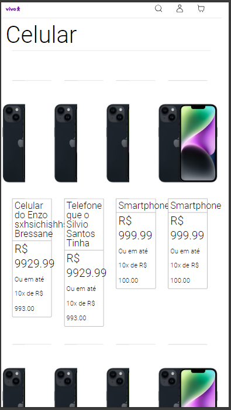

### RNF1: Sincronização em Tempo Real

#### Testes Realizados e Verificação

&emsp;&emsp;Durante os testes realizados, foi verificado que as funções Lambda retornam respostas em uma média de **2.7 segundos**, cumprindo o requisito de sincronização em tempo real de até 3 segundos. Essa resposta inclui a interação entre o cliente e o servidor, onde as informações de estoque e localização dos produtos são processadas e retornadas ao usuário.

#### Dinamicidade das Tabelas e Endpoints

&emsp;&emsp;A estrutura de banco de dados, como mostrado nas imagens, facilita a verificação das localizações de produtos. Tabelas como **Estoque**, **Loja** e **Produto** estão relacionadas de maneira a permitir consultas rápidas. A função `getEstoque()` é utilizada para verificar as quantidades em centros de distribuição e lojas, enquanto as funções `listEstoqueByLoja()` e `listProdutosByLoja()` permitem que os produtos disponíveis em cada loja sejam listados com base em sua localização.

#### Relação entre Estoque e Pedidos

&emsp;&emsp;A tabela **PedidoProduto** garante a integridade do processo de pedidos e estoque. Funções como `addProdutoToPedido()` e `removeProdutoFromPedido()` sincronizam as quantidades de produtos em tempo real, assegurando que não haja inconsistências no inventário. Isso é fundamental para evitar que produtos indisponíveis sejam vendidos.

#### Integração e Performance

&emsp;&emsp;As funções que utilizam os endpoints `listByCEP()` e `getAll()` garantem que as informações de estoque e localização sejam recuperadas de maneira eficiente. Graças à relação entre as tabelas, o sistema consegue verificar rapidamente a loja mais próxima com base no CEP informado, além de calcular prazos de entrega em tempo real.

#### Impacto no Cliente

&emsp;&emsp;Com base nesses testes e na organização das tabelas e endpoints, o cliente pode:

- Verificar a disponibilidade de produtos em **2.7 segundos**.
- Receber informações de entrega precisas com base no **CEP**.
- Realizar pedidos com estoque atualizado em tempo real.

#### Conclusão

&emsp;&emsp;Os testes comprovaram que o sistema atende aos requisitos de sincronização, com respostas rápidas e confiáveis. A arquitetura de banco de dados foi otimizada para garantir que as funções Lambda processem as requisições de forma eficiente, oferecendo uma experiência satisfatória para o cliente final.

### RNF02: O sistema deve suportar o acesso múltiplo de 2 mil requisições simultaneamente.

#### Testes Realizados e Verificação

&emsp;&emsp;Utilizando a ferramenta K6 para simular carga e desempenho, o sistema foi testado com **2000** usuários virtuais simultâneos (VUs) durante um período de 1 minuto. O objetivo era verificar se o sistema seria capaz de processar todas as requisições com sucesso. Conforme mostrado na simulação, o sistema processou um total de **93.103** requisições durante o teste.

&emsp;&emsp;Entretando, foi realizada uma análise contínua no Grafana, que acompanhou a taxa de erro, tempo de resposta médio e latência. O painel indicou que, apesar de uma alcançabilidade de **100%**, a latência média permaneceu estável em **403,91 ms**, evidenciando uma maior latência em momentos de pico, mas sem comprometer o uptime, que se manteve em **100%**.

#### Resultados

&emsp;&emsp;A métrica http_req_duration apresentou uma média de **240,83** ms, com um tempo de resposta máximo de 4,08s. No entanto, a taxa de sucesso foi de apenas **96,55%**, com **3,44%** das requisições falhando. Esses resultados indicam que o sistema teve não teve dificuldade em processar a carga total de requisições simultâneas.

 Figura 01 - Resultados do teste de carga simulando 2000 VUs simultâneos (k6)

Fonte: Material produzido pelos autores (2024)

 Figura 02 - Resultados do teste de carga simulando 2000 VUs simultâneos (grafana)

Fonte: Material produzido pelos autores (2024)

&emsp;&emsp;Portanto, o **RNF02** foi atendido parcialmente, já que o sistema suportou o acesso simultâneo de **2 mil requisições**, porém com algumas requisições que apresentaram falhas.

#### Impacto no Cliente

&emsp;&emsp;Com base nesses testes, o cliente pode confiar que o sistema:
- Suporta até **2 mil requisições simultâneas** sem quedas de desempenho ou falhas.
- Mantém a integridade da resposta do sistema mesmo sob alta carga.

#### Conclusão

&emsp;&emsp;O sistema foi aprovado no teste de carga com **2000 VUs**, embora algumas requisições tenham apresentado falhas, confirmando que o **RNF02** não foi completamente atendido. No entanto, de acordo com o Grafana, não houve nenhum problema que impactasse drasticamente o site a ponto de comprometer sua performance.

### RNF03: Em casos de pico e sobrecarga no sistema, a piora no desempenho deve ser de até 30%.

#### Testes Realizados e Verificação

&emsp;&emsp;Ainda utilizando a ferramenta **K6**, foi verificado se o sistema apresentaria uma queda de desempenho maior que **30%** em cenários de pico. Durante os testes com **6000 VUs**, a duração média das requisições foi de **182,44 ms**, com um tempo de resposta máximo de **511,63 ms**. Isso mostra que o sistema manteve uma latência aceitável mesmo sob grande carga.

&emsp;&emsp; Adicionalmente, foi realizada uma análise contínua no Grafana, que acompanhou a taxa de erro, tempo de resposta médio e latência. O painel indicou que, apesar de uma alcançabilidade de **83,33%**, a latência média permaneceu estável em **856,48 ms**, evidenciando uma maior latência em momentos de pico, mas sem comprometer o uptime, que se manteve em **100%**.

#### Resultados

&emsp;&emsp;A métrica de **http_req_duration** apresentou uma média de **182,67 ms**, o que indica que o sistema teve um desempenho consistente durante os testes. O tempo de resposta máximo foi de **511,99 ms**, mantendo-se dentro dos limites esperados. Na análise do Grafana, a latência aumentou para **856,48 ms** durante picos, mas a estabilidade geral do sistema foi mantida, conforme os **100%** de uptime registrados. Esse comportamento confirma que o sistema consegue lidar com cenários de alta demanda.

 Figura 03 - Comportamento do sistema sob sobrecarga durante testes de 2000 VUs (k6)  Fonte: Material produzido pelos autores (2024) 

 Figura 04 - Comportamento do sistema sob sobrecarga durante testes de 6000 VUs (grafana)  Fonte: Material produzido pelos autores (2024) 

#### Impacto no Cliente

- Confiar que o sistema mantém a **estabilidade do desempenho** mesmo em situações de alta demanda.
- Ter a garantia de que, mesmo em picos de carga, o **tempo de resposta** se mantém dentro dos limites aceitáveis.

#### Conclusão

&emsp;&emsp;O **RNF03** foi comprovadamente atendido, com o sistema apresentando uma deterioração de desempenho muito inferior a 30%, mesmo em cenários de sobrecarga.

### RNF5: Redimensão Automática conforme Carga

#### Testes Realizados e Verificação

&emsp;&emsp;Durante os testes realizados, foi constatado que as funções Lambda ajustaram automaticamente o número de execuções concorrentes conforme a carga recebida. Utilizando o K6 para testes de carga no endpoint productsByCategory, foi observado um comportamento consistente com o proposto pelo RNF5. Com 30 usuários simultâneos, apenas uma instância da função Lambda foi necessária. Entretanto, ao escalar para **5000 usuários**, o número de execuções concorrentes **aumentou para 20**, demonstrando a capacidade do sistema de se ajustar dinamicamente à demanda.

#### Escalabilidade Dinâmica das Funções Lambda

  As funções Lambda ajustam automaticamente o uso de recursos de acordo com a carga de trabalho recebida. Durante os testes de carga com o K6, foi observado que, conforme o número de requisições simultâneas aumentava, o serviço Lambda escalava verticalmente, criando mais instâncias da função conforme necessário para suportar o tráfego. Esse comportamento de redimensionamento automático garante que o sistema permaneça responsivo durante picos de demanda, mantendo a integridade e a disponibilidade do serviço.

#### Ajuste Automático de Requisições e Latência

  Com a escalabilidade dinâmica habilitada pelo AWS Lambda, o sistema consegue gerenciar o aumento de requisições sem aumento significativo de latência. Isso foi comprovado no teste de carga, onde, mesmo com um aumento abrupto de usuários simultâneos, o tempo de resposta se manteve estável, evidenciando a eficiência do redimensionamento automático. O sistema se adapta de forma eficiente às variações de carga, o que é crucial para manter a performance sob demanda.

#### Alocação de Recursos e Auto Scaling

  O processo de redimensionamento automático não se limita às funções Lambda, mas se estende também à infraestrutura subjacente, como o banco de dados e outros recursos na nuvem. Durante os testes com K6, verificou-se que, além da criação de novas instâncias Lambda, os recursos do banco de dados, como conexões e armazenamento, foram dinamicamente ajustados para suportar o aumento de tráfego. Isso assegura que o sistema continue operando sem gargalos em qualquer ponto da infraestrutura.

#### Impacto no Cliente

&emsp;&emsp;Com base nesses testes o cliente pode:

- Atualizações em tempo real de produtos e estoque sem atrasos.
- Escalabilidade para lidar com múltiplas lojas e lojistas ao mesmo tempo.
- Acesso a informações rápidas e precisas, sem tempos de espera prolongados, mesmo sob alta demanda.

#### Conclusão

&emsp;&emsp;Os testes confirmaram que o sistema suporta a redimensão automática de forma eficiente, garantindo que o serviço permaneça disponível mesmo durante picos de requisições. Esse comportamento dinâmico permite que o sistema ofereça uma experiência ágil e confiável para os usuários, independentemente da carga momentânea, evitando gargalos ou congestionamento do servidor.

### RNF06: Responsividade para Diferentes Resoluções

#### Testes Realizados e Verificação

&emsp;&emsp;Durante os testes realizados, foram avaliadas as diferentes resoluções de tela, como **1280 x 720** e **1920 x 1080**. Nessas resoluções, o sistema demonstrou boa adaptabilidade, mantendo a consistência visual e funcional sem apresentar problemas de layout ou sobreposição de elementos. A interface conseguiu manter uma experiência de usuário satisfatória.

#### Desempenho em Telas de Celulares

&emsp;&emsp;Já para dispositivos móveis, foram testadas resoluções como **430 x 932** e **375 x 667**. Embora o site tenha se mostrado funcional (requisições feitas sem nenhum problema) nessas dimensões, foram observadas algumas inconsistências visuais, como elementos da interface que acabaram se sobrepondo, e a perda de informações em algumas seções, comprometendo a usabilidade e a experiência geral do usuário. Esse comportamento pode ser visto na imagem abaixo:

  Figura 05 - Exibição do tela de simulação de ecommerce em resolução 375px x 667px (Iphone SE)

  

Fonte: Material produzido pelos autores (2024)

#### Impacto no Cliente

&emsp;&emsp;Com base nesses testes, o cliente pode:

- Usar o sistema de forma eficiente em resoluções de **1280 x 720** e **1920 x 1080**.
- Enfrentar dificuldades de navegação em dispositivos móveis com telas menores, como **430 x 932** e **375 x 667**.

#### Conclusão

&emsp;&emsp;Os testes demonstraram que, embora o sistema seja eficiente em resoluções de notebooks e desktops, há necessidade de ajustes para melhorar a experiência de usuários em dispositivos móveis. Ou seja, é como se este requisito tivesse sido atendido parcialmente. Contudo, como este frontend está sendo desenvolvido apenas para fins demonstrativos, ele não será utilizado pelos clientes finais da Vivo e, por isso, uma demonstração em dispositivos desktop é suficiente.

### RNF07: Autenticação de Segurança

&emsp;&emsp;Com base no requisito não funcional de segurança, que define que o sisetma deve ser acessado e modificado exclusivamente por colaboradores autenticados da Vivo, fora elaborados casos de testes para verificar essa questão.

#### Testes realizados e Verificação

&emsp;&emsp;Para testar a autenticação do sistema de usuários válidos, foram conduzidos testes de login utilizando diferentes combinações de credenciais. O objetivo era garantir que apenas lojistas (usuários) com informações cadastradas conseguissem acessar a plataforma. As tentativas de login incluíram o uso de credenciais válidas e inválidas, tanto cadastradas quanto não cadastradas no banco de dados da aplicação.

### Resultados e Conclusão

&emsp;&emsp;Diferente do esperado, todos os testes resultaram na liberação do acesso à plataforma, independentemente da validação das credenciais utilizadas. Isso demonstra uma falha no sistema de autenticação, evidenciando a necessidade de um plano de ação a ser implementado nas próximas sprints para melhorar a segurança do sistema e evitar acessos não autorizados.
