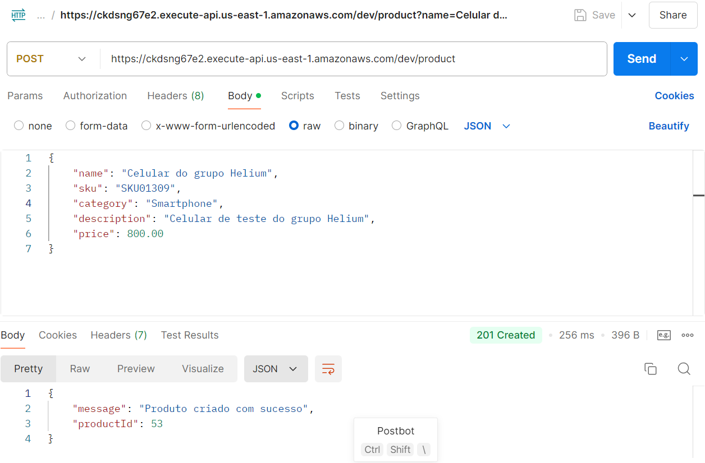
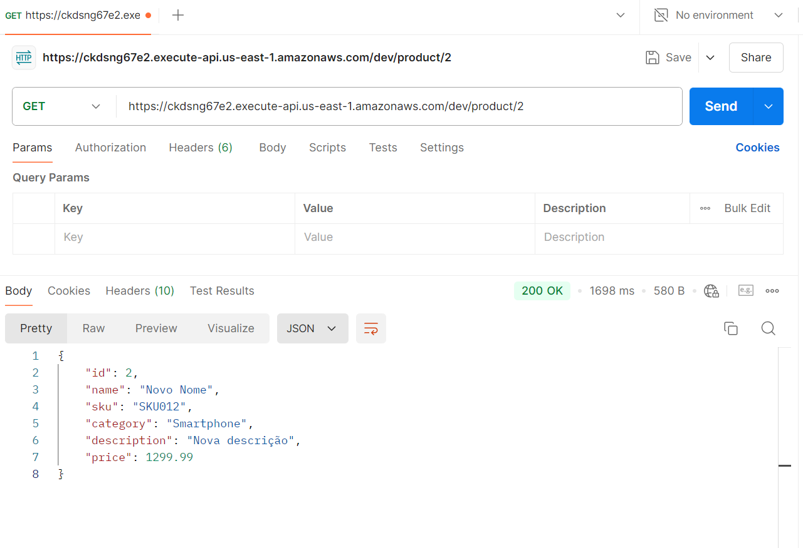
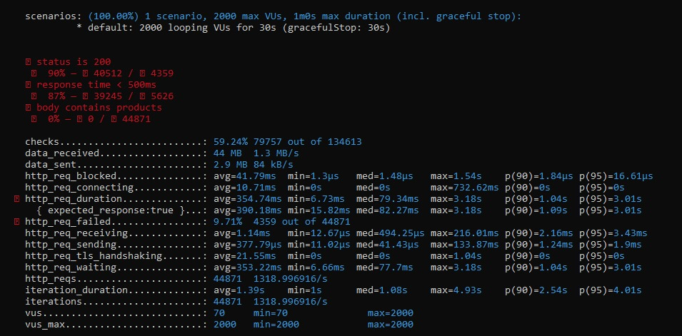

## 1. Cenários de Teste

&emsp;&emsp;Esta seção descreve os cenários de teste que devem ser preparados para verificar a qualidade da aplicação e o cumprimento dos requisitos funcionais e objetivos propostos.

### 1. CDU1: Adicionar Produto no Estoque

#### Preparação
- O usuário deve estar autenticado no site.

#### Configuração Inicial
- O sistema deve estar conectado ao banco de dados.
- A página de adicionar produto no estoque deve estar acessível.
- O usuário deve estar autenticado no sistema.

#### Passos para Execução
1. Navegar até a página "Adicionar Produto", clicando no botão indicado na barra inferior.
2. Inserir "Smartphone A53" no campo de nome do produto.
3. Inserir "ABC987" no campo de SKU.
4. Inserir "10" no campo de quantidade.
5. Selecionar a loja "JK1".
6. Clicar no botão "Adicionar Produto".

#### Resultados Esperados
- O sistema deve exibir uma mensagem de sucesso: "Produto adicionado com sucesso!".
- O produto deve aparecer na lista de produtos do estoque correspondente.
- A quantidade de 10 unidades do Smartphone A53 deve ser registrada corretamente no estoque da loja "JK1".

### 1.2. CDU2: Remover Produto no Estoque

#### Preparação
- O usuário deve estar autenticado no site.
- O produto a ser removido deve estar disponível no estoque.

#### Configuração Inicial
1. Abrir o site Helium, seguindo o link existente.
2. Certificar-se de que o usuário está autenticado, após realizar o _login_ na aplicação.

#### Passos para Execução
1. Clicar no botão de gerenciamento de estoque, acessando essa área.
2. Selecionar a opção de remover um produto.
3. Inserir o SKU do produto ("ABC987").
4. Confirmar a remoção do produto.

#### Resultados Esperados
- O produto deve ser removido do banco de dados.
- Uma mensagem de sucesso deve ser exibida, confirmando a remoção e dizendo "Produto removido do estoque".
- A quantidade de produtos no estoque deve ser diminuída em uma unidade.

### 1.3. CDU3: Realizar Login na Aplicação "Helium"

#### Preparação
- O usuário deve ter um _user_ e senha válidos.
- A aplicação deve estar acessível.

#### Configuração Inicial
1. Abrir o aplicativo "Helium", seguindo o link existente, acessando diretamente a tela de _Login_.

#### Passos para Execução
1. Inserir `lojista1` no campo de _login_.
2. Inserir `lojista1` no campo de senha.
3. Clicar no botão "Login".

#### Resultados Esperados
- O sistema deve redirecionar para a tela de estoque, demonstando os dados de Produtos Vendidos e Produtos em Estoque.

### 1.4. CDU4: Verificar Produto no Estoque

#### Preparação
- O usuário deve estar autenticado na plataforma e na tela de verificação de estoque.
- O produto a ser verificado deve estar disponível no estoque.

#### Configuração Inicial
1. Abrir o aplicativo "Helium" através do link dispinível.
2. Certificar-se de que o usuário está autenticado.

#### Passos para Execução
1. Navegar até a tela de estoque, clicando no botão de Estoque.
2. Inserir o SKU do produto "ABC987".
3. Enviar a requisição.

#### Resultados Esperados
- O SKU, o nome do produto e o centro de distribuição onde está disponível devem ser mostrados ao usuário.
- A resposta deve corresponder às informações armazenadas no banco de dados, sendo este o CEP de "10000-001".

### 1.5. CDU5: Selecionar Tipo de Entrega

#### Preparação
- O usuário deve ter selecionado um produto e estar na página de seleção de entrega.
- O CEP do endereço de entrega deve estar disponível.

#### Configuração Inicial
1. Abrir o aplicativo de e-commerce, seguindo o link existente.

#### Passos para Execução
1. Navegar até a página de seleção de entrega após clicar em um produto.
2. Inserir o CEP de entrega (por exemplo, "01001-000").
3. Selecionar uma das opções de entrega disponíveis (retirada na loja, entrega comum, entrega full).
4. Confirmar a seleção da opção de entrega.

#### Resultados Esperados
- O sistema deve exibir as opções de entrega com detalhes, incluindo lojas próximas e tempos de entrega.
- A opção selecionada deve ser registrada e a solicitação enviada para a loja ou serviço de entrega.

### 1.6. CDU6: Realizar Login na Aplicação de Inventário
Assim como no CDU3: Realizar Login na Aplicação "Helium", para validar o login, será necessário seguir os mesmos testes.

#### Preparação
- O usuário deve ter um email e senha válidos.
- A aplicação deve estar acessível.

#### Configuração Inicial
1. Abrir a aplicação _web_ de inventário, seguindo o _link_ existente.

#### Passos para Execução
1. Inserir "usuario_gerente@example.com" no campo de email.
2. Inserir "senha_gerente" no campo de senha.
3. Clicar no botão "Login".

#### Resultados Esperados
- O sistema deve redirecionar para a tela principal da aplicação de inventário.
- O nome do usuário "Usuário Gerente" deve ser exibido no canto superior direito da tela principal.

### 1.7. CDU7: Enviar CSV para Popular Estoque

#### Preparação
- O usuário deve estar logado como gerente de logística.
- O arquivo CSV com os produtos deve estar disponível no dispositivo do usuário.
- A aplicação e o banco de dados devem estar acessíveis e operacionais.
  
#### Configuração Inicial
1. Abrir a aplicação _web_ de inventário, seguindo o _link_ existente.
2. Avançar pela tela de _login_, primeira página da aplicação, seguindo os casos de uso especificados e usando o _login_ como "gerentedelogistica@teste.com" e a senha como "teste123".

#### Passos para Execução
1. Navegar até a seção de _upload_ de arquivos CSV na aplicação.
2. Clicar no ícone “Entuba” na barra lateral esquerda para abrir a área de upload de arquivos.
3. Clicar na caixa de seleção de documentos para abrir o gerenciador de arquivos.
4. Selecionar o arquivo `Produtos_para_estoque.csv` do dispositivo.
5. Clicar no botão “Enviar Arquivo” para submeter o arquivo ao sistema.
6. Aguardar a verificação do arquivo pelo backend.
7. Confirmar a notificação de sucesso exibida na tela.

#### Resultados Esperados
- O sistema deve validar o formato do arquivo CSV e processar o upload.
- Os dados do arquivo devem ser inseridos no banco de dados sem erros ou duplicações.
- Uma notificação de sucesso deve ser exibida ao usuário, confirmando que os produtos foram adicionados ao estoque.
- Os produtos adicionados devem aparecer na tela principal do estoque da aplicação.

### 1.8. CDU8: Pesquisar CEP's Disponíveis Próximos

#### Preparação
- O usuário deve estar logado como gerente de logística.
- A aplicação deve estar acessível e conectada ao banco de dados com informações de CEPs.

#### Configuração Inicial
1. Abrir a aplicação _web_ de inventário, seguindo o _link_ existente.
2. Avançar pela tela de _login_, primeira página da aplicação, seguindo os casos de uso especificados e usando o _login_ como "gerentedelogistica@teste.com" e a senha como "teste123".

#### Passos para Execução
1. Clicar na seção “Pesquisar CEP” na barra lateral da aplicação.
2. Inserir o CEP no campo de pesquisa (“01001-000”).
3. Clicar no botão “Pesquisar” para enviar o CEP ao backend.
4. Aguardar a verificação do CEP pelo backend.
5. Visualizar a lista de CEPs das filiais que entregam no CEP especificado.

#### Resultados Esperados
- O sistema deve validar se o CEP inserido existe e está correto.
- Se o CEP existir, o backend deve retornar uma lista com os CEPs das filiais que entregam naquela localidade.
- A lista de CEPs deve ser exibida no frontend em um formato claro e organizado.
- Se o CEP não for reconhecido, o sistema deve exibir uma mensagem de erro indicando o problema e limpar o campo de entrada, dizendo "Dado de CEP incorreto".
- Se não houver filiais que entregam no CEP inserido, o sistema deve informar o usuário da indisponibilidade.

### 1.9. CDU9: Adicionar Produto no Inventário

#### Preparação
- O usuário deve estar logado como gerente de logística.
- A aplicação deve estar conectada ao banco de dados para registrar novos produtos.

#### Configuração Inicial
1. Abrir a aplicação _web_ de inventário, seguindo o _link_ existente.
2. Avançar pela tela de _login_, primeira página da aplicação, seguindo os casos de uso especificados e usando o _login_ como "gerentedelogistica@teste.com" e a senha como "teste123".

#### Passos para Execução
1. Clicar na seção “Inserir Produto” na barra lateral da aplicação.
2. Inserir os dados do produto nos campos designados:
   - SKU: “ABC987”
   - Nome: “Smartphone A53”
   - Centro de Distribuição: “001”
   - Quantidade: “50”
   
3. Clicar no botão “Adicionar Produto” para enviar as informações ao backend.
4. Aguardar a verificação dos dados inseridos pelo backend.
5. Verificar a exibição de um _popup_ de sucesso indicando a adição do produto, dizendo "Produto inserido com sucesso".

#### Resultados Esperados
- O sistema deve validar os dados inseridos (SKU, Nome, Centro de Distribuição e Quantidade).
- Se os dados estiverem corretos, o backend deve adicionar o produto ao banco de dados e retornar uma confirmação de sucesso ao frontend.
- O frontend deve exibir um _popup_ de sucesso confirmando a operação, dizendo "Produto inserido com sucesso".
- O usuário deve ser capaz de visualizar o novo produto adicionado na tela principal da aplicação.
- Se os dados estiverem incorretos, o sistema deve apresentar uma mensagem de erro específico (dizendo "Dado incorreto") para o campo incorreto e limpar a entrada para nova inserção.
- Se o produto já estiver cadastrado com o mesmo SKU e Centro de Distribuição, o sistema deve somar a nova quantidade à existente e confirmar a operação com um _popup_, dizendo "Produto inserido com sucesso".

### 1.10. CDU10: Excluir Produto no Inventário

#### Preparação
- O usuário deve estar logado como gerente de logística.
- O produto a ser excluído deve estar presente no banco de dados.

#### Configuração Inicial
1. Abrir a aplicação _web_ de inventário, seguindo o _link_ existente.
2. Avançar pela tela de _login_, primeira página da aplicação, seguindo os casos de uso especificados e usando o _login_ como "gerentedelogistica@teste.com" e a senha como "teste123".

#### Passos para Execução
1. Acessar a tela principal (_Home_) da aplicação.
2. Clicar no campo de pesquisa de produtos.
3. Inserir o SKU “ABC987” ou o Nome “Smartphone A53” do produto a ser excluído.
4. Visualizar a lista de produtos relacionados apresentada pelo frontend.
5. Encontrar o produto desejado na lista e clicar no botão “Excluir” ao lado do item.
6. Confirmar a exclusão quando solicitado pelo sistema.
7. Verificar a exibição de um _popup_ de sucesso indicando que o produto foi excluído.

#### Resultados Esperados
- O sistema deve apresentar o produto correspondente ao SKU ou Nome inserido na busca.
- Ao clicar em “Excluir”, o backend deve remover o produto do banco de dados.
- O frontend deve exibir um _popup_ confirmando que o produto foi excluído com sucesso, dizendo "Produto Excluído".
- O produto excluído não deve mais aparecer na tela principal (_Home_) da aplicação.
- Caso o produto não seja encontrado, o sistema deve retornar uma mensagem de “Nenhum produto encontrado”.
- Se o produto não for excluído corretamente, o sistema deve notificar o usuário com uma mensagem de erro dizendo "Erro. O produto não foi excluído".

### 1.11. CDU11: Editar Produto no Inventário

#### Preparação
- O usuário deve estar logado como gerente de logística.
- O produto a ser editado deve estar presente no banco de dados.

#### Configuração Inicial
1. Abrir a aplicação _web_ de inventário, seguindo o _link_ existente.
2. Avançar pela tela de _login_, primeira página da aplicação, seguindo os casos de uso especificados e usando o _login_ como "gerentedelogistica@teste.com" e a senha como "teste123".

#### Passos para Execução
1. Acessar a tela principal (_Home_) da aplicação.
2. Clicar no campo de pesquisa de produtos.
3. Inserir o SKU “ABC987” ou o Nome “Smartphone A53” do produto a ser editado.
4. Visualizar a lista de produtos relacionados apresentada pelo frontend.
5. Encontrar o produto desejado na lista e clicar no botão “Editar” ao lado do item.
6. O frontend abrirá um campo de edição semelhante ao de adição de produto.
7. Inserir os novos dados: Nome, SKU, Centro de Distribuição e Quantidade.
8. Confirmar a edição e enviar a requisição ao backend.
9. O frontend exibe um _popup_ confirmando que o produto foi editado com sucesso.
10. O usuário visualiza a edição deste produto refletida na tela principal (_Home_) da aplicação.

#### Resultados Esperados
- O sistema deve apresentar o produto correspondente ao SKU ou Nome inserido na busca.
- Após a edição, o sistema deve atualizar o banco de dados com os novos dados do produto.
- O frontend deve exibir um _popup_ confirmando que o produto foi editado com sucesso, com a dita "Produto editado com Sucesso".
- O produto editado deve ser exibido com as informações atualizadas na tela principal (_Home_).
- Se algum dado estiver incorreto, o sistema deve notificar o usuário com uma mensagem de erro informando "Dados inválidos" e solicitar a correção dos campos.

### 1.12. CDU12: Buscar Produto no Inventário

#### Preparação
- O usuário deve estar logado como gerente de logística.
- O produto a ser buscado deve estar presente no banco de dados.

#### Configuração Inicial
1. Abrir a aplicação _web_ de inventário, seguindo o _link_ existente.
2. Avançar pela tela de _login_, primeira página da aplicação, seguindo os casos de uso especificados e usando o _login_ como "gerentedelogistica@teste.com" e a senha como "teste123".

#### Passos para Execução
1. Acessar a tela principal (_Home_) da aplicação.
2. Clicar no botão de "Pesquisa de produtos".
3. Inserir o SKU “ABC987” ou o Nome “Smartphone A53” do produto a ser buscado no campo de texto no espaço superior direito.
4. O frontend deve apresentar uma lista de produtos relacionados.
5. Encontrar e selecionar (com um clique no campo do objeto) o produto esperado na lista.

#### Resultados Esperados
- O sistema deve apresentar os produtos correspondentes ao SKU “ABC987” ou Nome “Smartphone A53”.
- Se o produto for encontrado, o usuário deve visualizá-lo claramente na lista.
- Caso não haja correspondências, o sistema deve exibir uma mensagem informando "Nenhum produto encontrado".
- O usuário deve ter a opção de aplicar filtros adicionais para refinar a busca, como Centro de Distribuição ou ordenação por diferentes critérios.

### 1.13. CDU13: Visualizar Informações do Produto Selecionado

#### Preparação
- O usuário deve estar logado no aplicativo de e-commerce e estar na página inicial com a lista de produtos visível.

#### Configuração Inicial
1. Abrir o aplicativo de e-commerce e seguir o link para a página principal que exibe os produtos disponíveis.

#### Passos para Execução
1. Navegar até a página inicial que exibe a lista de produtos.
2. Selecionar um produto clicando na imagem ou nome do produto.
3. Verificar se as informações do produto são exibidas, incluindo:
   - Nome do produto
   - Preço total
   - Informações de parcelamento

#### Resultados Esperados
- O sistema deve exibir corretamente o nome do produto, preço total e as opções de parcelamento.
- As informações exibidas devem estar formatadas de maneira clara e fácil de entender.
- As opções de parcelamento devem ser corretamente calculadas e apresentadas de acordo com o preço do produto selecionado.

### 1.14. CDU14: Visualizar Informações do Produto

#### Preparação
- O usuário deve estar logado no aplicativo do e-commerce 
- O usuário deve estar na página inicial, onde a lista de produtos disponíveis é exibida

#### Passos para Execução
1. Navegar até a página inicial que exibe a lista de produtos.
2. Verificar se as informações do produto são exibidas, incluindo:
   - Nome do produto
   - Preço total

#### Resultados Esperados
- O sistema deve exibir corretamente todos os produtos disponíveis.
- As informações exibidas devem estar formatadas de maneira clara e fácil de entender.
- O usuário deve ter a opção de selecionar um produto e visualizar suas informações detalhadas.

## 2. Testes Unitários

### 2.1 Introdução

&emsp;&emsp;Esta documentação descreve o processo de execução dos testes unitários para o sistema de gerenciamento de produtos. O objetivo dos testes unitários é garantir que as funcionalidades de CRUD (Create, Read, Update, Delete) funcionem corretamente de forma isolada. Esses testes servem para verificar o comportamento individual das operações antes de realizar testes de integração e de microsserviços.

## 2.2 Preparação do Banco de Dados

&emsp;&emsp;Antes de executar os testes unitários, é necessário garantir que o banco de dados esteja devidamente configurado. O banco de dados RDS foi preparado com a seguinte estrutura:

### 2.3 Estrutura da Tabela Product

&emsp;&emsp;A tabela Product armazena as informações dos produtos e foi criada com o seguinte comando SQL:

```sql
CREATE TABLE Product (
    id VARCHAR(191) NOT NULL PRIMARY KEY,
    name VARCHAR(191) NOT NULL,
    sku VARCHAR(191) NOT NULL,
    category VARCHAR(191) NOT NULL,
    description VARCHAR(191),
    price DOUBLE NOT NULL
);
```
**Inserção de Produtos**
Para garantir que o banco de dados contenha dados durante os testes, é possível inserir produtos de exemplo:

```sql
INSERT INTO Product (id, name, sku, category, description, price) 
VALUES ('1', 'iPhone 12', 'SKU123', 'Smartphone', 'Apple iPhone 12', 999.99);
```

&emsp;&emsp;Esses produtos servirão como base para verificar se as operações de leitura, listagem e exclusão estão funcionando conforme o esperado.

#### 2.4 Testes Unitários
&emsp;&emsp;A seguir estão os quatro testes unitários planejados e realizados para validar as funcionalidades principais do sistema. Cada teste foi desenvolvido para cobrir um aspecto específico da aplicação.

**Teste Unitário 1:** Criação de Produto
- Objetivo: Verificar se o sistema permite a criação de um produto corretamente.
- Entradas: Nome, SKU, categoria, descrição e preço.
- Passos:
1. Enviar uma requisição POST para o endpoint /product com os dados do produto.
2. Verificar se a resposta contém a mensagem de sucesso e o productId retornado.
- Saída Esperada: O produto deve ser criado com sucesso, e o productId deve ser retornado na resposta.

**Teste Unitário 2:** Busca de Produto por ID
- Objetivo: Verificar se o sistema retorna corretamente os detalhes de um produto específico a partir do seu productId.
- Entradas: productId do produto recém-criado.
- Passos:
1. Enviar uma requisição GET para o endpoint /product/{productId}.
2. Verificar se os detalhes retornados correspondem ao produto criado no teste anterior.
- Saída Esperada: O sistema deve retornar os detalhes corretos do produto com base no productId fornecido.

**Teste Unitário 3:** Listagem de Todos os Produtos
- Objetivo: Verificar se o sistema lista todos os produtos corretamente.
- Passos:
1. Enviar uma requisição GET para o endpoint /product.
2. Verificar se o produto criado aparece na lista de produtos.
- Saída Esperada: A lista de produtos deve conter o produto criado no Teste Unitário 1.

**Teste Unitário 4:** Exclusão de Produto
-Objetivo: Verificar se o sistema permite a exclusão de um produto corretamente.
- Entradas: productId do produto a ser excluído.
- Passos:
1. Enviar uma requisição DELETE para o endpoint /product/{productId}.
2. Verificar se o produto foi excluído com sucesso.
3. Tentar listar o produto e verificar se ele não aparece mais na listagem.
- Saída Esperada: O produto deve ser excluído com sucesso, e não deve mais aparecer na listagem de produtos.
#### Conclusão
&emsp;&emsp;Os testes unitários cobriram as funcionalidades principais do sistema de gerenciamento de produtos, incluindo a criação, busca por ID, listagem e exclusão de produtos. Cada teste foi executado com sucesso, garantindo que o sistema funcione de maneira robusta e confiável. A execução desses testes confirma que o sistema atende aos requisitos funcionais, permitindo que o próximo passo seja a realização de testes de integração para validar o comportamento das funcionalidades em conjunto.


## 3. Testes de Integração

Esta seção descreve os testes de integração desenvolvidos com o propósito de verificar a conectividade entre o _FrontEnd_ e _BackEnd_ desenvolvidos, considerando, ademais, a conexão estabelecida no Banco de Dados e o sucesso nas operações de requisição esperadas. 

### 3.1 Teste de Integração 1

|  | Descrição |
| --- | --- |
| Identificação Única | integration-test-001 Visualizar produto por ID |
| Objetivo | Demonstrar os dados específicos de um produto selecionado na plataforma de _Ecommerce_|
| Passos para a execução | Dentro da aplicação do _Ecommerce_, clicar em um dos produtos disponíveis. A partir disso, o sistema abre uma nova tela, enviando uma solicitação ao _BackEnd_ (e, posteriormente, ao Banco de Dados) solicitando as informações do dispositivo que foi selecionado através de seu ID único. Com isso, as informações do aparelho são inseridas na nova tela que foi aberta|
| Prova de execução |  |
| Resultado esperado | Informações do produto disponíveis e sendo chamadas pelo endpoint `\getByID` |
| Resultado obtido |  |
|Data de verificação do teste| 02/10/2024 |

### 3.2 Teste de Integração 2

|  | Descrição |
| --- | --- |
| Identificação Única | integration-test-002 Visualizar todos os produtos |
| Objetivo | Listar todos os produtos disponíveis na plataforma de _Ecommerce_|
| Passos para a execução | Dentro da aplicação do _Ecommerce_, ao entrar na página principal, o sistema deve listar todos os produtos disponíveis. A partir disso, o sistema demonstra, enviando uma solicitação ao _BackEnd_ (e, posteriormente, ao Banco de Dados) solicitando as informações do dispositivos que estão cadastrados no sistema eviados pelo sap Ecc. Com isso, as informações de todos os aparelhos são listadas na página principal|
| Prova de execução |  |
| Resultado esperado | Informações de todos os produtos disponíveis e sendo chamadas pelo endpoint `\getAll` |
| Resultado obtido |  |
|Data de verificação do teste| 02/10/2024 |

## 4. Testes de Microsserviços 

&emsp;&emsp;A arquitetura de microsserviços tem como objetivo alcançar uma interdependência entre as funcionalidades do sistema desenvolvido, em que as camadas de negócio, execução dos serviços, entre outros, são separados de forma que cada um possa ser executado de forma independente. Dessa forma, os testes de microsserviços funcionam como um conjunto de práticas e métodos que envolvem dividir a aplicação em partes menores de serviços independentes e testá-las separadamente para verificar e validar o comportamento funcional e não funcional conforme apresentado a seguir.

### 4.1. Teste dos Produtos

#### 4.1.1. Criar Produto

**Objetivo:** Criar um novo produto com base nas informações de *name*, *sku*, *category*, *description* e *price*, considerando, para fins de teste, respectivamente os valores: "Celular do grupo Helium", "SKU01309", "Smartphone", "Celular de teste do grupo Helium" e 800.00.

**URL:** https://ckdsng67e2.execute-api.us-east-1.amazonaws.com/dev/product

**Resultado esperado:** Retornar um JSON com uma mensagem de "Produto criado com sucesso" e o *id* do produto criado.


**Resultado obtido:**

<div align="center">
  <p><b>Figura 01 </b>- Método POST Product no Postman </p>
  
  <p>Fonte: Postman</p>
</div>

#### 4.1.2. Pegar Produto

**Objetivo:** Pegar as informações de um produto existente com base em seu *id*, considerando, para fins de teste, o *id* de valor 2.

**URL:** https://ckdsng67e2.execute-api.us-east-1.amazonaws.com/dev/product/2

**Resultado esperado:** Retornar um JSON com as informações de *id*, *name*, *sku*, *category*, *description*, *price* do produto com *id* de valor 2.

**Resultado obtido:**

<div align="center">
  <p><b>Figura 02 </b>- Método GET Product no Postman </p>
  
  <p>Fonte: Postman</p>
</div>


#### 4.1.3. Editar Produto

**Objetivo:** Editar as informações de um produto existente com base em seu *id*, considerando, para fins de teste, o produto de *id* 53 e os novos valores de *name*, *sku*, *category*, *description* e *price* como respectivamente: "Celular do grupo Helium modificado", "SKU013091", "Smartphone", "Celular de teste do grupo Helium modificado" e 900.00.

**URL:** https://ckdsng67e2.execute-api.us-east-1.amazonaws.com/dev/product/53

**Resultado esperado:** Retornar um JSON com a mensagem de: "Produto atualizado com sucesso".

**Resultado obtido:**

<div align="center">
  <p><b>Figura 03 </b>- Método PUT Product no Postman </p>
  
  <p>Fonte: Postman</p>
</div>

#### 4.1.4. Deletar Produto

**Objetivo:** Deletar um produto existente com base em seu *id*, considerando, para fins de teste, o produto de do valor de *id* de 53.

**URL:** https://ckdsng67e2.execute-api.us-east-1.amazonaws.com/dev/product/53

**Resultado esperado:** Retornar um JSON com a mensagem de: "Produto deletado com sucesso".

**Resultado obtido:** 

<div align="center">
  <p><b>Figura 04 </b>- Método DELETE Product no Postman </p>
  
  <p>Fonte: Postman</p>
</div>


&emsp;&emsp;Todos esses endpoints podem ser encontrados na documentação a seguir do próprio Postman: https://documenter.getpostman.com/view/27000711/2sAXxLBDnp.


# 5. Aprimoramento dos testes de carga

&emsp;&emsp;Aprimorar a aplicação em um ambiente serverless como o AWS Lambda, onde não temos controle direto sobre a escalabilidade, exige a realização de testes mais amplos e refinados. Isso se torna ainda mais necessário à medida que o projeto evolui e a aplicação é expandida para atender a um número crescente de requisições. Para garantir a escalabilidade, foi necessário realizar testes de carga em várias funções Lambda, avaliando o comportamento em cenários de alta demanda. O foco principal é entender como a arquitetura se comporta em termos de escalabilidade e performance conforme as requisições aumentam.

&emsp;&emsp;O endpoint `getAllProducts` é responsável por retornar a lista completa de produtos do sistema. O teste a seguir simula uma alta carga de usuários simultâneos e mede métricas de performance como tempo de resposta, taxa de sucesso e capacidade de processamento. Os valores escolhidos para os testes do `getAllProducts` foram baseados em um cenário privado, onde o sistema não estará aberto a requisições públicas, mas acessível apenas para aqueles que tiverem permissão para utilizar a interface do inventário. A visualização do Grafana, mostrada na imagem, confirma que o sistema se comportou conforme o esperado, sem mudanças significativas nas métricas, mantendo um tempo de resposta estável e sem aumento na taxa de erro, garantindo que o sistema cumpriu com o esperado durante o teste de carga. 


<div align="center">
  <sup>Figura 01 - Teste de carga getAllProducts</sup>

  

<sup>Fonte: Elaboração Helium</sup>
</div>

<div align="center">
  <sup>Figura 02 - Teste de carga getAllProducts Grafana</sup>

  

<sup>Fonte: Elaboração Helium</sup>
</div>
## Cenário Testado
- **Usuários Virtuais (VUs)**: 1000
- **Duração Máxima**: 1 minuto
- **Total de Requisições**: 23.676
- **Status HTTP**: 200 (sucesso)

## Resultados Principais
- **Média de Resposta HTTP (`http_req_duration`)**: 270.74ms (média)
- **Média de Conexão HTTP (`http_req_connecting`)**: 3.3ms
- **Dados Recebidos**: 39 MB (1.2 MB/s)
- **Dados Enviados**: 1.6 MB (50 kB/s)

&emsp;&emsp;O teste de carga do endpoint `POST Entuba` foi realizado para medir o desempenho em um cenário de alta demanda, simulando até 2.000 usuários virtuais simultâneos (VUs). O objetivo foi avaliar como o sistema lida com operações de escrita e processamento de dados. No entanto, não foi possível incluir essa análise no Grafana devido às limitações impostas pela conta gratuita de estudante, que restringe o monitoramento de certas operações, como as requisições POST, durante os testes de carga.

<div align="center">
  <sup>Figura 03 - Teste de carga Entuba</sup>

  

<sup>Fonte: Elaboração Helium</sup>
</div>

## Cenário Testado
- **Usuários Virtuais (VUs)**: 2.000
- **Duração Máxima**: 1 minuto
- **Total de Requisições**: 44.871
- **Status HTTP**: 90% de respostas bem-sucedida

## Resultados Principais
- **Média de Resposta HTTP (`http_req_duration`)**: 354.18ms
- **Dados Recebidos**: 44 MB (1.3 MB/s)
- **Dados Enviados**: 2.9 MB (84 kB/s)
- **Taxa de Falhas**: 9.71% (4.359 requisições falharam)

&emsp;&emsp;O teste demonstrou que as requisições POST apresentam um desafio de carga mais pesado em comparação às requisições GET. Isso se deve ao fato de que as requisições POST geralmente envolvem operações mais complexas no servidor, como:
gravação e atualização de dados e validações e regras de negócio.


## Funções Lambda e Limitações de Arquitetura Serverless
&emsp;&emsp;O endpoint `getAllProducts` e o `Entuba` estão implementados utilizando AWS Lambda, uma arquitetura serverless que permite escalar dinamicamente conforme a demanda. Embora a arquitetura serverless traga vantagens como elasticidade e menor custo para cargas variáveis, ela também possui algumas limitações que impactam os testes de carga:

1. **Controle Limitado sobre a Infraestrutura**: Diferente de servidores tradicionais, com funções Lambda não temos controle direto sobre a alocação de recursos como CPU e memória, o que pode levar a variações no tempo de resposta dependendo da carga.
2. **Limites de Conexões e Tempo de Execução**: As funções Lambda possuem limites de tempo de execução e de número de conexões simultâneas, o que pode afetar o desempenho em cenários de altíssima carga.

&emsp;&emsp;Os testes também foram refinados para simular diferentes cenários de carga, com diferentes números de usuários e tempos de execução, garantindo que a aplicação se comporte de maneira consistente e resiliente sob diferentes condições.


## Referências

BARBOSA, T. F. Testes de Microserviços: O que são e como aplicá-los. Disponível em: https://www.linkedin.com/pulse/testes-de-microservi%C3%A7os-o-que-s%C3%A3o-e-como-aplic%C3%A1-los-thiago/. Acesso em 24 out 2024.

GILL, Navdeep Singh. Microservices Testing, Automation and Continuous Testing Strategy. Disponível em: https://www.xenonstack.com/blog/devops/microservices-testing-strategy-automation-architecture/. Acesso em 24 out 2024.

